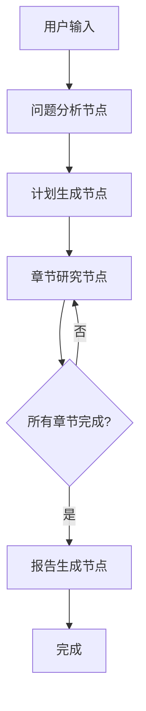

# DeepResearch Agent

基于 LangGraphJS 的智能研究助手，能够自动完成复杂的研究任务，包括问题分析、计划制定、信息搜索、深度分析和报告生成。

## 功能特性

- 🧠 **智能问题分析**：自动分析研究问题的复杂度和研究方向
- 📋 **自动计划生成**：根据问题生成详细的研究计划和章节结构
- 🔍 **多源信息搜索**：使用 Tavily 搜索引擎获取权威信息
- 🤔 **深度思考分析**：集成 MCP sequential-thinking 工具进行深度分析
- 📝 **高质量内容生成**：生成结构化的 Markdown 格式研究报告
- 💾 **状态持久化**：支持检查点保存和恢复研究进度
- 🔄 **流式处理**：支持实时进度反馈和流式输出

## 架构设计

### 状态图流程



### 核心组件

1. **状态管理** (`state.ts`)

   - 定义研究状态的完整数据结构
   - 支持状态注解和类型安全

2. **节点实现** (`nodes.ts`)

   - 问题分析节点：分析研究问题的核心主题和复杂度
   - 计划生成节点：制定详细的研究计划和章节结构
   - 章节研究节点：完成单个章节的完整研究流程
   - 报告生成节点：整合所有章节生成最终报告

3. **工具集成** (`tools.ts`)

   - Tavily 搜索工具：获取高质量的外部信息
   - MCP sequential-thinking：进行深度思考和分析
   - ReactAgent：集成多个工具的智能代理

4. **边定义** (`edges.ts`)
   - 条件边：根据状态决定下一步执行路径
   - 循环控制：管理章节研究的循环执行

## 快速开始

### 基本使用

```typescript
import { runDeepResearch } from './agent/deepresearch';

async function basicExample() {
  const question =
    '什么是人工智能？请详细介绍AI的发展历史、核心技术和应用场景。';
  const sessionId = `research-${Date.now()}`;
  const userId = 'user-123';

  const result = await runDeepResearch(question, sessionId, userId, {
    onProgress: (progress, status) => {
      console.log(`进度: ${progress}% - 状态: ${status}`);
    },
    onError: (error) => {
      console.error('研究错误:', error);
    },
  });

  console.log('研究完成!');
  console.log('最终报告:', result?.finalReport);
}
```

### 流式执行

```typescript
import { streamDeepResearch } from './agent/deepresearch';

async function streamingExample() {
  const question = '区块链技术的原理和应用';
  const sessionId = `stream-research-${Date.now()}`;
  const userId = 'user-456';

  for await (const chunk of streamDeepResearch(question, sessionId, userId)) {
    const nodeNames = Object.keys(chunk);
    if (nodeNames.length > 0) {
      const nodeName = nodeNames[0];
      const nodeState = (chunk as any)[nodeName];

      console.log(`节点: ${nodeName}`);
      console.log(`进度: ${nodeState.progress || 0}%`);
    }
  }
}
```

### 带检查点的执行

```typescript
import { runDeepResearch } from './agent/deepresearch';
import { checkpointer } from './agent/chatbot';

async function checkpointExample() {
  const question = '机器学习的基本概念和算法';
  const sessionId = `checkpoint-research-${Date.now()}`;
  const userId = 'user-789';

  const result = await runDeepResearch(question, sessionId, userId, {
    checkpointer, // 启用检查点保存
    onProgress: (progress, status) => {
      console.log(`[检查点] 进度: ${progress}% - 状态: ${status}`);
    },
  });

  console.log('研究完成，状态已保存到检查点');
}
```

## API 参考

### 主要函数

#### `runDeepResearch(question, sessionId, userId, options?)`

执行完整的深度研究流程。

**参数：**

- `question: string` - 研究问题
- `sessionId: string` - 会话 ID，用于状态管理
- `userId: string` - 用户 ID
- `options?: object` - 可选配置
  - `checkpointer?: any` - 检查点保存器
  - `onProgress?: (progress: number, status: string) => void` - 进度回调
  - `onError?: (error: string) => void` - 错误回调

**返回：** `Promise<ResearchState>` - 最终研究状态

#### `streamDeepResearch(question, sessionId, userId, options?)`

流式执行深度研究，返回异步生成器。

**参数：** 同 `runDeepResearch`

**返回：** `AsyncGenerator<any>` - 状态更新流

#### `createDeepResearchGraph()`

创建基本的研究状态图。

**返回：** 编译后的状态图实例

#### `createDeepResearchGraphWithCheckpoint(checkpointer)`

创建带检查点的研究状态图。

**参数：**

- `checkpointer: any` - 检查点保存器实例

**返回：** 编译后的状态图实例

### 类型定义

#### `ResearchState`

研究状态的完整定义，包含：

```typescript
interface ResearchState {
  // 用户输入
  question: string;
  sessionId: string;
  userId: string;

  // 分析结果
  analysis?: QuestionAnalysis;

  // 研究计划
  plan?: ResearchPlan;

  // 执行结果
  searchResults: SearchResult[];
  analysisResults: AnalysisResult[];
  generatedContent: ContentSection[];

  // 最终输出
  finalReport?: string;
  generatedFiles: GeneratedFile[];

  // 状态控制
  status: ResearchStatus;
  progress: number;
  error?: string;

  // 消息历史
  messages: BaseMessage[];
}
```

#### `QuestionAnalysis`

问题分析结果：

```typescript
interface QuestionAnalysis {
  coreTheme: string;
  keywords: string[];
  complexity: 'simple' | 'medium' | 'complex';
  estimatedTime: number;
  researchDirections: string[];
  sourceTypes: string[];
}
```

#### `ResearchPlan`

研究计划：

```typescript
interface ResearchPlan {
  title: string;
  description: string;
  objectives: string[];
  methodology: string[];
  expectedOutcome: string;
  sections: PlanSection[];
}
```

## 配置要求

### 环境变量

确保设置以下环境变量：

```bash
# OpenAI API 配置
OPENAI_API_KEY=your_openai_api_key
OPENAI_MODEL_NAME=gpt-4

# Tavily 搜索 API 配置
TAVILY_API_KEY=your_tavily_api_key
```

### 依赖包

项目需要以下依赖：

```json
{
  "@langchain/core": "^0.3.61",
  "@langchain/langgraph": "^0.3.5",
  "@langchain/openai": "^0.5.16",
  "@langchain/tavily": "^0.1.4",
  "@langchain/mcp-adapters": "^0.5.3"
}
```

## 工作流程详解

### 1. 问题分析阶段

- 分析研究问题的核心主题
- 提取关键词和研究方向
- 评估问题复杂度
- 预估研究时间

### 2. 计划生成阶段

- 制定研究目标和方法
- 设计章节结构
- 确定预期成果

### 3. 章节研究阶段

对每个章节执行完整的研究流程：

1. **信息搜索**：使用 Tavily 搜索相关信息
2. **深度分析**：使用 sequential-thinking 工具分析信息
3. **内容生成**：基于分析结果生成高质量内容

### 4. 报告生成阶段

- 整合所有章节内容
- 生成目录和摘要
- 统一格式和风格
- 添加引用和参考文献

## 最佳实践

### 1. 问题设计

- 确保问题具体明确
- 避免过于宽泛的主题
- 提供必要的背景信息

### 2. 会话管理

- 使用唯一的 sessionId
- 合理设置用户标识
- 利用检查点功能保存进度

### 3. 错误处理

- 实现进度和错误回调
- 处理网络超时和 API 限制
- 提供用户友好的错误信息

### 4. 性能优化

- 合理设置搜索结果数量
- 控制并发请求数量
- 使用流式处理提升用户体验

## 故障排除

### 常见问题

1. **API 密钥错误**

   - 检查环境变量设置
   - 确认 API 密钥有效性

2. **搜索结果为空**

   - 检查网络连接
   - 验证 Tavily API 配额

3. **内容生成失败**

   - 检查 OpenAI API 状态
   - 确认模型可用性

4. **状态保存失败**
   - 检查数据库连接
   - 验证检查点配置

### 调试技巧

- 启用详细日志输出
- 使用进度回调监控执行
- 检查中间状态数据
- 验证工具集成状态

## 扩展开发

### 添加新节点

1. 在 `nodes.ts` 中定义节点函数
2. 更新状态图配置
3. 添加相应的边定义

### 集成新工具

1. 在 `tools.ts` 中添加工具配置
2. 更新 ReactAgent 配置
3. 测试工具集成效果

### 自定义分析逻辑

1. 修改分析节点实现
2. 调整提示词模板
3. 优化结果处理逻辑

## 许可证

本项目采用 MIT 许可证。
