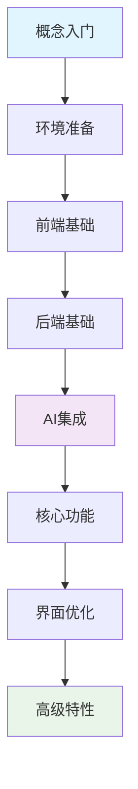

# LangGraph 智能聊天应用开发教程 - 完整教学大纲

> 零基础到专业开发者的系统化学习路径

## 📋 课程概述

### 课程目标
通过系统化学习，让零基础学员能够：
1. 理解现代AI应用开发的核心概念和技术栈
2. 掌握Next.js、LangGraphJS、OpenAI API等关键技术
3. 独立开发一个功能完善的智能聊天应用
4. 具备生产级AI应用的开发能力

### 学习成果
完成本课程后，学员将拥有：
- 一个完整的LangGraph聊天应用项目
- 现代前端开发技能
- AI应用集成经验
- 生产级项目开发经验

---

## 🎯 学习路径图



---

## 📚 详细课程内容

### 第1章：概念入门 🎯

#### 🎯 学习目标
完成本章学习后，学员将能够：
- 理解AI聊天应用的核心概念和工作原理
- 掌握大语言模型的基础知识和应用场景
- 熟悉现代AI应用的技术架构模式
- 了解项目技术栈的组成和作用
- 具备项目需求分析和架构设计的基础能力

#### 📚 知识点清单

##### 1.1 AI应用开发基础
**核心概念**
- **对话式AI应用架构**
  - 用户界面层：消息输入和显示
  - API调用层：与AI服务的交互
  - 状态管理层：对话历史和上下文
  - 数据存储层：会话和消息持久化

- **大语言模型API使用**
  - API调用基础概念和流程
  - 输入输出格式理解
  - Token概念和计费模式
  - 上下文窗口限制和管理
  - 常用参数(temperature、max_tokens等)的作用

- **AI应用常见场景**
  - 智能客服和问答助手
  - 内容创作和文本生成
  - 代码辅助和编程助手
  - 文档分析和信息提取
  - 多轮对话和任务导向对话

##### 1.2 项目技术栈应用
**前端技术栈**
- **Next.js 15 实际应用**
  - App Router文件系统路由
  - 服务端组件和客户端组件区别
  - API Routes后端接口
  - 流式渲染用于聊天界面

- **React 19 基础使用**
  - 函数组件和Hook
  - useState和useEffect状态管理
  - 事件处理和表单
  - 组件化开发

- **TypeScript 项目应用**
  - 基础类型定义
  - 接口和组件Props类型
  - API响应类型定义
  - 错误处理类型

- **Tailwind CSS 样式开发**
  - 实用类名系统
  - 响应式设计
  - 组件样式化
  - 现代UI效果

**后端技术栈**
- **Next.js API Routes**
  - RESTful接口设计
  - GET/POST请求处理
  - 流式响应实现
  - 错误处理中间件

- **SQLite数据库**
  - better-sqlite3库使用
  - 会话和消息表设计
  - 基础CRUD操作
  - 数据库连接管理

**AI技术栈应用层面**
- **LangGraphJS核心框架**
  - StateGraph状态图构建
  - MessagesAnnotation状态管理
  - 节点(Node)和边(Edge)设计
  - 检查点(Checkpoint)持久化
  - 流式事件处理

- **核心概念应用**
  - 状态图工作流设计
  - 聊天节点实现
  - START和END节点连接
  - SqliteSaver检查点存储
  - streamEvents流式响应

##### 1.3 项目架构设计
**项目架构模式**
- **前端层**
  - React组件：消息列表、输入框、侧边栏
  - 状态管理：useState管理聊天状态
  - 路由管理：Next.js App Router
  - 样式系统：Tailwind CSS

- **API层**
  - 聊天接口：/api/chat
  - 会话管理：/api/chat/sessions
  - 流式响应：ReadableStream
  - 错误处理：统一错误格式

- **AI集成层**
  - OpenAI API调用
  - LangGraphJS StateGraph
  - MessagesAnnotation状态
  - SqliteSaver持久化

- **数据层**
  - SQLite数据库
  - 会话表和消息表
  - 检查点存储
  - 数据备份策略

#### 💡 技能要求
- **基础要求**：了解Web开发基础概念
- **推荐背景**：具备JavaScript/TypeScript基础
- **学习态度**：对AI技术有浓厚兴趣

**实践任务**：
- 创建技术栈对比表
- 绘制项目架构图
- 分析现有聊天应用的用户体验

---

### 第2章：环境准备 ⚙️

#### 🎯 学习目标
完成本章学习后，学员将能够：
- 熟练配置现代JavaScript开发环境
- 理解包管理器的差异和选择标准
- 掌握项目结构设计和最佳实践
- 建立高效的代码开发工作流
- 具备项目初始化和配置管理能力

#### 📚 知识点清单

#### 2.1 开发工具安装
- **Node.js环境**
  - Node.js 18+安装与版本管理
  - npm vs pnpm：包管理器选择
  - 环境变量配置

- **代码编辑器配置**
  - VS Code安装与插件推荐
  - TypeScript支持配置
  - 代码格式化工具设置

- **版本控制工具**
  - Git安装与基础配置
  - GitHub仓库创建
  - .gitignore文件配置

#### 2.2 项目初始化
```bash
# 创建Next.js项目
pnpm create next-app@latest langgraph-chat-app

# 安装LangGraphJS核心依赖
pnpm add @langchain/langgraph @langchain/core @langchain/openai
pnpm add @langchain/langgraph-checkpoint-sqlite
pnpm add better-sqlite3 uuid dotenv

# 安装开发依赖
pnpm add -D @types/better-sqlite3 @types/uuid
```

#### 2.3 项目结构搭建
```
langgraph-chat-app/
├── app/                    # Next.js App Router
│   ├── agent/             # AI代理相关代码
│   ├── api/              # API路由
│   ├── components/       # React组件
│   └── utils/            # 工具函数
├── docs/                 # 项目文档
├── public/              # 静态资源
└── 配置文件
```

#### 2.4 环境变量配置
```env
OPENAI_API_KEY=your_openai_api_key
OPENAI_MODEL_NAME=gpt-3.5-turbo
NODE_ENV=development
```

**实践任务**：
- 完成开发环境配置
- 创建项目骨架
- 配置环境变量
- 运行开发服务器

---

### 第3章：前端基础 ⚛️

#### 🎯 学习目标
完成本章学习后，学员将能够：
- 深度理解React 19的核心概念和新特性
- 熟练使用Next.js 15的App Router架构
- 掌握TypeScript在React开发中的高级应用
- 运用Tailwind CSS构建现代化用户界面
- 具备组件化开发和状态管理能力

#### 📚 知识点清单

#### 3.1 React基础应用
- **组件开发**
  - 函数组件创建
  - JSX语法使用
  - Props传递和类型定义
  - 组件拆分原则

- **状态管理**
  - useState管理消息列表
  - useEffect处理副作用
  - useRef引用DOM元素
  - 表单状态处理

- **事件处理**
  - 消息发送事件
  - 键盘快捷键(Enter发送)
  - 文本框自动调整高度

#### 3.2 Next.js项目应用
- **App Router使用**
  - 页面文件结构(page.tsx)
  - 布局文件(layout.tsx)
  - 组件组织方式

- **组件类型**
  - 客户端组件('use client')
  - 服务端组件(默认)
  - 混合使用策略

- **API Routes**
  - 创建API接口(route.ts)
  - 处理POST请求(聊天)
  - 处理GET请求(历史)
  - 流式响应实现

#### 3.3 TypeScript实际应用
- **类型定义**
  - 消息类型接口
  - 组件Props类型
  - API响应类型
  - 状态类型定义

- **实际使用**
  - 组件类型安全
  - 事件处理类型
  - 异步函数类型

#### 3.4 Tailwind CSS项目应用
- **基础样式**
  - 聊天界面布局
  - 消息气泡样式
  - 输入框样式
  - 按钮和图标

- **响应式设计**
  - 移动端适配
  - 侧边栏响应式
  - 消息列表滚动

**实践任务**：
- 创建基础聊天界面组件
- 实现消息输入框
- 添加基础样式
- 实现响应式布局

---

### 第4章：后端基础 🔙

#### 🎯 学习目标
完成本章学习后，学员将能够：
- 深度理解RESTful API设计原则和最佳实践
- 熟练使用Next.js API Routes构建服务端接口
- 掌握SQLite数据库设计和优化技巧
- 实现高性能的流式响应处理
- 建立完善的错误处理和验证机制

#### 📚 知识点清单

#### 4.1 API接口实现
- **Next.js API Routes**
  - 聊天接口实现(/api/chat)
  - 会话管理接口(/api/chat/sessions)
  - GET/POST请求处理
  - JSON数据格式

- **实际接口设计**
  ```typescript
  // 聊天接口
  export async function POST(request: NextRequest) {
    const { message, thread_id } = await request.json();
    // 处理聊天逻辑
  }
  
  // 历史记录接口
  export async function GET(request: NextRequest) {
    const thread_id = searchParams.get('thread_id');
    // 返回聊天历史
  }
  ```

#### 4.2 数据库实际应用
- **SQLite项目使用**
  - better-sqlite3库配置
  - 数据库文件管理
  - 连接和初始化

- **项目数据模型**
  ```typescript
  // 消息表结构
  interface Message {
    id: string;
    content: string;
    role: 'user' | 'assistant';
    timestamp: Date;
    session_id: string;
  }
  
  // 会话表结构
  interface Session {
    id: string;
    name: string;
    created_at: Date;
    updated_at: Date;
  }
  ```

#### 4.3 流式响应实现
- **聊天流式响应**
  - ReadableStream创建
  - 实时数据推送
  - 前端流式接收
  - 错误处理

- **实际代码实现**
  ```typescript
  const stream = new ReadableStream({
    async start(controller) {
      // 发送聊天数据块
      controller.enqueue(encoder.encode(JSON.stringify(data)));
      controller.close();
    }
  });
  ```

#### 4.4 错误处理实践
- **API错误处理**
  - try-catch包装
  - 错误状态码返回
  - 用户友好错误信息

- **数据验证**
  - 消息内容验证
  - 会话ID验证
  - 基础安全检查

**实践任务**：
- 创建聊天API路由
- 实现数据库连接
- 设计消息数据模型
- 实现基础的错误处理

---

### 第5章：AI集成 🤖

#### 🎯 学习目标
完成本章学习后，学员将能够：
- 熟练使用OpenAI API进行模型调用和参数配置
- 掌握LangGraphJS StateGraph的构建和应用
- 实现MessagesAnnotation状态管理和检查点持久化
- 构建完整的流式响应处理系统
- 集成LangGraphJS到Next.js API路由
- 建立基础的错误处理和容错机制

#### 📚 知识点清单

##### 5.1 OpenAI API实际应用
**API基础使用**
- **认证和配置**
  - API密钥获取和配置
  - 环境变量安全设置
  - 基础请求格式
  - 常见错误代码处理
  - 请求限制和重试策略

- **模型选择和使用**
  - GPT-3.5-turbo vs GPT-4的选择
  - 不同场景下的模型推荐
  - 成本和性能权衡
  - 响应速度考虑
  - 实际使用建议

- **高级参数调优**
  ```typescript
  const model = new ChatOpenAI({
    model: "gpt-4", // 模型选择
    temperature: 0.7, // 创造性控制 (0-2)
    maxTokens: 2000, // 最大输出长度
    topP: 0.95, // 核采样参数 (0-1)
    frequencyPenalty: 0.1, // 频率惩罚 (-2到2)
    presencePenalty: 0.1, // 存在惩罚 (-2到2)
    stop: ["\n\n"], // 停止序列
    logitBias: {}, // 词汇偏置
    user: "user-123", // 用户标识
  });
  ```

- **消息格式和上下文管理**
  - **消息类型实际应用**
    - SystemMessage: 设置AI角色和行为
    - HumanMessage: 处理用户输入
    - AIMessage: 管理AI回复
    - 工具消息: 处理工具调用结果

  - **上下文管理实践**
    - Token数量控制方法
    - 对话历史截断技巧
    - 重要信息保留策略
    - 多轮对话优化
    - 成本控制技巧

##### 5.2 LangGraphJS核心应用
**StateGraph状态图构建**
- **基础状态图创建**
  ```typescript
  import { StateGraph, MessagesAnnotation, START, END } from '@langchain/langgraph';
  
  // 创建状态图工作流
  const workflow = new StateGraph(MessagesAnnotation)
    .addNode('chatbot', chatbotNode)
    .addEdge(START, 'chatbot')
    .addEdge('chatbot', END);
  ```

- **节点实现**
  ```typescript
  // 聊天节点实现
  async function chatbotNode(state: typeof MessagesAnnotation.State) {
    const response = await model.invoke(state.messages);
    return { messages: [response] };
  }
  ```

- **检查点持久化**
  ```typescript
  import { SqliteSaver } from '@langchain/langgraph-checkpoint-sqlite';
  
  // 创建检查点保存器
  const checkpointer = new SqliteSaver(db);
  const app = workflow.compile({ checkpointer });
  ```

##### 5.3 流式响应处理
**流式事件系统**
- **streamEvents基础使用**
  ```typescript
  // 流式响应处理
  for await (const event of app.streamEvents(
    { messages: [new HumanMessage('你好')] },
    { version: 'v2', configurable: { thread_id: 'session-1' } }
  )) {
    if (event.event === 'on_chat_model_stream') {
      const chunk = event.data?.chunk;
      if (chunk?.content) {
        process.stdout.write(chunk.content);
      }
    }
  }
  ```

- **实际应用场景**
  - 实时聊天响应
  - 打字机效果实现
  - 流式数据传输
  - 用户体验优化

**节点设计和实现**
- **常用节点类型**
  - 聊天节点：处理AI对话
  - 工具节点：调用外部工具
  - 条件节点：根据条件分支

- **基础节点实现**
  ```typescript
  // 并行节点执行
  const parallelNode = async (state: State) => {
    const [result1, result2, result3] = await Promise.all([
      processTask1(state),
      processTask2(state),
      processTask3(state),
    ]);
    
    return {
      ...state,
      results: { result1, result2, result3 },
    };
  };

  // 流水线处理
  const pipelineNode = async (state: State) => {
    let currentState = state;
    
    for (const processor of processors) {
      currentState = await processor(currentState);
    }
    
    return currentState;
  };
  ```

**边控制和路由策略**
- **条件路由实现**
  ```typescript
  const conditionalRouting = (state: State): string => {
    const { messages, sessionContext } = state;
    const lastMessage = messages[messages.length - 1];
    
    // 基于消息内容路由
    if (lastMessage.content.includes("计算")) {
      return "calculator_node";
    }
    
    // 基于用户状态路由
    if (sessionContext.userType === "premium") {
      return "premium_service_node";
    }
    
    // 基于消息长度路由
    if (lastMessage.content.length > 1000) {
      return "complex_processing_node";
    }
    
    return "default_node";
  };
  ```

- **动态边生成**
  ```typescript
  const dynamicEdges = (state: State) => {
    const availableNodes = getAvailableNodes(state);
    const edges: Record<string, string> = {};
    
    for (const node of availableNodes) {
      edges[node.condition] = node.target;
    }
    
    return edges;
  };
  ```

##### 5.4 会话和状态管理
**检查点实际应用**
- **SQLite检查点配置**
  ```typescript
  import { SqliteSaver } from '@langchain/langgraph-checkpoint-sqlite';
  import Database from 'better-sqlite3';
  
  // 数据库连接
  const dbPath = path.resolve(process.cwd(), 'chat_history.db');
  const db = new Database(dbPath);
  
  // 创建检查点保存器
  const checkpointer = new SqliteSaver(db);
  const app = workflow.compile({ checkpointer });
  ```

**会话管理实践**
- **Thread配置使用**
  ```typescript
  // 会话配置
  const threadConfig = {
    configurable: { thread_id: 'user-session-123' }
  };
  
  // 带会话的消息处理
  const response = await app.invoke(
    { messages: [new HumanMessage('你好')] },
    threadConfig
  );
  ```

- **状态获取和管理**
  ```typescript
  // 获取会话状态
  const state = await app.getState(threadConfig);
  const history = state?.values?.messages | [];
  ```

##### 5.5 实际项目集成
**API路由集成**
- **流式API实现**
  ```typescript
  // app/api/chat/route.ts
  export async function POST(request: NextRequest) {
    const { message, thread_id } = await request.json();
    
    const stream = new ReadableStream({
      async start(controller) {
        for await (const event of app.streamEvents(
          { messages: [new HumanMessage(message)] },
          { 
            version: 'v2',
            configurable: { thread_id }
          }
        )) {
          if (event.event === 'on_chat_model_stream') {
            const chunk = event.data?.chunk;
            if (chunk?.content) {
              controller.enqueue(
                new TextEncoder().encode(
                  JSON.stringify({ type: 'chunk', content: chunk.content })
                )
              );
            }
          }
        }
        controller.close();
      }
    });
    
    return new Response(stream);
  }
  ```

**前端集成**
- **流式响应接收**
  ```typescript
  // 前端流式处理
  const response = await fetch('/api/chat', {
    method: 'POST',
    body: JSON.stringify({ message, thread_id })
  });
  
  const reader = response.body?.getReader();
  const decoder = new TextDecoder();
  
  while (true) {
    const { done, value } = await reader.read();
    if (done) break;
    
    const chunk = decoder.decode(value);
    const data = JSON.parse(chunk);
    
    if (data.type === 'chunk') {
      setStreamingContent(prev => prev + data.content);
    }
  }
  ```

##### 5.6 错误处理实践
**基础错误处理**
- **常见错误场景**
  - OpenAI API调用失败
  - 网络连接中断
  - 检查点保存失败
  - 流式响应中断

- **实际错误处理**
  ```typescript
  // LangGraph错误处理
  try {
    const response = await app.invoke(
      { messages: [new HumanMessage(message)] },
      { configurable: { thread_id } }
    );
  } catch (error) {
    console.error('LangGraph调用失败:', error);
    return { 
      error: '抱歉，AI暂时无法响应，请稍后重试' 
    };
  }
  
  // 流式响应错误处理
  for await (const event of app.streamEvents(...)) {
    try {
      // 处理流式事件
    } catch (error) {
      console.error('流式处理错误:', error);
      controller.error(error);
      break;
    }
  }
  ```

#### 🛠️ 实践技能要求
- **必备技能**：JavaScript/TypeScript异步编程
- **推荐经验**：RESTful API集成经验
- **进阶要求**：状态管理和事件驱动编程理解

**实践任务**：
- 配置OpenAI API连接
- 构建LangGraphJS StateGraph工作流
- 实现chatbotNode聊天节点
- 配置SqliteSaver检查点持久化
- 测试streamEvents流式响应

---

### 第6章：核心功能 🔧

#### 🎯 学习目标
完成本章学习后，学员将能够：
- 构建完整的聊天机器人核心功能
- 实现高效的消息处理和状态管理
- 掌握流式响应的前后端集成技术
- 优化聊天界面的用户体验
- 建立可靠的消息传输和错误恢复机制

#### 📚 知识点清单

#### 6.1 LangGraphJS聊天机器人实现
- **StateGraph构建**
  ```typescript
  import { StateGraph, MessagesAnnotation, START, END } from '@langchain/langgraph';
  
  // 聊天节点实现
  async function chatbotNode(state: typeof MessagesAnnotation.State) {
    const response = await model.invoke(state.messages);
    return { messages: [response] };
  }
  
  // 创建工作流
  const workflow = new StateGraph(MessagesAnnotation)
    .addNode('chatbot', chatbotNode)
    .addEdge(START, 'chatbot')
    .addEdge('chatbot', END);
  ```

- **应用编译和初始化**
  ```typescript
  import { SqliteSaver } from '@langchain/langgraph-checkpoint-sqlite';
  
  const checkpointer = new SqliteSaver(db);
  const app = workflow.compile({ checkpointer });
  ```

#### 6.2 API路由完善
- **流式聊天API实现**
  ```typescript
  // app/api/chat/route.ts
  export async function POST(request: NextRequest) {
    const { message, thread_id } = await request.json();
    
    const stream = new ReadableStream({
      async start(controller) {
        try {
          for await (const event of app.streamEvents(
            { messages: [new HumanMessage(message)] },
            { 
              version: 'v2',
              configurable: { thread_id }
            }
          )) {
            if (event.event === 'on_chat_model_stream') {
              const chunk = event.data?.chunk;
              if (chunk?.content) {
                controller.enqueue(
                  new TextEncoder().encode(
                    JSON.stringify({ type: 'chunk', content: chunk.content })
                  )
                );
              }
            }
          }
        } catch (error) {
          controller.error(error);
        } finally {
          controller.close();
        }
      }
    });
    
    return new Response(stream);
  }
  ```

- **历史记录API**
  ```typescript
  export async function GET(request: NextRequest) {
    const { searchParams } = new URL(request.url);
    const thread_id = searchParams.get('thread_id');
    
    if (thread_id) {
      const state = await app.getState({ 
        configurable: { thread_id } 
      });
      return NextResponse.json({
        thread_id,
        history: state?.values?.messages | []
      });
    }
  }
  ```

#### 6.3 前端聊天界面
- **消息接口定义**
  ```typescript
  interface Message {
    id: string
    content: string
    role: 'user' | 'assistant'
    timestamp: Date
    isStreaming?: boolean
  }
  ```

- **状态管理实现**
  ```typescript
  const [messages, setMessages] = useState<Message[]>([])
  const [input, setInput] = useState('')
  const [isLoading, setIsLoading] = useState(false)
  const [sessionId, setSessionId] = useState<string>(() => getOrCreateThreadId())
  
  // 自动滚动
  const messagesEndRef = useRef<HTMLDivElement>(null)
  const scrollToBottom = () => {
    messagesEndRef.current?.scrollIntoView({ behavior: 'smooth' })
  }
  ```

- **历史记录加载**
  ```typescript
  useEffect(() => {
    fetch(`/api/chat?thread_id=${sessionId}`)
      .then(res => res.json())
      .then(data => {
        if (Array.isArray(data.history) && data.history.length > 0) {
          const historyMsgs: Message[] = data.history.map((msg: any, idx: number) => {
            let role: 'user' | 'assistant' = 'assistant'
            if (Array.isArray(msg.id) && msg.id.includes('HumanMessage')) {
              role = 'user'
            }
            return {
              id: String(idx + 1),
              content: msg.kwargs?.content | '',
              role,
              timestamp: new Date()
            }
          })
          setMessages(historyMsgs)
        }
      })
  }, [sessionId])
  ```

#### 6.4 流式响应前端实现
- **消息发送和流式接收**
  ```typescript
  const sendMessage = async () => {
    if (!input.trim() | isLoading) return

    const userMessage: Message = {
      id: Date.now().toString(),
      content: input.trim(),
      role: 'user',
      timestamp: new Date()
    }

    setMessages(prev => [...prev, userMessage])
    setInput('')
    setIsLoading(true)

    try {
      const response = await fetch('/api/chat', {
        method: 'POST',
        headers: { 'Content-Type': 'application/json' },
        body: JSON.stringify({ message: input.trim(), thread_id: sessionId })
      })

      // 创建流式响应消息
      const assistantMessage: Message = {
        id: (Date.now() + 1).toString(),
        content: '',
        role: 'assistant',
        timestamp: new Date(),
        isStreaming: true
      }
      setMessages(prev => [...prev, assistantMessage])

      // 读取流式响应
      const reader = response.body?.getReader()
      const decoder = new TextDecoder()
      let buffer = ''

      while (true) {
        const { done, value } = await reader.read()
        if (done) break

        buffer += decoder.decode(value, { stream: true })
        const lines = buffer.split('\n')
        buffer = lines.pop() | ''

        for (const line of lines) {
          if (line.trim()) {
            const data = JSON.parse(line)
            
            if (data.type === 'chunk' && data.content) {
              setMessages(prev => prev.map(msg =>
                msg.id === assistantMessage.id
                  ? { ...msg, content: msg.content + data.content }
                  : msg
              ))
            } else if (data.type === 'end') {
              setMessages(prev => prev.map(msg =>
                msg.id === assistantMessage.id
                  ? { ...msg, isStreaming: false }
                  : msg
              ))
              break
            }
          }
        }
      }
    } catch (error) {
      console.error('发送消息时出错:', error)
    } finally {
      setIsLoading(false)
    }
  }
  ```

- **键盘事件处理**
  ```typescript
  const handleKeyPress = (e: React.KeyboardEvent) => {
    if (e.key === 'Enter' && !e.shiftKey) {
      e.preventDefault()
      sendMessage()
    }
  }
  ```

**实践任务**：
- 完成聊天API实现
- 创建消息组件
- 实现流式响应
- 添加基础错误处理
- 测试完整聊天流程

---

### 第7章：界面优化 🎨

#### 🎯 学习目标
完成本章学习后，学员将能够：
- 掌握现代UI设计原则和设计系统构建
- 运用Tailwind CSS实现复杂的界面效果
- 优化用户交互体验和界面响应性
- 实现流畅的动画效果和过渡
- 建立可维护的组件化设计体系

#### 📚 知识点清单

#### 7.1 聊天界面设计
- **界面布局**
  - 聊天消息列表
  - 输入框区域
  - 侧边栏设计
  - 响应式布局

- **用户体验优化**
  - 消息自动滚动
  - 打字中状态显示
  - 加载动画效果
  - 错误提示设计

#### 7.2 Tailwind CSS样式实现
- **项目主题配置**
  ```typescript
  // tailwind.config.js - 项目实际配置
  module.exports = {
    theme: {
      extend: {
        colors: {
          // 聊天应用主题色
          primary: '#3b82f6',
          secondary: '#64748b',
        }
      }
    }
  }
  ```

- **核心样式实现**
  - 消息气泡样式
  - 渐变背景效果
  - 毛玻璃效果
  - 悬浮动画

#### 7.3 交互功能实现
- **键盘交互**
  ```typescript
  // Enter发送消息
  const handleKeyPress = (e: React.KeyboardEvent) => {
    if (e.key === 'Enter' && !e.shiftKey) {
      e.preventDefault();
      sendMessage();
    }
  };
  ```

- **实用交互效果**
  - 消息发送动画
  - 按钮悬浮效果
  - 加载状态显示
  - 流式打字效果

#### 7.4 组件优化
- **消息组件**
  - 用户消息组件
  - AI消息组件
  - 时间戳显示
  - 消息状态

- **输入组件**
  - 自动调整高度
  - 发送按钮状态
  - 字符计数
  - 表单验证

**实践任务**：
- 设计统一的设计系统
- 实现现代化聊天界面
- 添加动画和交互效果
- 优化响应式布局
- 提升整体用户体验

---

### 第8章：高级特性 🚀

#### 🎯 学习目标
完成本章学习后，学员将能够：
- 构建完整的多会话管理系统
- 实现高效的历史记录存储和检索
- 优化实时交互体验和性能
- 建立健壮的错误处理和恢复机制
- 具备大规模聊天应用的架构设计能力

#### 📚 知识点清单

#### 8.1 会话管理功能
- **会话数据结构**
  ```typescript
  interface Session {
    id: string;
    name: string;
    created_at: string;
  }
  ```

- **数据库操作实现**
  ```typescript
  // app/agent/db.ts
  export function initSessionTable() {
    db.prepare(`CREATE TABLE IF NOT EXISTS sessions (
      id TEXT PRIMARY KEY,
      name TEXT,
      created_at DATETIME DEFAULT CURRENT_TIMESTAMP
    )`).run();
  }

  export function createSession(id: string, name: string) {
    db.prepare('INSERT INTO sessions (id, name) VALUES (?, ?)').run(id, name);
  }

  export function getAllSessions() {
    return db.prepare('SELECT id, name, created_at FROM sessions ORDER BY created_at DESC').all();
  }

  export function updateSessionName(id: string, name: string) {
    db.prepare('UPDATE sessions SET name = ? WHERE id = ?').run(name, id);
  }

  export function deleteSession(id: string) {
    db.prepare('DELETE FROM sessions WHERE id = ?').run(id);
  }
  ```

- **API路由实现**
  ```typescript
  // app/api/chat/sessions/route.ts
  export async function GET() {
    const sessions = getAllSessions();
    return NextResponse.json({ sessions });
  }

  export async function POST(request: Request) {
    const { name } = await request.json();
    const id = randomUUID();
    createSession(id, name | `新会话-${id.slice(0, 8)}`);
    return NextResponse.json({ id });
  }

  export async function DELETE(request: Request) {
    const { id } = await request.json();
    deleteSession(id);
    return NextResponse.json({ success: true });
  }

  export async function PATCH(request: Request) {
    const { id, name } = await request.json();
    updateSessionName(id, name);
    return NextResponse.json({ success: true });
  }
  ```

#### 8.2 SessionSidebar组件实现
- **组件结构和Props**
  ```typescript
  interface SessionSidebarProps {
    currentSessionId: string;
    onSelect: (id: string) => void;
    onNew: (id: string) => void;
  }

  const SessionSidebar = forwardRef(function SessionSidebar(
    { currentSessionId, onSelect, onNew }: SessionSidebarProps,
    ref
  ) {
    const [sessions, setSessions] = useState<Session[]>([]);
    // ...组件实现
  });
  ```

- **会话操作功能**
  ```typescript
  // 获取会话列表
  async function fetchSessions() {
    const res = await fetch('/api/chat/sessions');
    const data = await res.json();
    if (Array.isArray(data.sessions)) {
      setSessions(data.sessions);
    }
  }

  // 新建会话
  async function handleNew() {
    const res = await fetch('/api/chat/sessions', {
      method: 'POST',
      headers: { 'Content-Type': 'application/json' },
      body: JSON.stringify({ name: '' })
    });
    const data = await res.json();
    if (data.id) {
      onNew(data.id);
      fetchSessions();
    }
  }

  // 删除会话
  async function handleDelete(id: string) {
    await fetch('/api/chat/sessions', {
      method: 'DELETE',
      headers: { 'Content-Type': 'application/json' },
      body: JSON.stringify({ id })
    });
    fetchSessions();
  }

  // 重命名会话
  async function handleRename(id: string) {
    await fetch('/api/chat/sessions', {
      method: 'PATCH',
      headers: { 'Content-Type': 'application/json' },
      body: JSON.stringify({ id, name: renameValue.trim() })
    });
    setRenameId(null);
    fetchSessions();
  }
  ```

#### 8.3 UI和交互优化
- **打字机光标效果**
  ```css
  .typing-cursor {
    animation: blink 1s infinite;
  }
  
  @keyframes blink {
    50% { opacity: 0; }
  }
  ```

- **流式消息更新**
  ```typescript
  // 处理流式数据块
  if (data.type === 'chunk' && data.content) {
    setMessages(prev => prev.map(msg =>
      msg.id === assistantMessageId
        ? { ...msg, content: msg.content + data.content }
        : msg
    ))
  } else if (data.type === 'end') {
    setMessages(prev => prev.map(msg =>
      msg.id === assistantMessageId
        ? { ...msg, isStreaming: false }
        : msg
    ))
  }
  ```

- **加载状态显示**
  ```typescript
  {isLoading && (
    <div className="flex gap-4">
      <div className="flex space-x-1">
        <div className="w-2 h-2 bg-purple-400 rounded-full animate-bounce"></div>
        <div className="w-2 h-2 bg-cyan-400 rounded-full animate-bounce" style={{ animationDelay: '0.1s' }}></div>
        <div className="w-2 h-2 bg-pink-400 rounded-full animate-bounce" style={{ animationDelay: '0.2s' }}></div>
      </div>
      <span className="text-purple-200 text-xs ml-2">AI 正在思考...</span>
    </div>
  )}
  ```

#### 8.4 错误处理完善
- **常见错误处理**
  - 网络请求失败
  - API调用错误
  - 数据格式错误

- **用户体验优化**
  - 友好错误提示
  - 自动重试机制
  - 降级处理策略

**实践任务**：
- 实现完整会话管理系统
- 添加历史记录功能
- 优化实时交互体验
- 完善错误处理机制
- 测试各种边界情况

---

## 🎯 学习成果评估

### 技能掌握评估表

| 技能领域 | 初级 | 中级 | 高级 | 评估标准 |
|----------|------|------|------|----------|
| **前端开发** | | | | |
| React/Next.js | ✅ 组件创建<br>✅ 状态管理<br>✅ 事件处理 | ✅ Hook使用<br>✅ 路由管理<br>✅ 性能优化 | ✅ 高级模式<br>✅ 自定义Hook<br>✅ SSR/SSG | 能独立开发复杂前端应用 |
| TypeScript | ✅ 基础类型<br>✅ 接口定义<br>✅ 类型注解 | ✅ 泛型使用<br>✅ 高级类型<br>✅ 条件类型 | ✅ 类型体操<br>✅ 声明文件<br>✅ 编译配置 | 能设计类型安全的大型应用 |
| **AI技术集成** | | | | |
| OpenAI API | ✅ 基础调用<br>✅ 密钥配置<br>✅ 错误处理 | ✅ 参数调优<br>✅ 流式响应<br>✅ 上下文管理 | ✅ 高级特性<br>✅ 性能优化<br>✅ 安全实践 | 能构建生产级AI应用 |
| LangGraphJS | ✅ 基础概念<br>✅ StateGraph构建<br>✅ 消息处理 | ✅ 复杂工作流<br>✅ 状态管理<br>✅ 检查点持久化 | ✅ 高级架构<br>✅ 自定义组件<br>✅ 性能调优 | 能设计复杂AI工作流系统 |
| **系统架构** | | | | |
| 后端开发 | ✅ API设计<br>✅ 数据库操作<br>✅ 基础安全 | ✅ 微服务<br>✅ 缓存策略<br>✅ 性能优化 | ✅ 分布式系统<br>✅ 高可用设计<br>✅ 监控运维 | 能设计大规模后端系统 |
| 系统设计 | ✅ 组件设计<br>✅ 数据流设计<br>✅ 基础架构 | ✅ 模块化架构<br>✅ 状态管理<br>✅ 错误处理 | ✅ 分布式架构<br>✅ 安全设计<br>✅ 可扩展性 | 能进行企业级架构设计 |

### 项目完成度检查

- [ ] **基础功能**（必须完成）
  - [ ] 用户可以发送消息
  - [ ] AI能够回复消息
  - [ ] 基础界面可用
  - [ ] 消息历史保存

- [ ] **核心功能**（建议完成）
  - [ ] 流式响应效果
  - [ ] 多会话管理
  - [ ] 历史记录查看
  - [ ] 现代化UI设计

- [ ] **高级功能**（可选完成）
  - [ ] 完善错误处理
  - [ ] 界面交互优化
  - [ ] 代码质量提升

### 学习质量评估

1. **理论理解**：能够解释核心概念和技术原理
2. **实践能力**：能够独立实现功能模块
3. **问题解决**：能够调试和解决开发中的问题
4. **代码质量**：遵循最佳实践，代码可读性好
5. **项目管理**：能够规划和组织开发任务

---

## 📚 扩展学习路径

### 深入学习方向

1. **AI应用进阶 🤖**
   - **多模型生态集成**
     - Claude、Gemini、文心一言等模型对接
     - 模型切换和负载均衡策略
     - 跨模型一致性处理
   - **RAG（检索增强生成）系统**
     - 向量数据库（Pinecone、Weaviate、Qdrant）
     - 文档解析和切块策略
     - 语义检索和重排序算法
     - 混合检索技术（稠密+稀疏）
   - **高级AI工作流**
     - 多步推理和规划算法
     - AI Agent自主决策系统
     - 工具链编排和优化
     - 人机协作界面设计
   - **模型优化**
     - 模型量化和压缩技术
     - 推理加速和缓存策略
     - 微调和适配技术

2. **LangGraphJS生态深度应用 🔗**
   - **高级Memory系统**
     - 长期记忆和知识图谱
     - 个性化上下文管理
     - 多模态记忆存储
   - **复杂Chain设计**
     - 自适应链路选择
     - 动态工作流生成
     - 错误恢复和重试机制
   - **企业级集成**
     - 权限和安全管控
     - 多租户架构设计

### 推荐资源

#### 官方文档和核心资源
- **前端技术文档**
  - [Next.js官方文档](https://nextjs.org/docs) - 最权威的框架指南
  - [React官方文档](https://react.dev/) - React 19最新特性
  - [TypeScript手册](https://www.typescriptlang.org/docs/) - 类型系统深度指南

- **AI技术文档**
  - [LangGraphJS文档](https://langchain-ai.github.io/langgraphjs/) - 状态图工作流框架
  - [OpenAI API文档](https://platform.openai.com/docs) - 模型使用指南
  - [LangSmith](https://docs.smith.langchain.com/) - AI应用监控和调试

#### 实战学习资源
- **API使用指南**
  - [OpenAI API最佳实践](https://platform.openai.com/docs/guides/best-practices) - 官方使用建议
  - [Prompt Engineering Guide](https://www.promptingguide.ai/) - 提示工程技巧
  - [LangGraphJS教程](https://langchain-ai.github.io/langgraphjs/tutorials/) - 状态图框架教程

- **实际应用案例**
  - [OpenAI Cookbook](https://github.com/openai/openai-cookbook) - 实用代码示例
  - [LangChain应用模板](https://github.com/langchain-ai/langchain/tree/master/templates) - 项目模板

#### 开源项目和示例
- **优秀的AI应用项目**
  - [LangGraph Examples](https://github.com/langchain-ai/langgraph/tree/main/examples) - LangGraph官方示例
  - [ChatGPT-Next-Web](https://github.com/Yidadaa/ChatGPT-Next-Web) - 开源聊天应用
  - [Dify](https://github.com/langgenius/dify) - LLM应用开发平台

- **学习项目和案例**
  - [OpenAI Cookbook](https://github.com/openai/openai-cookbook) - OpenAI使用案例
  - [LangGraph教程项目](https://github.com/langchain-ai/langgraph/tree/main/examples) - 实战项目示例
  - [Awesome LangGraph](https://github.com/kyrolabs/awesome-langchain) - 精选资源集合

#### 社区和论坛
- **技术社区**
  - [LangChain Discord](https://discord.gg/langchain) - 官方技术交流
  - [OpenAI Community](https://community.openai.com/) - OpenAI官方社区
  - [AI/ML Reddit](https://www.reddit.com/r/MachineLearning/) - 机器学习讨论
  - [Hacker News AI](https://news.ycombinator.com/item?id=ai) - 技术新闻和讨论
 

 
---

## 🎊 课程总结

通过本课程的系统化学习，您将：

1. **掌握现代技术栈**：Next.js、React、TypeScript、LangGraphJS
2. **具备AI应用开发能力**：OpenAI API集成、流式响应、状态管理
3. **拥有完整项目经验**：从设计到完善的全流程实践
4. **建立专业开发习惯**：代码质量、错误处理、性能优化

这不仅是一门技术课程，更是一次完整的产品开发实践。希望您在学习过程中不仅获得技术技能，还能培养产品思维和工程素养。 

---

