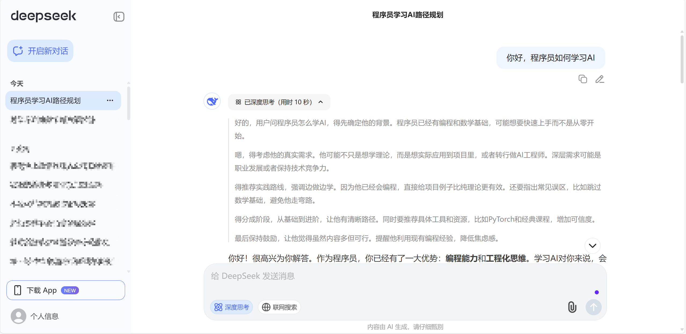
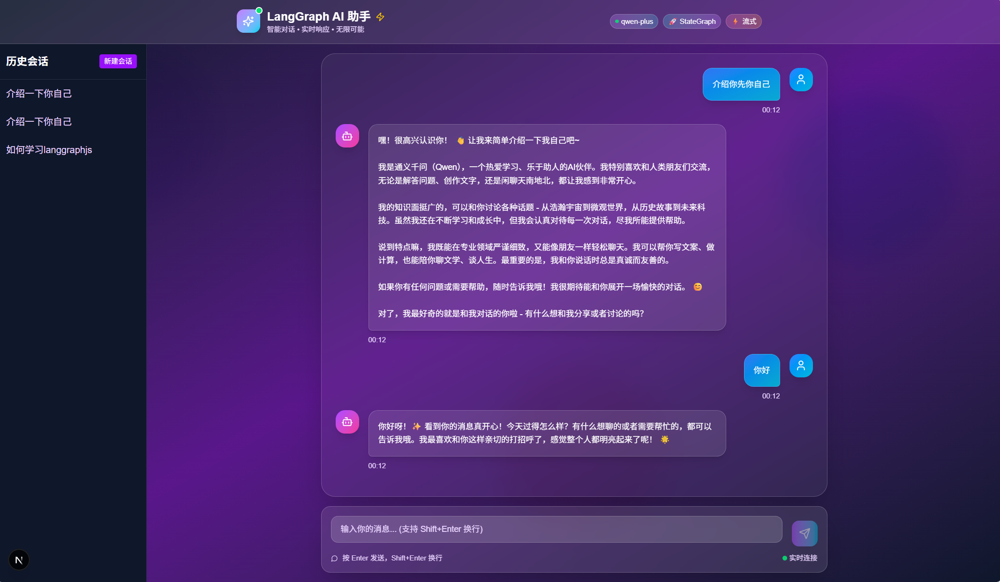

<!-- _class: lead -->

# 1.1 AI 应用开发基础 🤖

## 踏上 AI 应用开发的奇妙旅程

**LangGraph 智能聊天应用开发教程**

---

## 🎯 学习目标概述

### 本节课的核心价值

- **建立正确的 AI 认知框架**：从用户视角转向开发者视角
- **掌握核心技术概念**：为后续技术学习打下理论基础
- **培养系统思维能力**：学会从架构层面思考 AI 应用

### 具体学习目标

- 清楚解释什么是对话式 AI 应用
- 掌握大语言模型 API 的基本概念
- 识别 AI 应用的常见应用场景
- 具备基础的技术沟通能力

---

## 📚 核心概念架构

### 三大核心概念

- 🏗️ **对话式 AI 应用架构**：了解 AI 应用的"内部构造"
- 🔗 **大语言模型 API 使用**：掌握与 AI"对话"的技术
- 🎯 **AI 应用常见场景**：发现 AI 的实际应用价值

---

## DeepSeek


 
---

## 本项目


 
---

## 🏗️ 对话式 AI 应用架构

### 四层架构模型

就像一家高级餐厅的服务流程：

1. **用户界面层**：前台接待（消息输入和显示）
2. **API 调用层**：传菜员（与 AI 服务交互）
3. **状态管理层**：记录系统（对话历史和上下文）
4. **数据存储层**：数据库（会话和消息持久化）

---

## 🏗️ 用户界面层

### 核心职责

- **接收用户的消息输入**：就像前台记录客户需求
- **展示 AI 的回复内容**：显示 AI 的智能回答
- **提供友好的交互界面**：确保用户体验舒适

### 具体实现

- 消息输入框和发送按钮
- 消息显示区域展示对话历史
- 交互元素如表情符号等

---

## 🏗️ API 调用层

### 传菜员的角色

- **发送消息给 AI 服务**：把用户问题传递给 AI 大脑
- **接收 AI 服务响应**：获取 AI 生成的智能回答
- **处理技术细节**：网络连接、数据格式转换等

### 技术实现要点

```javascript
// API调用示例
const response = await openai.chat.completions.create({
  model: "qwen-plus",
  messages: [...] // 对话消息
});
```

---

## 🏗️ 状态管理层

### 记忆系统的作用

- **保存对话历史**：记住之前聊过的内容
- **管理上下文信息**：让 AI 理解对话连贯性
- **维护会话状态**：当前话题、用户偏好等

### 实际例子

```
用户：我想了解React
AI：React是一个JavaScript库...
用户：它有什么优势？ ← 这里的"它"需要上下文
```

---

## 🏗️ 数据存储层

### 永久记忆系统

- **持久化存储对话记录**：关闭应用后数据仍然保存
- **管理用户会话**：支持多个对话窗口
- **备份和恢复数据**：保证数据安全可靠

### 核心价值

确保用户的对话历史永远不会丢失

---

## 🔗 大语言模型 API 使用

### API 就像翻译官

帮助不同程序之间进行沟通

### 完整调用流程

1. **准备阶段**：配置 API 密钥和参数
2. **发送请求**：将用户消息打包发送
3. **等待处理**：AI 模型生成回答
4. **接收响应**：获取并展示结果

---

## 🔗 输入输出格式

### 标准 JSON 格式

<div class="two-column">

<div class="text-content">

**输入示例**：

```json
{
  "model": "qwen-plus",
  "messages": [
    {
      "role": "user",
      "content": "介绍React"
    }
  ],
  "temperature": 0.7
}
```

</div>

<div class="text-content">

**输出示例**：

```json
{
  "choices": [
    {
      "message": {
        "role": "assistant",
        "content": "React是一个用于构建用户界面的JavaScript库..."
      }
    }
  ]
}
```

</div>

</div>

---

## 💡 Token 概念详解

### AI 世界的"货币"

- **Token 是什么**：AI 处理文本的基本单位
- **计算规则**：一般一个单词或者短语为一个 token

### 计费模式

```
用户输入："请介绍React" (约5个Token)
AI回复："React是一个用于构建用户界面的JavaScript库..." (约150个Token)
```

总费用 = 输入 Token 费用 + 输出 Token 费用

---

## 🔧 上下文窗口管理

### AI 的记忆限制

- **固定大小的记事本**：不同模型有不同限制
- **qwen-plus 模型**：支持 8K-32K Token 上下文

### 管理策略

1. **滑动窗口**：保留最近对话
2. **重要信息提取**：总结关键信息
3. **分段处理**：长对话分片处理

---

## ⚙️ 重要参数配置

https://help.aliyun.com/zh/model-studio/use-qwen-by-calling-api

### 调节 AI"性格"的按钮

**temperature (创造性)**：

- 0：非常确定和一致
- 1：平衡创造性和准确性
- 2：非常有创意但可能不准确

**max_tokens (输出长度)**：

- 控制回复的最大长度
- 防止费用过高

---

## 🎯 AI 应用常见场景

### 五大核心应用领域

1. **智能客服和问答助手** 💬
2. **内容创作和文本生成** ✍️
3. **代码辅助和编程助手** 💻
4. **文档分析和信息提取** 📄
5. **多轮对话和任务导向** 🤖

---

## 💬 智能客服场景

### 应用价值

- **24 小时在线服务**：永不下班的客服
- **处理重复问题**：释放人工客服精力
- **即时响应**：用户无需等待

### 技术特点

- 需要训练特定领域知识
- 要求高准确率和专业性
- 支持多轮对话理解

---

## ✍️ 内容创作场景

### 实际应用

- **文章写作助手**：提高写作效率
- **营销文案生成**：创意灵感源泉
- **创意写作辅助**：激发创作灵感

### 技术要求

- 较高的创造性参数设置
- 丰富的语言表达能力
- 支持不同写作风格

---

## 💻 代码辅助场景

### 开发者的得力助手

- **代码自动补全**：提高编程效率
- **错误诊断修复**：减少调试时间
- **技术文档生成**：自动化文档编写

### 核心价值

- 理解多种编程语言
- 高度的逻辑准确性
- 提供代码优化建议

---

## 📚 AI 技术发展历程

### 四个重要阶段

1. **规则基础系统** (1960s-1980s)：早期专家系统
2. **统计学习方法** (1990s-2010s)：机器学习兴起
3. **深度学习革命** (2010s-2020s)：神经网络突破
4. **大语言模型时代** (2020s-现在)：接近人类水平

### 现在是最佳时机

- 技术成熟度高
- 开发门槛降低
- 市场需求旺盛

---

## 📋 核心概念总结

### 四层架构重点回顾

1. **用户界面层**：友好的交互体验
2. **API 调用层**：与 AI 服务通信
3. **状态管理层**：维护对话连贯性
4. **数据存储层**：持久化数据保存

### API 使用要点

- Token 是重要资源，需合理管理
- 参数配置影响 AI 输出效果
- 上下文窗口需要策略性管理

---

## 🚀 学习成果检验

### 基础理解检查

- [ ] 能解释对话式 AI 应用的四层架构
- [ ] 理解 Token 概念和计费模式
- [ ] 知道 API 调用的基本流程
- [ ] 识别至少 3 个 AI 应用场景

### 深入理解目标

- [ ] 能够分析现有 AI 产品的技术实现
- [ ] 可以设计简单的 AI 应用方案
- [ ] 具备与技术团队讨论 AI 项目的能力

---

## 🔮 下节课预告

### 1.2 项目技术栈应用

**我们将学习**：

- 为什么选择 Next.js 作为前端框架？
- LangGraphJS 相比其他 AI 框架有什么优势？
- TypeScript 在 AI 项目中的重要作用？

**知识衔接**：
从理论基础 → 技术选型 → 架构设计

---

## 🎊 课程结语

### 今天的重要收获

1. 🏗️ **AI 应用有清晰的四层架构**：不再是神秘黑盒子
2. 🔗 **API 调用是与 AI 对话的桥梁**：理解技术实现核心
3. 🎯 **AI 技术有广阔应用前景**：看到无限可能性

### 继续学习的动力

> **每一个技术大牛都是从理解基础概念开始的！**

**让我们在下节课继续精彩的 AI 应用开发之旅！** 🚀
