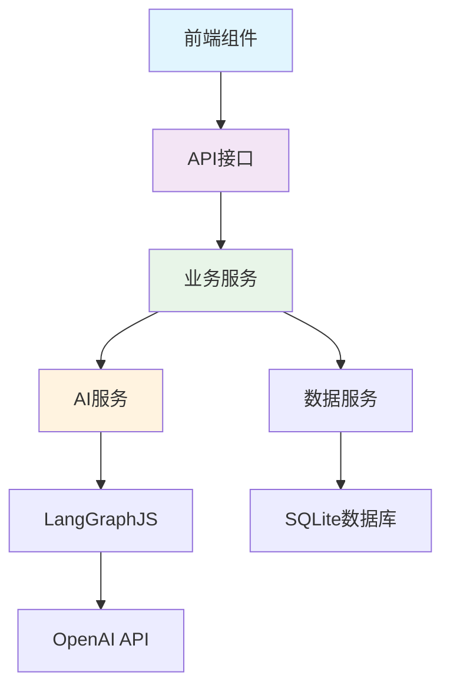

# 1.3 项目架构设计 🏗️

> 构建稳固而优雅的AI应用架构

---

## 🎯 小节概述与学习目标

欢迎来到第一章的压轴课程！如果说前两节课让我们理解了AI应用的"大脑"和"肌肉"，那么今天我们要学习的就是如何构建应用的"骨架"——系统架构。

### 小节核心价值和重要性

想象一下建造一座摩天大楼，你有了最好的建材（技术栈），也有了最先进的设备（AI能力），但如果没有合理的建筑设计图，这座大楼可能会倒塌。软件架构就是我们的"建筑设计图"。

这一小节的价值在于：
- **建立系统思维**：从整体角度看待复杂的软件系统
- **掌握架构原则**：学会如何设计可扩展、可维护的系统
- **培养设计能力**：具备分析和设计软件架构的基础能力

### 与前后小节的连接关系

让我们回顾一下整个第一章的学习路径：

**从1.1到1.2到1.3的完整闭环**：
- **1.1 AI应用基础**：理解了"要做什么"（需求和原理）
- **1.2 技术栈应用**：学会了"用什么做"（技术选择）
- **1.3 架构设计**：掌握"如何组织"（系统设计）

**为后续章节奠定基础**：
- **第2章 环境准备**：基于架构设计来配置开发环境
- **第3-4章 前后端开发**：按照架构设计来实现各个层次
- **第5-8章 AI集成和优化**：在稳固的架构基础上添加高级功能

### 具体的理论掌握目标

学完这一小节，你将能够：

1. **理解分层架构的设计原则**：知道为什么要分层，如何分层
2. **掌握各层之间的交互模式**：理解数据如何在系统中流转
3. **具备架构分析能力**：能够分析现有系统的架构设计
4. **建立架构设计思维**：能够为新项目设计合理的架构方案

### 本小节涉及的核心架构

我们今天要深入学习的四层架构：
- 🖥️ **前端层**：用户界面和交互逻辑
- 🔌 **API层**：接口服务和业务逻辑
- 🤖 **AI集成层**：智能处理和工作流管理
- 💾 **数据层**：存储管理和持久化

---

## 📚 核心概念深度讲解

### 第一部分：架构设计的基本原则 🎯

在深入具体架构之前，让我们先理解什么是好的软件架构。我喜欢把软件架构比作城市规划——既要满足当前需求，也要为未来发展留下空间。

#### 分层架构的核心思想

**为什么要分层？**

想象一下，如果把所有代码都写在一个文件里会怎样：

```
不分层的混乱代码：
function handleUserMessage() {
  // 界面逻辑
  updateUI();
  
  // 业务逻辑
  validateMessage();
  
  // AI调用
  callOpenAI();
  
  // 数据库操作
  saveToDatabase();
  
  // 更多混合逻辑...
}
```

这就像把厨房、客厅、卧室、厕所都建在一个房间里——虽然功能都有，但是：
- **难以维护**：修改一个功能可能影响其他功能
- **难以测试**：无法单独测试某个部分
- **难以扩展**：添加新功能需要修改很多地方
- **难以协作**：多人开发容易冲突

**分层架构的优势**：

```
分层的清晰架构：
前端层：只负责用户界面
  ↓
API层：只负责业务逻辑
  ↓  
AI层：只负责智能处理
  ↓
数据层：只负责数据存储
```

这就像设计良好的房子：
- **职责清晰**：每个房间有明确的用途
- **独立维护**：装修厨房不影响卧室
- **容易扩展**：需要时可以加盖房间
- **便于协作**：不同工人可以同时施工

#### 架构设计的黄金原则

**1. 单一职责原则（Single Responsibility Principle）**

每一层只做一件事，并且把这件事做好：

```typescript
// 好的设计：职责清晰
class MessageService {
  // 只负责消息的业务逻辑
  async processMessage(message: string, threadId: string) {
    return await this.aiService.generateResponse(message, threadId);
  }
}

class DatabaseService {
  // 只负责数据存储
  async saveMessage(message: Message) {
    return await this.db.insert('messages', message);
  }
}
```

**2. 依赖倒置原则（Dependency Inversion Principle）**

高层模块不依赖低层模块，都应该依赖抽象：

```typescript
// 好的设计：通过接口解耦
interface AIService {
  generateResponse(message: string, threadId: string): Promise<string>;
}

class MessageController {
  constructor(private aiService: AIService) {}
  
  async handleMessage(message: string, threadId: string) {
    // 不关心具体用的是OpenAI还是其他AI服务
    return await this.aiService.generateResponse(message, threadId);
  }
}
```

**3. 开放封闭原则（Open-Closed Principle）**

对扩展开放，对修改封闭：

```typescript
// 好的设计：容易扩展新功能
interface MessageProcessor {
  process(message: Message): Promise<Message>;
}

class ChatWorkflow {
  private processors: MessageProcessor[] = [];
  
  addProcessor(processor: MessageProcessor) {
    this.processors.push(processor);
  }
  
  async processMessage(message: Message) {
    for (const processor of this.processors) {
      message = await processor.process(message);
    }
    return message;
  }
}

// 添加新功能不需要修改原有代码
class SpamFilterProcessor implements MessageProcessor {
  async process(message: Message): Promise<Message> {
    // 垃圾信息过滤逻辑
    return message;
  }
}
```

### 第二部分：四层架构详细设计 🏗️

现在让我们深入了解我们AI应用的具体架构设计。

#### 前端层：用户体验的门面 🖥️

前端层就像是一家高端酒店的大堂——第一印象至关重要，用户体验决定成败。

**前端层的核心职责**：

1. **用户界面渲染**
   ```tsx
   // 消息列表组件
   function MessageList({ messages }: { messages: Message[] }) {
     return (
       <div className="flex-1 overflow-y-auto p-4 space-y-4">
         {messages.map(message => (
           <MessageBubble key={message.id} message={message} />
         ))}
       </div>
     );
   }
   ```

2. **用户交互处理**
   ```tsx
   // 消息输入组件
   function MessageInput({ onSend }: { onSend: (msg: string) => void }) {
     const [input, setInput] = useState('');
     
     const handleSubmit = (e: React.FormEvent) => {
       e.preventDefault();
       if (input.trim()) {
         onSend(input.trim());
         setInput('');
       }
     };
     
     return (
       <form onSubmit={handleSubmit}>
         <input 
           value={input}
           onChange={(e) => setInput(e.target.value)}
           placeholder="输入你的消息..."
         />
         <button type="submit">发送</button>
       </form>
     );
   }
   ```

3. **状态管理**
   ```tsx
   // 聊天应用的状态管理
   function ChatApp() {
     const [messages, setMessages] = useState<Message[]>([]);
     const [isLoading, setIsLoading] = useState(false);
     const [currentSession, setCurrentSession] = useState<string>('');
     
     // 状态更新逻辑
     const addMessage = useCallback((message: Message) => {
       setMessages(prev => [...prev, message]);
     }, []);
     
     return (
       <div className="h-screen flex flex-col">
         <MessageList messages={messages} />
         <MessageInput onSend={handleSendMessage} />
       </div>
     );
   }
   ```

**前端层的设计原则**：

- **响应式设计**：适配各种设备屏幕
- **组件化开发**：可重用、可测试的小组件
- **状态管理**：清晰的数据流和状态更新
- **用户体验优化**：加载状态、错误提示、流畅动画

#### API层：业务逻辑的中枢 🔌

API层就像是酒店的管理中心——协调各部门工作，处理客户需求。

**API层的核心职责**：

1. **接口路由设计**
   ```typescript
   // app/api/chat/route.ts - 聊天接口
   export async function POST(request: NextRequest) {
     try {
       // 1. 请求验证
       const { message, threadId } = await request.json();
       if (!message || !threadId) {
         return NextResponse.json({ error: '参数不完整' }, { status: 400 });
       }
       
       // 2. 业务逻辑处理
       const response = await chatService.processMessage(message, threadId);
       
       // 3. 响应返回
       return new Response(response.stream);
     } catch (error) {
       // 4. 错误处理
       return NextResponse.json({ error: '服务异常' }, { status: 500 });
     }
   }
   ```

2. **业务逻辑封装**
   ```typescript
   // 聊天服务类
   class ChatService {
     constructor(
       private aiService: AIService,
       private dbService: DatabaseService
     ) {}
     
     async processMessage(message: string, threadId: string) {
       // 1. 保存用户消息
       const userMessage = await this.dbService.saveMessage({
         content: message,
         role: 'user',
         threadId
       });
       
       // 2. 调用AI服务
       const aiResponse = await this.aiService.generateResponse(message, threadId);
       
       // 3. 保存AI回复
       const aiMessage = await this.dbService.saveMessage({
         content: aiResponse.content,
         role: 'assistant',
         threadId
       });
       
       return aiResponse;
     }
   }
   ```

3. **数据验证和转换**
   ```typescript
   // 请求数据验证
   function validateChatRequest(body: any): ChatRequest {
     if (!body.message || typeof body.message !== 'string') {
       throw new Error('消息内容不能为空');
     }
     
     if (!body.threadId || typeof body.threadId !== 'string') {
       throw new Error('会话ID不能为空');
     }
     
     return {
       message: body.message.trim(),
       threadId: body.threadId,
       timestamp: new Date()
     };
   }
   ```

**API层的设计原则**：

- **RESTful设计**：符合HTTP语义的接口设计
- **统一响应格式**：一致的成功和错误响应结构
- **参数验证**：严格的输入验证和类型检查
- **错误处理**：友好的错误信息和适当的状态码

#### AI集成层：智能处理的核心 🤖

AI集成层就像是酒店的智能管家——理解客户需求，提供个性化服务。

**AI集成层的核心职责**：

1. **AI工作流管理**
   ```typescript
   // LangGraphJS工作流配置
   import { StateGraph, MessagesAnnotation, START, END } from '@langchain/langgraph';
   
   class AIWorkflowService {
     private app: CompiledGraph;
     
     constructor() {
       this.app = this.createWorkflow();
     }
     
     private createWorkflow() {
       const workflow = new StateGraph(MessagesAnnotation)
         .addNode('chatbot', this.chatbotNode)
         .addNode('validator', this.validatorNode)
         .addEdge(START, 'validator')
         .addEdge('validator', 'chatbot')
         .addEdge('chatbot', END);
       
       return workflow.compile({ 
         checkpointer: new SqliteSaver(db)
       });
     }
     
     private async chatbotNode(state: typeof MessagesAnnotation.State) {
       const response = await this.model.invoke(state.messages);
       return { messages: [response] };
     }
     
     private async validatorNode(state: typeof MessagesAnnotation.State) {
       // 消息验证和预处理
       const lastMessage = state.messages[state.messages.length - 1];
       
       if (this.isInappropriate(lastMessage.content)) {
         throw new Error('消息内容不当');
       }
       
       return state;
     }
   }
   ```

2. **会话状态管理**
   ```typescript
   // 会话管理服务
   class SessionService {
     async getOrCreateSession(threadId: string): Promise<SessionState> {
       // 1. 尝试获取现有会话
       let session = await this.getSession(threadId);
       
       if (!session) {
         // 2. 创建新会话
         session = await this.createSession(threadId);
       }
       
       return session;
     }
     
     async updateSessionState(threadId: string, state: Partial<SessionState>) {
       return await this.db.updateSession(threadId, state);
     }
     
     async getSessionHistory(threadId: string): Promise<Message[]> {
       const state = await this.app.getState({
         configurable: { thread_id: threadId }
       });
       
       return state?.values?.messages || [];
     }
   }
   ```

3. **流式响应处理**
   ```typescript
   // 流式响应生成器
   class StreamingService {
     async createStream(message: string, threadId: string): Promise<ReadableStream> {
       return new ReadableStream({
         async start(controller) {
           try {
             // 流式处理AI响应
             for await (const event of this.app.streamEvents(
               { messages: [new HumanMessage(message)] },
               { 
                 version: 'v2',
                 configurable: { thread_id: threadId }
               }
             )) {
               if (event.event === 'on_chat_model_stream') {
                 const chunk = event.data?.chunk;
                 if (chunk?.content) {
                   // 发送数据块
                   controller.enqueue(
                     new TextEncoder().encode(
                       JSON.stringify({ 
                         type: 'chunk', 
                         content: chunk.content 
                       })
                     )
                   );
                 }
               }
             }
             
             // 结束流
             controller.enqueue(
               new TextEncoder().encode(
                 JSON.stringify({ type: 'end' })
               )
             );
           } catch (error) {
             controller.error(error);
           } finally {
             controller.close();
           }
         }
       });
     }
   }
   ```

#### 数据层：稳固的存储基础 💾

数据层就像是酒店的档案室——安全可靠地保存所有重要信息。

**数据层的核心职责**：

1. **数据模型设计**
   ```typescript
   // 数据模型定义
   interface Session {
     id: string;
     name: string;
     createdAt: Date;
     updatedAt: Date;
     metadata?: Record<string, any>;
   }
   
   interface Message {
     id: string;
     content: string;
     role: 'user' | 'assistant' | 'system';
     timestamp: Date;
     sessionId: string;
     metadata?: {
       tokens?: number;
       model?: string;
       temperature?: number;
     };
   }
   ```

2. **数据访问层（DAO）**
   ```typescript
   // 数据库访问对象
   class SessionDAO {
     constructor(private db: Database) {}
     
     async create(session: Omit<Session, 'id' | 'createdAt' | 'updatedAt'>): Promise<Session> {
       const id = randomUUID();
       const now = new Date();
       
       const stmt = this.db.prepare(`
         INSERT INTO sessions (id, name, created_at, updated_at, metadata)
         VALUES (?, ?, ?, ?, ?)
       `);
       
       stmt.run(id, session.name, now, now, JSON.stringify(session.metadata || {}));
       
       return { ...session, id, createdAt: now, updatedAt: now };
     }
     
     async findById(id: string): Promise<Session | null> {
       const stmt = this.db.prepare(`
         SELECT * FROM sessions WHERE id = ?
       `);
       
       const row = stmt.get(id);
       if (!row) return null;
       
       return this.mapRowToSession(row);
     }
     
     async findAll(): Promise<Session[]> {
       const stmt = this.db.prepare(`
         SELECT * FROM sessions ORDER BY updated_at DESC
       `);
       
       const rows = stmt.all();
       return rows.map(row => this.mapRowToSession(row));
     }
     
     private mapRowToSession(row: any): Session {
       return {
         id: row.id,
         name: row.name,
         createdAt: new Date(row.created_at),
         updatedAt: new Date(row.updated_at),
         metadata: JSON.parse(row.metadata || '{}')
       };
     }
   }
   ```

3. **数据库初始化和迁移**
   ```typescript
   // 数据库初始化
   class DatabaseInitializer {
     constructor(private db: Database) {}
     
     async initialize() {
       // 创建会话表
       await this.createSessionsTable();
       
       // 创建消息表
       await this.createMessagesTable();
       
       // 创建索引
       await this.createIndexes();
     }
     
     private async createSessionsTable() {
       this.db.exec(`
         CREATE TABLE IF NOT EXISTS sessions (
           id TEXT PRIMARY KEY,
           name TEXT NOT NULL,
           created_at DATETIME NOT NULL,
           updated_at DATETIME NOT NULL,
           metadata TEXT DEFAULT '{}'
         )
       `);
     }
     
     private async createMessagesTable() {
       this.db.exec(`
         CREATE TABLE IF NOT EXISTS messages (
           id TEXT PRIMARY KEY,
           content TEXT NOT NULL,
           role TEXT NOT NULL CHECK (role IN ('user', 'assistant', 'system')),
           timestamp DATETIME NOT NULL,
           session_id TEXT NOT NULL,
           metadata TEXT DEFAULT '{}',
           FOREIGN KEY (session_id) REFERENCES sessions (id) ON DELETE CASCADE
         )
       `);
     }
     
     private async createIndexes() {
       this.db.exec(`
         CREATE INDEX IF NOT EXISTS idx_messages_session_id ON messages (session_id);
         CREATE INDEX IF NOT EXISTS idx_messages_timestamp ON messages (timestamp);
         CREATE INDEX IF NOT EXISTS idx_sessions_updated_at ON sessions (updated_at);
       `);
     }
   }
   ```

### 第三部分：层间交互和数据流设计 🔄

现在让我们看看这四层是如何协作的，就像一场精心编排的交响乐。

#### 数据流的完整生命周期

**用户发送消息的完整流程**：

```typescript
// 1. 前端层：用户交互
function ChatInput({ onSend }: { onSend: (msg: string) => void }) {
  const handleSubmit = (message: string) => {
    // 前端验证
    if (!message.trim()) return;
    
    // 调用API层
    onSend(message.trim());
  };
}

// 2. API层：接口处理
export async function POST(request: NextRequest) {
  // 2.1 请求解析和验证
  const { message, threadId } = await request.json();
  
  // 2.2 调用业务服务
  const streamResponse = await chatService.processMessage(message, threadId);
  
  // 2.3 返回流式响应
  return new Response(streamResponse);
}

// 3. AI集成层：智能处理
class ChatService {
  async processMessage(message: string, threadId: string) {
    // 3.1 会话状态管理
    await this.sessionService.updateSession(threadId, { lastActivity: new Date() });
    
    // 3.2 调用AI工作流
    const stream = await this.aiWorkflow.streamResponse(message, threadId);
    
    return stream;
  }
}

// 4. 数据层：持久化存储
class MessageDAO {
  async saveMessage(message: MessageData) {
    // 4.1 数据验证
    this.validateMessage(message);
    
    // 4.2 数据库写入
    const result = await this.db.insert('messages', message);
    
    return result;
  }
}
```

#### 错误处理的分层策略

**分层错误处理机制**：

```typescript
// 数据层错误
class DatabaseError extends Error {
  constructor(message: string, public code: string) {
    super(message);
    this.name = 'DatabaseError';
  }
}

// AI层错误
class AIServiceError extends Error {
  constructor(message: string, public retryable: boolean = false) {
    super(message);
    this.name = 'AIServiceError';
  }
}

// API层错误处理
export async function POST(request: NextRequest) {
  try {
    // 业务逻辑
    const result = await chatService.processMessage(message, threadId);
    return NextResponse.json(result);
  } catch (error) {
    if (error instanceof DatabaseError) {
      return NextResponse.json(
        { error: '数据存储异常，请稍后重试' },
        { status: 500 }
      );
    }
    
    if (error instanceof AIServiceError) {
      return NextResponse.json(
        { 
          error: 'AI服务暂时不可用', 
          retryable: error.retryable 
        },
        { status: 503 }
      );
    }
    
    // 未知错误
    return NextResponse.json(
      { error: '系统异常' },
      { status: 500 }
    );
  }
}

// 前端错误处理
function ChatApp() {
  const [error, setError] = useState<string | null>(null);
  
  const handleSend = async (message: string) => {
    try {
      setError(null);
      await sendMessage(message);
    } catch (error) {
      setError('发送失败，请稍后重试');
      console.error('Chat error:', error);
    }
  };
  
  return (
    <div>
      {error && <ErrorBanner message={error} onClose={() => setError(null)} />}
      {/* 其他组件 */}
    </div>
  );
}
```

---

## 💡 理论知识详细说明

### 架构设计的背景和发展

#### 软件架构的演进历程

**第一代：单体架构（Monolithic Architecture）**
```
所有功能都在一个应用中：
[用户界面 + 业务逻辑 + 数据访问] → 数据库

优点：开发简单，部署方便
缺点：难以扩展，技术栈固定
```

**第二代：分层架构（Layered Architecture）**
```
按功能分层：
用户界面层 → 业务逻辑层 → 数据访问层 → 数据库

优点：职责清晰，便于维护
缺点：层级过多可能影响性能
```

**第三代：微服务架构（Microservices Architecture）**
```
按业务领域拆分：
用户服务 + 聊天服务 + AI服务 + 消息服务

优点：高度解耦，技术多样化
缺点：复杂度高，网络开销大
```

**第四代：Serverless架构（Serverless Architecture）**
```
函数即服务：
Function1 + Function2 + Function3 → 云服务

优点：按需付费，自动扩展
缺点：冷启动延迟，供应商锁定
```

**我们的选择：现代化分层架构**

我们选择的是经过现代化改良的分层架构，它结合了：
- **分层架构的清晰职责**
- **微服务的模块化思想**
- **现代技术栈的开发效率**

#### 为什么选择这种架构？

**项目特点分析**：
1. **中等复杂度**：功能丰富但不过于复杂
2. **快速迭代需求**：需要快速开发和部署
3. **小团队开发**：不需要微服务的复杂性
4. **AI应用特性**：需要处理流式数据和状态管理

**架构选择的权衡**：
```
单体架构：太简单，难以扩展
微服务架构：太复杂，开发成本高
分层架构：复杂度适中，满足需求
```

### 核心原理的深入剖析

#### 分层架构的科学性

**为什么分层架构如此有效？**

这其实来源于计算机科学的一个基本原理——**抽象分层**：

1. **计算机系统的分层**：
   ```
   应用软件 → 操作系统 → 硬件驱动 → 物理硬件
   ```

2. **网络协议的分层**：
   ```
   应用层 → 传输层 → 网络层 → 数据链路层 → 物理层
   ```

3. **我们的应用分层**：
   ```
   用户界面 → API接口 → AI处理 → 数据存储
   ```

**分层的科学优势**：
- **降低复杂度**：每层只关注自己的职责
- **提高重用性**：下层可以为多个上层服务
- **便于测试**：可以单独测试每一层
- **支持并行开发**：不同团队可以开发不同层

#### 数据流设计的原理

**单向数据流 vs 双向数据流**：

```typescript
// 单向数据流（推荐）
用户输入 → API → AI → 数据库 → API → 前端更新

// 双向数据流（容易混乱）
用户输入 ↔ 前端状态 ↔ API ↔ 数据库
```

**为什么单向数据流更好？**
- **可预测性**：数据变化路径清晰
- **调试友好**：容易追踪数据变化
- **状态一致性**：避免状态冲突
- **测试简单**：输入输出关系明确

#### 接口设计的哲学

**好的接口设计应该是什么样的？**

1. **简单性**：接口应该简单易用
   ```typescript
   // 好的接口：简单直观
   sendMessage(message: string, sessionId: string): Promise<Response>
   
   // 不好的接口：参数复杂
   sendMessage(options: {
     message: string;
     sessionId: string;
     userId?: string;
     timestamp?: Date;
     metadata?: any;
     config?: any;
   }): Promise<Response>
   ```

2. **一致性**：相似功能应该有相似接口
   ```typescript
   // 一致的接口设计
   async getSessions(): Promise<Session[]>
   async getMessages(sessionId: string): Promise<Message[]>
   async getUsers(): Promise<User[]>
   ```

3. **可扩展性**：接口应该为未来扩展留有余地
   ```typescript
   // 可扩展的接口设计
   interface SendMessageOptions {
     message: string;
     sessionId: string;
     // 未来可以添加更多选项而不破坏现有代码
   }
   ```

### 概念之间的关系梳理

#### 架构组件的依赖关系

**依赖关系图**：


**重要的设计原则**：
1. **高层不依赖低层**：前端不直接访问数据库
2. **通过接口解耦**：使用抽象接口而不是具体实现
3. **依赖注入**：通过构造函数传入依赖

#### 数据模型的关系设计

**实体关系图（ERD）**：
```
Session (会话)
  ↓ 1:N
Message (消息)
  ↓ 1:1
AIResponse (AI响应)
```

**关系设计的考虑**：
```typescript
// 会话和消息的关系
interface Session {
  id: string;
  name: string;
  // 不直接包含messages数组，避免数据冗余
}

interface Message {
  id: string;
  sessionId: string;  // 外键关联
  content: string;
  // 其他属性...
}

// 通过服务层管理关系
class SessionService {
  async getSessionWithMessages(sessionId: string) {
    const session = await this.sessionDAO.findById(sessionId);
    const messages = await this.messageDAO.findBySessionId(sessionId);
    return { session, messages };
  }
}
```

### 理论在实际中的意义

#### 对开发效率的影响

**好的架构如何提高开发效率？**

1. **并行开发**：
   ```
   前端工程师：开发用户界面，不需要等待后端完成
   后端工程师：开发API接口，使用模拟数据
   AI工程师：开发AI逻辑，独立于其他模块
   ```

2. **功能测试**：
   ```typescript
   // 可以单独测试每一层
   describe('MessageService', () => {
     it('should process message correctly', async () => {
       const mockAI = createMockAIService();
       const mockDB = createMockDatabase();
       const service = new MessageService(mockAI, mockDB);
       
       const result = await service.processMessage('test', 'session-1');
       expect(result).toBeDefined();
     });
   });
   ```

3. **功能扩展**：
   ```typescript
   // 添加新功能不影响现有代码
   class EnhancedChatService extends ChatService {
     async processMessage(message: string, threadId: string) {
       // 添加新的处理逻辑
       const enhanced = await this.enhanceMessage(message);
       return super.processMessage(enhanced, threadId);
     }
   }
   ```

#### 对系统维护的影响

**架构设计如何影响长期维护？**

1. **bug定位**：
   ```
   用户报告问题 → 确定是哪一层的问题 → 快速定位具体代码
   
   例如：
   - 界面显示问题 → 前端层
   - 数据不正确 → 数据层  
   - AI回复异常 → AI层
   ```

2. **性能优化**：
   ```typescript
   // 可以针对性地优化某一层
   
   // 前端性能优化
   const MessageList = React.memo(({ messages }) => { ... });
   
   // 数据库性能优化
   CREATE INDEX idx_messages_session_timestamp ON messages(session_id, timestamp);
   
   // AI性能优化
   const model = new ChatOpenAI({
     maxTokens: 1000,  // 控制响应长度
     temperature: 0.7   // 平衡创造性和准确性
   });
   ```

3. **技术升级**：
   ```
   升级数据库：SQLite → PostgreSQL
   - 只需要修改数据层
   - 其他层不受影响
   
   更换AI服务：OpenAI → Claude
   - 只需要修改AI层
   - 接口保持不变
   ```

#### 对团队协作的影响

**架构如何促进团队协作？**

1. **职责分工**：
   ```
   前端开发：负责用户界面和交互
   后端开发：负责API和业务逻辑
   AI开发：负责智能处理和工作流
   数据开发：负责数据模型和存储
   ```

2. **接口约定**：
   ```typescript
   // 团队共同约定的接口格式
   interface APIResponse<T> {
     success: boolean;
     data?: T;
     error?: string;
     timestamp: string;
   }
   
   // 每个人按照约定开发，减少沟通成本
   ```

3. **代码审查**：
   ```
   前端代码：关注用户体验和组件设计
   后端代码：关注业务逻辑和性能
   AI代码：关注准确性和效率
   数据代码：关注数据一致性和安全性
   ```

---

## 🔧 概念理解指导

### 概念理解的方法技巧

#### 1. 建筑类比法

把软件架构和建筑设计进行类比，是理解架构概念最有效的方法：

**建筑的分层结构**：
```
屋顶 ← 保护作用，相当于用户界面
墙壁 ← 结构支撑，相当于API层
地基 ← 承载重量，相当于数据层
```

**建筑的设计原则**：
- **稳固的地基**：数据层要稳定可靠
- **坚实的结构**：API层要处理所有业务逻辑
- **美观的外观**：前端层要提供良好用户体验
- **合理的布局**：各层职责清晰，不互相干扰

#### 2. 分解组合法

把复杂的架构分解成小的、可理解的部分：

**第一步：理解单个组件**
```typescript
// 先理解单个消息组件
function Message({ content, isUser }: MessageProps) {
  return (
    <div className={isUser ? 'user-message' : 'ai-message'}>
      {content}
    </div>
  );
}
```

**第二步：理解组件组合**
```typescript
// 再理解多个组件如何组合
function MessageList({ messages }: MessageListProps) {
  return (
    <div>
      {messages.map(msg => 
        <Message key={msg.id} content={msg.content} isUser={msg.isUser} />
      )}
    </div>
  );
}
```

**第三步：理解整体架构**
```typescript
// 最后理解完整的聊天应用
function ChatApp() {
  return (
    <div>
      <Header />
      <Sidebar />
      <MessageList messages={messages} />
      <MessageInput onSend={handleSend} />
    </div>
  );
}
```

#### 3. 数据流追踪法

通过跟踪数据在系统中的流动来理解架构：

**用户发送消息的数据流**：
```
1. 用户在前端输入 "Hello"
   ↓
2. 前端组件调用 sendMessage("Hello", "session-1")
   ↓
3. API接收到 POST /api/chat { message: "Hello", threadId: "session-1" }
   ↓
4. API调用 ChatService.processMessage("Hello", "session-1")
   ↓
5. ChatService调用 AIWorkflow.generateResponse("Hello", "session-1")
   ↓
6. AIWorkflow调用 OpenAI API
   ↓
7. OpenAI返回 "Hi there! How can I help you?"
   ↓
8. 结果逐层返回到前端显示
```

### 常见误区和澄清

#### 误区1："架构设计是高级开发者才需要关心的"

**澄清**：
架构思维对所有开发者都很重要：
- **初级开发者**：理解架构有助于写出更好的代码
- **中级开发者**：架构思维是晋升的必备技能
- **高级开发者**：需要设计和优化系统架构

**实际例子**：
```typescript
// 没有架构思维的代码
function handleUserMessage(message) {
  // 混合了UI、业务逻辑、数据操作
  updateUI("正在处理...");
  const response = await fetch('https://api.openai.com/chat', {
    body: JSON.stringify({ message })
  });
  const data = await response.json();
  saveToLocalStorage(data);
  updateUI(data.response);
}

// 有架构思维的代码
function handleUserMessage(message) {
  // 清晰的职责分离
  this.uiService.showLoading();
  const response = await this.chatService.processMessage(message);
  this.uiService.displayMessage(response);
}
```

#### 误区2："分层架构会影响性能"

**澄清**：
合理的分层不会显著影响性能，反而有助于性能优化：

**性能优势**：
```typescript
// 分层架构支持缓存
class MessageService {
  private cache = new Map();
  
  async getMessages(sessionId: string) {
    // 可以在服务层添加缓存
    if (this.cache.has(sessionId)) {
      return this.cache.get(sessionId);
    }
    
    const messages = await this.messageDAO.findBySessionId(sessionId);
    this.cache.set(sessionId, messages);
    return messages;
  }
}

// 分层架构支持并行处理
class ChatService {
  async processMessage(message: string, sessionId: string) {
    // 可以并行执行多个操作
    const [userMsg, sessionUpdate] = await Promise.all([
      this.saveUserMessage(message, sessionId),
      this.updateSessionActivity(sessionId)
    ]);
    
    const aiResponse = await this.generateAIResponse(message, sessionId);
    return aiResponse;
  }
}
```

#### 误区3："架构设计要一次性完美"

**澄清**：
架构是演化的，可以逐步改进：

**演化式架构**：
```typescript
// 第一版：简单实现
class ChatService {
  async processMessage(message: string) {
    const response = await fetch('/api/openai', { ... });
    return response.json();
  }
}

// 第二版：添加错误处理
class ChatService {
  async processMessage(message: string) {
    try {
      const response = await fetch('/api/openai', { ... });
      return response.json();
    } catch (error) {
      return { error: '处理失败' };
    }
  }
}

// 第三版：添加重试和缓存
class ChatService {
  async processMessage(message: string) {
    return await this.retryWrapper(() => {
      return this.cacheWrapper(message, () => {
        return this.callAI(message);
      });
    });
  }
}
```

#### 误区4："前端不需要架构，只是做UI"

**澄清**：
现代前端应用同样需要良好的架构：

**前端架构的重要性**：
```typescript
// 没有架构的前端代码
function ChatApp() {
  const [messages, setMessages] = useState([]);
  const [input, setInput] = useState('');
  const [loading, setLoading] = useState(false);
  const [error, setError] = useState(null);
  const [sessions, setSessions] = useState([]);
  const [currentSession, setCurrentSession] = useState(null);
  
  // 100+ 行混乱的逻辑...
}

// 有架构的前端代码
function ChatApp() {
  // 清晰的状态管理
  const { messages, sendMessage } = useMessages();
  const { sessions, currentSession, switchSession } = useSessions();
  const { loading, error } = useAppState();
  
  return (
    <div className="chat-app">
      <Sidebar sessions={sessions} onSwitch={switchSession} />
      <MessageArea messages={messages} loading={loading} error={error} />
      <InputArea onSend={sendMessage} disabled={loading} />
    </div>
  );
}
```

### 概念掌握的检验方法

#### 架构理解深度测试

**基础理解检验**：
- [ ] 能说出四层架构的名称和作用
- [ ] 理解为什么要分层
- [ ] 知道数据是如何在层间流动的

**深入理解检验**：
- [ ] 能分析分层架构的优缺点
- [ ] 理解各层的设计原则
- [ ] 能识别不合理的架构设计

**应用理解检验**：
- [ ] 能为新项目设计合理的架构
- [ ] 能重构现有项目的架构
- [ ] 能评估架构变更的影响

#### 实际应用场景测试

**场景1：性能问题定位**
```
问题：聊天应用响应很慢
分析思路：
1. 是前端渲染慢吗？→ 检查组件性能
2. 是API接口慢吗？→ 检查网络请求
3. 是AI处理慢吗？→ 检查AI服务响应
4. 是数据库慢吗？→ 检查SQL查询
```

**场景2：功能扩展需求**
```
需求：添加文件上传功能
架构影响分析：
1. 前端层：需要添加文件选择和上传组件
2. API层：需要添加文件处理接口
3. AI层：需要支持文件内容分析
4. 数据层：需要存储文件信息
```

**场景3：技术栈升级**
```
升级：React 18 → React 19
影响分析：
1. 主要影响前端层
2. API层和数据层不受影响
3. 需要测试组件兼容性
4. 可以逐步迁移，不影响服务
```

### 理论联系实际的思路

#### 从架构原理到具体代码

**将架构概念转化为实际实现**：

1. **分层原理 → 文件组织**
   ```
   项目结构反映架构分层：
   src/
   ├── components/     # 前端层
   ├── api/           # API层  
   ├── services/      # 业务服务层
   ├── ai/            # AI集成层
   └── database/      # 数据层
   ```

2. **接口设计 → 类型定义**
   ```typescript
   // 架构设计的接口约定转化为TypeScript类型
   interface ChatAPI {
     sendMessage(message: string, sessionId: string): Promise<MessageResponse>;
     getHistory(sessionId: string): Promise<Message[]>;
     createSession(name?: string): Promise<Session>;
   }
   ```

3. **数据流设计 → 状态管理**
   ```typescript
   // 架构的数据流设计转化为React状态管理
   function useChatState() {
     const [messages, setMessages] = useState<Message[]>([]);
     
     const addMessage = useCallback((message: Message) => {
       setMessages(prev => [...prev, message]);
     }, []);
     
     return { messages, addMessage };
   }
   ```

#### 架构决策的实际考量

**如何在实际项目中应用架构知识**：

1. **性能考量**：
   ```
   决策：是否需要添加缓存层？
   分析：
   - 数据访问频率高吗？
   - 数据计算成本高吗？
   - 数据一致性要求如何？
   - 缓存复杂度是否可接受？
   ```

2. **扩展性考量**：
   ```
   决策：是否需要微服务化？
   分析：
   - 团队规模和能力
   - 业务复杂度
   - 独立部署需求
   - 运维成本
   ```

3. **维护性考量**：
   ```
   决策：如何平衡代码简洁和功能完整？
   分析：
   - 当前团队的技术水平
   - 项目的预期生命周期
   - 文档和测试的完善程度
   - 代码审查的流程
   ```

---

## 📋 知识点总结回顾

### 本节课核心概念清单

#### 🏗️ 架构设计的核心原理

**分层架构的价值**：
- **职责分离**：每层专注于特定功能
- **降低耦合**：层间通过接口交互
- **提高复用**：下层可服务多个上层
- **便于维护**：修改某层不影响其他层

**设计原则精华**：
- **单一职责**：一个模块只做一件事
- **依赖倒置**：依赖抽象而非具体实现
- **开放封闭**：对扩展开放，对修改封闭
- **接口分离**：接口小而专一

#### 🏛️ 四层架构详细解析

**前端层（Presentation Layer）**：
- **核心职责**：用户界面渲染和交互处理
- **技术实现**：React组件 + TypeScript + Tailwind CSS
- **设计要点**：响应式设计、组件化、状态管理
- **关键模式**：单向数据流、组件组合、事件处理

**API层（API Layer）**：
- **核心职责**：接口服务和业务逻辑处理
- **技术实现**：Next.js API Routes + RESTful设计
- **设计要点**：统一响应格式、参数验证、错误处理
- **关键模式**：路由分离、中间件、服务注入

**AI集成层（AI Integration Layer）**：
- **核心职责**：智能处理和工作流管理
- **技术实现**：LangGraphJS + OpenAI API + 状态图
- **设计要点**：流式处理、会话管理、检查点持久化
- **关键模式**：工作流编排、状态机、事件驱动

**数据层（Data Layer）**：
- **核心职责**：数据存储和持久化管理
- **技术实现**：SQLite + better-sqlite3 + DAO模式
- **设计要点**：数据模型设计、事务管理、性能优化
- **关键模式**：对象关系映射、数据访问对象、连接池

#### 🔄 层间交互和数据流

**数据流向设计**：
```
用户输入 → 前端验证 → API路由 → 业务服务 → AI处理 → 数据存储
    ↑                                                        ↓
    ←← 界面更新 ←← 流式响应 ←← 结果返回 ←← 状态保存 ←←
```

**错误处理策略**：
- **分层错误处理**：每层处理自己职责范围内的错误
- **错误传播机制**：向上传播，逐层转换错误信息
- **用户友好提示**：最终呈现易懂的错误信息
- **恢复策略**：支持重试、降级、回滚等机制

**接口设计规范**：
- **RESTful风格**：符合HTTP语义的URL和方法设计
- **统一格式**：一致的请求和响应数据结构
- **版本管理**：支持API版本演进和兼容性
- **文档规范**：清晰的接口文档和示例

### 重要理论和原理回顾

#### 软件架构的发展脉络

**架构演进历程**：
1. **单体架构时代**：简单但难以扩展
2. **分层架构时代**：职责清晰，便于维护
3. **微服务架构时代**：高度解耦，复杂度高
4. **现代混合架构**：根据需求选择合适方案

**我们选择的现代分层架构优势**：
- **开发效率高**：统一技术栈，学习成本低
- **部署简单**：单一项目，运维友好
- **扩展灵活**：支持功能扩展和性能优化
- **团队友好**：适合中小团队协作开发

#### 架构设计的科学依据

**计算机科学的分层原理**：
- **抽象层次**：每层提供更高级的抽象
- **封装隐藏**：隐藏底层实现细节
- **接口标准**：层间通过标准接口通信
- **独立演化**：各层可以独立优化升级

**软件工程的最佳实践**：
- **模块化设计**：大问题分解为小问题
- **关注点分离**：不同关注点分别处理
- **高内聚低耦合**：模块内部紧密，模块间松散
- **可测试性**：每个模块都能独立测试

### 概念要点和关键理解

#### 核心概念掌握检查

**架构理解核心要点**：
- [ ] 理解分层架构的本质和价值
- [ ] 掌握四层架构的职责分工
- [ ] 理解层间交互的设计原则
- [ ] 掌握数据流的设计思路

**设计能力核心要点**：
- [ ] 能够分析现有系统的架构
- [ ] 能够识别架构设计的问题
- [ ] 能够提出架构改进方案
- [ ] 能够设计新项目的架构

**实践应用核心要点**：
- [ ] 能够将架构设计转化为代码结构
- [ ] 能够在开发中遵循架构原则
- [ ] 能够在维护中保持架构清晰
- [ ] 能够在扩展中考虑架构影响

#### 关键理解的自我检验

**深度理解测试**：
1. **为什么要分层？**
   - 不是为了增加复杂度，而是为了管理复杂度
   - 通过分离关注点来降低单个模块的复杂度
   - 提高代码的可维护性和可扩展性

2. **如何设计好的接口？**
   - 简单易用：最少的参数，最直观的命名
   - 一致性：相似功能使用相似的接口设计
   - 扩展性：为未来功能留有扩展空间

3. **什么是好的架构？**
   - 满足当前需求：解决现在的问题
   - 支持未来扩展：为增长留有空间
   - 团队能力匹配：团队能够驾驭的复杂度
   - 成本效益平衡：开发和维护成本可接受

### 学习检查清单

#### 基础掌握标准（必须达到）
- [ ] 理解分层架构的基本概念和价值
- [ ] 知道四层架构的名称和主要职责
- [ ] 理解数据在系统中的基本流向
- [ ] 掌握架构设计的基本原则

#### 进阶理解标准（建议达到）
- [ ] 能够分析分层架构的优缺点
- [ ] 理解不同架构模式的适用场景
- [ ] 能够设计模块间的接口规范
- [ ] 掌握错误处理的分层策略

#### 专业应用标准（优秀目标）
- [ ] 能够为新项目设计完整架构方案
- [ ] 能够评估和改进现有架构设计
- [ ] 能够指导团队进行架构实践
- [ ] 能够在架构和性能间做出平衡决策

---

## 🚀 课程总结与展望

### 学习成果的肯定

🎉 恭喜你！我们已经完成了第一章的全部学习内容！通过这三节课的深入学习，你已经从一个对AI应用开发一无所知的初学者，成长为具备完整理论基础的准开发者！

#### 🌟 你获得的核心能力

1. **系统架构思维**：
   - 能够从整体角度思考复杂的软件系统
   - 理解分层架构的设计原理和实践价值
   - 具备分析和设计软件架构的基础能力

2. **技术决策能力**：
   - 理解技术选型背后的考量和权衡
   - 能够评估不同架构方案的优缺点
   - 具备为项目做出合理技术决策的思维

3. **全栈开发视野**：
   - 建立了从前端到后端再到AI的完整技术图景
   - 理解各技术层次之间的协作关系
   - 具备现代全栈开发者的理论素养

#### 🎊 第一章学习的完整收获

**从1.1到1.3的知识体系**：
- **1.1 AI应用基础**：建立了AI应用的核心认知
- **1.2 技术栈应用**：掌握了现代开发的技术选择
- **1.3 架构设计**：学会了系统设计的基本原理

**理论基础的完整性**：
```
概念理解 → 技术掌握 → 架构设计
    ↓         ↓         ↓
 是什么？   用什么？   怎么组织？
    ↓         ↓         ↓
 理论基础   技术准备   设计方案
```

### 与第二章的衔接

#### 🔗 从理论到实践的华丽转身

恭喜你！经过第一章的理论学习，我们即将进入激动人心的实践阶段！

**第一章的理论基础**为第二章提供了：
- **需求理解**：知道要做什么样的应用
- **技术选择**：明确使用什么技术栈  
- **架构指导**：理解如何组织代码结构

**第二章《环境准备》**将基于这些理论：
- **有目的的环境配置**：不再是盲目安装工具
- **结构化的项目搭建**：按照架构设计组织项目
- **高效的开发流程**：建立现代化的开发工作流

#### 📚 学习方式的重要转变

```
第一章：概念理解为主
- 听讲解、理解概念
- 分析案例、建立认知
- 思考原理、培养思维

第二章：动手实践为主  
- 安装配置、创建项目
- 编写代码、解决问题
- 测试运行、验证效果
```

### 课后思考建议

#### 🤔 总结性思考题

**知识整合题**：
1. 回顾整个第一章，你认为哪个概念最重要？为什么？
2. 如果要向朋友介绍AI应用开发，你会如何解释？
3. 我们学习的技术栈和架构有什么改进空间？

**应用延伸题**：
1. 如果要开发一个AI写作助手，架构设计需要做什么调整？
2. 如果用户量增长到100万，我们的架构面临什么挑战？
3. 如果要支持多种AI模型，技术栈需要如何扩展？

**未来展望题**：
1. 预测AI应用开发在未来3年的发展趋势？
2. 还有哪些新技术可能影响我们的技术选择？
3. 作为开发者，应该如何保持技术的先进性？

#### 📖 第一章知识巩固建议

**概念梳理**：
1. **制作概念地图**：将三节课的核心概念用思维导图连接起来
2. **编写技术词汇表**：整理所有重要技术术语和定义
3. **绘制架构图**：用自己的方式画出完整的系统架构

**理论深化**：
1. **技术对比分析**：制作一个技术选型对比表
2. **架构案例研究**：分析一个你喜欢的AI产品的可能架构
3. **设计方案练习**：为一个想象中的AI应用设计技术方案

### 激励继续学习的话语

#### 🎊 为你的理论基础点赞

首先，我要为你在理论学习阶段的坚持和认真点赞！很多人认为理论枯燥无用，但你已经证明了理论基础的重要性。记住：

> **扎实的理论基础是优秀开发者的核心竞争力！**

#### 🚀 从理论到实践的兴奋

现在你即将开始动手实践，这是最激动人心的阶段！想象一下：
- 亲手搭建开发环境的成就感
- 第一次运行代码成功的喜悦
- 看到AI回复出现在界面上的神奇感受
- 完成整个项目后的巨大满足感

#### 💪 持续学习的价值

**你现在具备的理论基础将在实践中发挥巨大价值**：

**解决问题时**：
- 遇到bug能够快速定位是哪一层的问题
- 需要优化性能时知道从哪个角度入手
- 要添加新功能时明确如何设计和实现

**团队协作时**：
- 能够用专业术语和同事讨论技术方案
- 理解系统整体设计，不会局限在某个细节
- 具备技术决策的参与能力

**职业发展时**：
- 扎实的理论基础让你在面试中脱颖而出
- 系统性的技术理解帮助你快速学习新技术
- 架构思维让你具备技术领导者的潜质

#### 🌟 第二章的精彩预告

第二章《环境准备》将是一个全新的体验！我们将：

**2.1 开发工具安装**：
- 配置现代化的开发环境
- 安装和配置所有必要的工具
- 建立高效的开发工作流

**2.2 项目初始化**：
- 创建我们的第一个AI应用项目
- 设置完整的项目结构
- 安装和配置所有依赖

**2.3 项目结构搭建**：
- 按照架构设计组织代码目录
- 创建基础的代码文件
- 建立开发规范和最佳实践

**2.4 环境变量配置**：
- 配置AI服务的API密钥
- 设置开发和生产环境
- 确保项目可以正常运行

---

## 🎯 第一章完整总结

经过三节课的深入学习，我们已经建立了AI应用开发的完整理论基础！

**记住第一章最重要的三个成就**：
1. 🧠 **建立了AI应用开发的完整认知框架**：从概念到技术到架构
2. 💡 **掌握了现代全栈开发的技术思维**：理解技术选型和架构设计
3. 🔧 **培养了系统性的分析和设计能力**：具备了开发者的理论素养

**为第二章的实践做好准备**：
- 保持对动手实践的期待和兴奋
- 准备好把理论知识转化为实际技能
- 相信自己能够掌握这些看似复杂的技术

理论的学习让你具备了现代开发者的思维基础，实践的开始将让你成为真正的AI应用开发者！

**让我们带着满满的理论武装，开始第二章的实战之旅！** 🚀

---

> **第一章学习提示**：建议在开始第二章之前，花一些时间回顾和消化第一章的内容。理论基础越扎实，实践阶段就越顺利。相信自己，你已经为成为优秀的AI应用开发者迈出了坚实的第一步！
