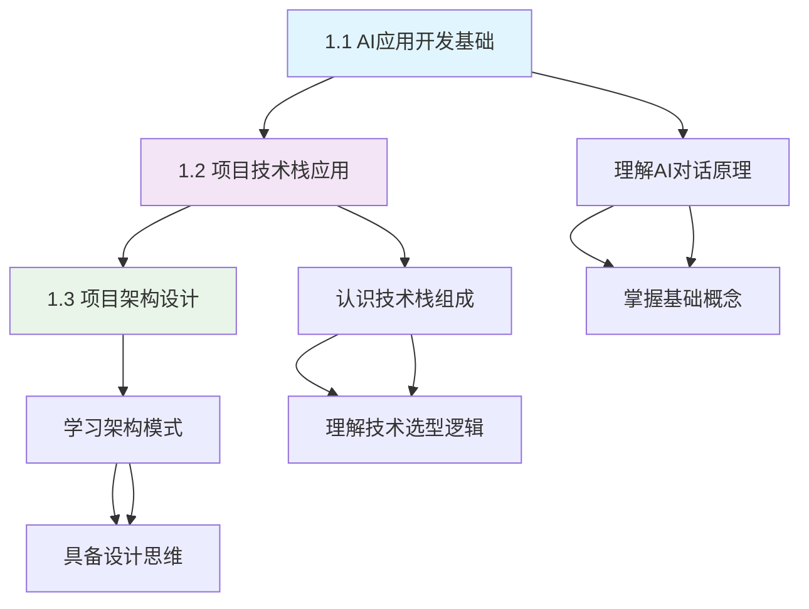
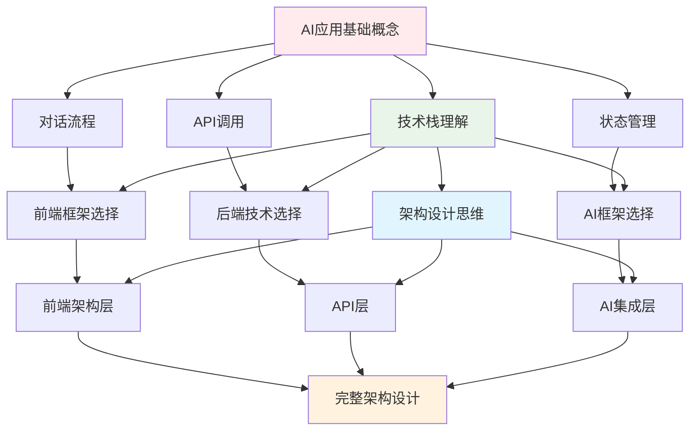

# 第1章：概念入门 🎯

> 零基础学员的AI应用开发启蒙之路

---

## 🎯 章节概述

欢迎来到LangGraph智能聊天应用开发教程的第一章！这一章是我们整个学习旅程的重要起点，将为您打开AI应用开发的大门。

### 章节核心价值和重要性

在这个AI技术飞速发展的时代，理解AI应用的本质和开发模式比学会使用某个具体工具更加重要。第1章的价值在于：

- **建立正确的AI应用认知**：从零开始理解什么是对话式AI应用，它的工作原理是什么
- **构建系统化技术视野**：掌握现代AI应用开发的完整技术栈和架构思维
- **奠定坚实理论基础**：为后续的实战开发提供必要的概念支撑和理论指导

### 与前后章节的连接关系

**承上启下的桥梁作用**：
- **为第2章做准备**：本章建立的概念认知将直接指导第2章的环境配置选择
- **为实战章节铺路**：第3-8章的所有实践都建立在本章建立的理论基础之上
- **整体课程的理论支柱**：本章内容将在整个课程中反复被引用和深化

### 学习完成后的能力提升

完成本章学习后，您将获得：

1. **概念理解能力**：能够清晰解释AI聊天应用的工作原理和技术架构
2. **技术选型判断力**：理解为什么选择这些技术栈，以及它们的优势
3. **架构设计思维**：具备分析和设计类似应用的基础思维能力
4. **学习方向感**：明确后续学习的重点和路径

---

## 📚 学习路径

### 章节内各小节的学习顺序

本章采用**概念递进式**的学习结构，从抽象到具体，从理论到应用：

### 每个小节的核心目标

#### 1.1 AI应用开发基础
**核心目标**：建立AI聊天应用的基础认知
- 理解对话式AI的工作机制
- 掌握大语言模型API的基本概念
- 认识AI应用的常见场景和价值

#### 1.2 项目技术栈应用
**核心目标**：全面了解项目技术选型
- 深入理解前端技术栈的作用和优势
- 认识后端技术的选择理由
- 掌握AI技术栈的核心概念

#### 1.3 项目架构设计
**核心目标**：建立系统架构思维
- 理解分层架构的设计原则
- 掌握各层之间的交互模式
- 具备架构分析和设计能力

### 章节内知识点的递进关系

1. **基础概念层**（1.1节）→ **技术实现层**（1.2节）→ **架构设计层**（1.3节）
2. **理论认知** → **技术理解** → **设计思维**
3. **是什么** → **用什么** → **怎么设计**

---

## 🛠️ 实践重点

虽然第1章以概念讲解为主，但仍然包含重要的实践思维培养：

### 本章节的主要实战项目

- **技术栈对比分析**：通过表格对比理解技术选型的优劣势
- **架构图绘制练习**：使用Mermaid语法绘制项目架构图
- **现有应用分析**：分析市面上聊天应用的用户体验和技术特点

### 需要掌握的核心技能

1. **概念理解技能**
   - AI应用工作流程分析
   - 技术栈组合逻辑理解
   - 架构模式识别能力

2. **分析思维技能**
   - 需求到技术的映射思维
   - 技术选型的判断标准
   - 系统设计的分层思维

3. **表达沟通技能**
   - 技术概念的清晰表达
   - 架构设计的可视化呈现
   - 技术选型的逻辑说明

### 重要的理论实现

- **对话式AI的交互模型**：用户输入 → API调用 → AI处理 → 流式返回
- **现代前端架构模式**：组件化 + 状态管理 + 路由系统
- **AI应用的技术栈融合**：前端框架 + AI框架 + 数据持久化

---

## 💡 学习建议

### 学习方法和注意事项

1. **理论联系实际**
   - 每学习一个概念，都要思考它在实际项目中的应用
   - 结合自己使用过的聊天应用来理解抽象概念
   - 主动寻找概念之间的联系和依赖关系

2. **多维度理解**
   - 从用户角度：理解功能和体验
   - 从开发角度：理解技术和实现
   - 从架构角度：理解设计和扩展

3. **知识体系构建**
   - 建立自己的概念地图
   - 记录重要的技术术语和定义
   - 整理技术栈之间的关系图

### 常见问题和解决方案

**Q1: 概念太抽象，难以理解怎么办？**
- A: 通过具体的应用场景来理解抽象概念，比如把AI聊天比作人与人的对话

**Q2: 技术栈太复杂，感觉overwhelming？**
- A: 不用一次性掌握所有细节，先理解每个技术的作用和位置即可

**Q3: 没有编程基础，能理解这些概念吗？**
- A: 本章专门为零基础学员设计，用生活化的比喻帮助理解技术概念

### 进阶学习方向

- **深入AI原理**：了解更多大语言模型的工作机制
- **扩展技术视野**：研究其他AI应用框架和工具
- **关注行业动态**：跟踪AI应用开发的最新趋势

---

## 📋 章节知识点总结

### 按小节整理的核心概念

#### 1.1 AI应用开发基础
- **对话式AI应用架构**：用户界面层、API调用层、状态管理层、数据存储层
- **大语言模型API使用**：API调用流程、输入输出格式、Token概念、参数配置
- **AI应用常见场景**：智能客服、内容创作、代码辅助、文档分析等

#### 1.2 项目技术栈应用
- **前端技术栈**：Next.js 15、React 19、TypeScript、Tailwind CSS
- **后端技术栈**：Next.js API Routes、SQLite + better-sqlite3
- **AI技术栈**：LangGraphJS、OpenAI API、状态管理、检查点持久化

#### 1.3 项目架构设计
- **项目架构模式**：前端层、API层、AI集成层、数据层
- **分层设计原则**：职责分离、接口清晰、可扩展性
- **技术栈集成**：各层技术的协作模式

### 重要API和方法

虽然本章主要讲概念，但涉及的重要概念包括：
- **OpenAI API调用模式**：认证、请求格式、响应处理
- **LangGraphJS核心概念**：StateGraph、MessagesAnnotation、检查点
- **Next.js架构特性**：App Router、API Routes、组件系统

### 关键配置和参数

- **AI模型参数**：temperature、max_tokens、top_p等
- **应用配置**：环境变量、数据库连接、API密钥管理
- **架构配置**：文件结构、路由设计、状态管理

---

## 🔗 知识点关联图

### 知识点之间的依赖关系

### 技术栈的集成方式

1. **前端到后端**：React组件 → Next.js API Routes
2. **后端到AI**：API Routes → LangGraphJS → OpenAI API
3. **数据流转**：用户输入 → 状态管理 → AI处理 → 流式响应

### 前后章节的连接点

- **连接第2章**：架构概念指导环境配置的选择
- **连接第3章**：前端概念为React实战提供理论基础
- **连接第5章**：AI集成概念为LangGraphJS使用做准备

---

## ✅ 学习检查清单

### 必须掌握的技能点

#### 概念理解检查
- [ ] 能够用自己的话解释什么是对话式AI应用
- [ ] 理解大语言模型API的基本工作流程
- [ ] 掌握前端、后端、AI技术栈的基本概念
- [ ] 理解分层架构的设计原则

#### 技术认知检查
- [ ] 知道为什么选择Next.js而不是其他前端框架
- [ ] 理解LangGraphJS相比直接调用OpenAI API的优势
- [ ] 掌握SQLite在这个项目中的作用和价值
- [ ] 理解TypeScript在现代Web开发中的重要性

#### 架构思维检查
- [ ] 能够画出项目的基本架构图
- [ ] 理解各层之间的数据流转方式
- [ ] 具备分析其他类似应用架构的能力

### 可以独立完成的任务

1. **分析任务**
   - [ ] 分析一个现有聊天应用的用户体验特点
   - [ ] 对比不同技术栈的优劣势
   - [ ] 绘制简单的应用架构图

2. **表达任务**
   - [ ] 向他人介绍AI聊天应用的工作原理
   - [ ] 解释项目技术选型的理由
   - [ ] 描述分层架构的设计思路

### 理论理解程度检查

#### 基础理解（必须达到）
- 知道AI聊天应用的基本工作流程
- 理解项目技术栈的组成部分
- 掌握分层架构的基本概念

#### 深入理解（期望达到）
- 理解技术选型背后的逻辑和考量
- 掌握各技术之间的协作关系
- 具备基础的架构分析能力

#### 应用理解（优秀标准）
- 能够设计类似应用的技术方案
- 理解不同场景下的技术选型差异
- 具备技术架构的评估和优化思维

---

## 🚀 下一步学习方向

### 为下一章节做准备

学完第1章后，您已经具备了：
- **理论基础**：清晰的AI应用开发概念
- **技术认知**：完整的技术栈理解
- **架构思维**：系统设计的基础能力

**第2章《环境准备》**将基于这些理论基础，指导您：
- 选择和配置合适的开发工具
- 建立高效的开发环境
- 初始化项目结构
- 配置必要的依赖和环境变量

### 扩展学习建议

1. **深入AI技术**
   - 了解Transformer架构的基本原理
   - 学习Prompt Engineering的基础技巧
   - 关注AI应用开发的最佳实践

2. **拓展技术视野**
   - 研究其他AI应用框架（如LangChain、Semantic Kernel）
   - 了解不同前端框架的特点（Vue.js、Angular）
   - 学习云服务平台的AI服务（AWS、Azure、阿里云）

3. **关注行业动态**
   - 跟踪大语言模型的最新发展
   - 了解AI应用的商业化趋势
   - 学习成功AI产品的设计理念

### 实践项目推荐

1. **概念实践**
   - 绘制更复杂的AI应用架构图
   - 分析不同行业的AI应用案例
   - 设计自己感兴趣的AI应用概念

2. **技术调研**
   - 对比不同AI框架的特点
   - 研究成功AI产品的技术栈
   - 了解开源AI项目的架构设计

---

## 🎊 章节总结

恭喜您完成了第1章的学习！这一章虽然以理论概念为主，但为您后续的学习打下了坚实的基础。

### 您已经掌握的核心能力

1. **AI应用认知**：深入理解对话式AI应用的本质和价值
2. **技术栈理解**：全面掌握现代AI应用开发的技术组合
3. **架构设计思维**：具备分析和设计系统架构的基础能力
4. **学习方向感**：明确了后续学习的重点和路径

### 学习成果的价值

- **理论基础扎实**：为后续实战开发提供了必要的概念支撑
- **技术视野开阔**：建立了现代AI应用开发的完整认知框架
- **思维模式转换**：从用户思维转向开发者思维，具备了技术分析能力

### 激励继续学习

第1章的学习证明了您具备理解复杂技术概念的能力。接下来的第2章《环境准备》将把这些理论概念转化为实际的开发环境，让您真正开始AI应用开发的实践之旅。

记住：**概念的理解是实践的基础，而实践又会加深对概念的理解**。第1章为您提供了地图，第2章开始将带您走上真正的开发道路！

继续保持学习的热情，精彩的编程实战就在前方等着您！🚀

---

> **学习提示**：建议在开始第2章之前，回顾一下本章的核心概念，确保对AI应用开发有清晰的整体认知。这将让您在后续的环境配置和代码实战中更加游刃有余。
