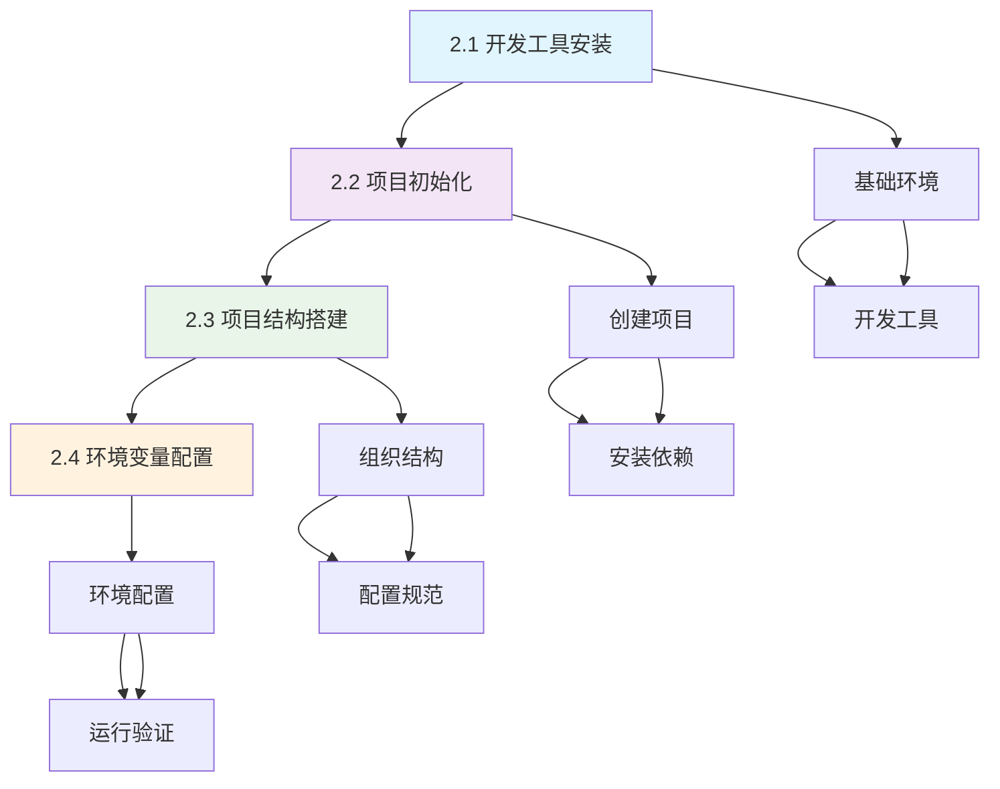
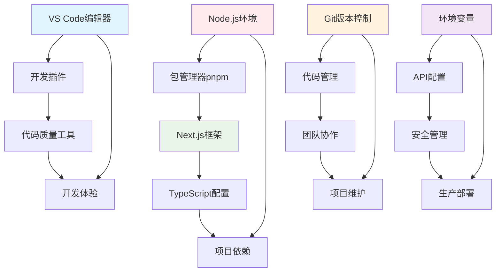

# 第2章：环境准备 ⚙️

> 从理论到实践的完美起步

---

## 🎯 章节概述

欢迎来到第二章！经过第一章的理论学习，你已经建立了AI应用开发的完整认知框架。现在我们要将这些理论知识转化为实际的开发能力，而环境准备就是我们实践之旅的第一步。

### 章节核心价值和重要性

想象一下，你现在就像一位拥有完整建筑设计图的建筑师，接下来需要准备工具、材料和工地，才能开始建造你的AI应用"大厦"。环境准备的价值在于：

- **奠定实践基础**：建立稳定可靠的开发环境
- **提升开发效率**：配置高效的工作流和工具链
- **保证项目质量**：建立标准化的开发规范
- **降低学习门槛**：一次配置，持续受益

没有好的开发环境，就像没有合适工具的工匠，即使有再好的技能也难以发挥。

### 与前后章节的连接关系

**承接第一章的理论基础**：
- 第一章让你明白了"要做什么"和"用什么做"
- 第二章将帮你准备"做事的工具和环境"
- 理论指导实践，让环境配置有的放矢

**为后续章节铺路**：
- 第3-4章的前后端开发需要完整的开发环境
- 第5-8章的AI集成和优化依赖稳定的技术基础
- 一次性配置好环境，后续开发一路绿灯

**学习方式的重要转变**：
```
第一章：理解概念 → 建立认知 → 培养思维
第二章：动手配置 → 解决问题 → 建立环境
第三章开始：编写代码 → 实现功能 → 完成项目
```

### 学习完成后的能力提升

完成本章学习后，你将获得：

1. **环境配置能力**：能够独立搭建现代JavaScript开发环境
2. **工具链掌握**：熟练使用包管理器、代码编辑器、版本控制等工具
3. **项目管理能力**：理解项目结构设计和最佳实践
4. **问题解决技能**：具备解决环境配置问题的基本能力
5. **开发流程建立**：形成高效的代码开发工作流

---

## 📚 学习路径

### 章节内各小节的学习顺序

本章采用**渐进式实践**的学习结构，从基础工具到完整项目：



### 每个小节的核心目标

#### 2.1 开发工具安装
**核心目标**：建立完整的开发环境基础
- 安装和配置Node.js环境
- 设置现代化的代码编辑器
- 配置版本控制系统
- 建立高效的开发工具链

#### 2.2 项目初始化
**核心目标**：创建标准化的项目基础
- 使用Next.js创建项目骨架
- 安装AI应用开发的核心依赖
- 配置TypeScript和构建工具
- 验证项目基础功能

#### 2.3 项目结构搭建
**核心目标**：建立清晰的代码组织结构
- 设计符合架构的目录结构
- 创建基础的代码文件和模块
- 建立开发规范和约定
- 配置代码质量工具

#### 2.4 环境变量配置
**核心目标**：配置安全的运行环境
- 设置AI服务的API密钥
- 配置开发和生产环境变量
- 建立环境安全最佳实践
- 验证完整的运行环境

### 章节内知识点的递进关系

1. **基础设施层**（2.1节）→ **项目骨架层**（2.2节）→ **代码组织层**（2.3节）→ **运行配置层**（2.4节）
2. **工具准备** → **项目创建** → **结构设计** → **环境配置**
3. **搭建基础** → **验证功能** → **规范代码** → **准备运行**

---

## 🛠️ 实践重点

第二章是我们从理论走向实践的关键转折点，每一个配置都是为了后续的开发服务。

### 本章节的主要实战项目

- **完整开发环境搭建**：从零开始建立现代JavaScript开发环境
- **AI聊天应用项目创建**：基于Next.js的项目初始化和配置
- **标准化代码结构建立**：符合最佳实践的目录组织和文件创建
- **生产级环境配置**：安全可靠的环境变量和运行时配置

### 需要掌握的核心技能

1. **环境配置技能**
   - Node.js版本管理和包管理器使用
   - 代码编辑器的高效配置和插件使用
   - Git版本控制的基础操作和最佳实践
   - 命令行工具的熟练使用

2. **项目管理技能**
   - 现代JavaScript项目的创建和初始化
   - 依赖管理和版本控制策略
   - 项目结构设计和代码组织原则
   - 开发规范和团队协作约定

3. **问题解决技能**
   - 常见环境问题的诊断和解决
   - 依赖冲突的识别和处理
   - 配置错误的调试和修复
   - 开发环境的优化和维护

### 重要的实践要点

- **版本一致性**：确保所有工具和依赖使用兼容的版本
- **安全性考虑**：正确处理API密钥和敏感信息
- **跨平台兼容**：考虑Windows、macOS、Linux的差异
- **团队协作**：建立统一的开发环境和规范

---

## 💡 学习建议

### 学习方法和注意事项

1. **循序渐进的实践方法**
   - 严格按照步骤顺序进行配置
   - 每完成一个步骤都要验证结果
   - 遇到问题及时查阅文档和寻求帮助
   - 记录配置过程中的重要信息

2. **系统性的环境管理**
   - 建立清晰的文件和目录组织
   - 使用版本控制跟踪所有变更
   - 定期备份重要的配置文件
   - 维护一份环境配置清单

3. **实用性的技能培养**
   - 重点关注开发效率的提升
   - 学习快捷键和自动化工具使用
   - 培养良好的代码习惯和规范
   - 建立持续学习和改进的意识

### 常见问题和解决方案

**Q1: 安装Node.js时遇到权限问题怎么办？**
- A: 推荐使用版本管理工具（如nvm），避免直接安装到系统目录

**Q2: 包安装失败或很慢怎么解决？**
- A: 配置国内镜像源，使用pnpm替代npm，检查网络连接

**Q3: VS Code插件太多导致卡顿怎么办？**
- A: 只安装必要插件，定期清理，使用工作区配置

**Q4: Git配置和使用遇到困难怎么办？**
- A: 先掌握基础命令，使用图形化工具辅助，建立良好的提交习惯

### 进阶学习方向

- **开发工具深度使用**：掌握更多VS Code高级功能和插件
- **自动化脚本编写**：学习编写自动化配置和部署脚本
- **容器化开发环境**：了解Docker在开发环境中的应用
- **CI/CD流程建立**：学习持续集成和部署的最佳实践

---

## 📋 章节知识点总结

### 按小节整理的核心概念

#### 2.1 开发工具安装
- **Node.js环境管理**：版本选择、安装方法、环境变量配置
- **包管理器对比**：npm vs pnpm的特点和选择理由
- **VS Code配置**：插件推荐、设置优化、工作区管理
- **Git版本控制**：安装配置、SSH密钥、基础操作

#### 2.2 项目初始化
- **Next.js项目创建**：create-next-app命令和选项
- **核心依赖安装**：LangGraphJS、OpenAI、数据库相关包
- **TypeScript配置**：tsconfig.json设置和类型定义
- **项目验证**：开发服务器启动和基础功能测试

#### 2.3 项目结构搭建
- **目录结构设计**：基于架构的文件组织原则
- **代码规范配置**：ESLint、Prettier、编辑器配置
- **模块创建**：基础文件和目录的创建
- **工作流建立**：开发、构建、测试的标准流程

#### 2.4 环境变量配置
- **API密钥管理**：OpenAI API Key的获取和配置
- **环境文件设置**：.env文件的创建和使用
- **安全最佳实践**：敏感信息的保护和管理
- **环境验证**：完整配置的测试和验证

### 重要工具和配置

#### 核心开发工具
- **Node.js 18+**：现代JavaScript运行时环境
- **pnpm**：高效的包管理器，速度快、节省空间
- **VS Code**：功能强大的代码编辑器
- **Git**：分布式版本控制系统

#### 项目依赖清单
```json
{
  "dependencies": {
    "@langchain/langgraph": "^0.0.x",
    "@langchain/core": "^0.1.x", 
    "@langchain/openai": "^0.0.x",
    "@langchain/langgraph-checkpoint-sqlite": "^0.0.x",
    "better-sqlite3": "^8.x.x",
    "uuid": "^9.x.x",
    "dotenv": "^16.x.x"
  },
  "devDependencies": {
    "@types/better-sqlite3": "^7.x.x",
    "@types/uuid": "^9.x.x"
  }
}
```

#### 关键配置文件
- **package.json**：项目信息和依赖管理
- **tsconfig.json**：TypeScript编译配置
- **.env.local**：本地环境变量配置
- **next.config.ts**：Next.js框架配置

---

## 🔗 知识点关联图

### 工具和技术的依赖关系



### 开发流程的工作链

1. **环境搭建**：Node.js + pnpm + VS Code + Git
2. **项目创建**：Next.js + TypeScript + 依赖安装
3. **结构设计**：目录创建 + 文件组织 + 规范配置
4. **环境配置**：API密钥 + 环境变量 + 安全设置
5. **验证运行**：开发服务器 + 功能测试 + 问题修复

### 前后章节的连接点

- **连接第1章**：理论指导实践，架构决定结构
- **连接第3章**：环境为前端开发提供基础支撑
- **连接第5章**：环境配置为AI集成做好准备

---

## ✅ 学习检查清单

### 必须掌握的技能点

#### 环境配置检查
- [ ] 成功安装Node.js 18+版本
- [ ] 配置并能正常使用pnpm包管理器
- [ ] VS Code已安装推荐插件并正常工作
- [ ] Git已配置用户信息和SSH密钥

#### 项目创建检查
- [ ] 能够使用create-next-app创建项目
- [ ] 成功安装所有AI应用开发依赖
- [ ] TypeScript配置正确且编译通过
- [ ] 开发服务器能够正常启动

#### 结构设计检查
- [ ] 项目目录结构清晰且符合最佳实践
- [ ] 代码规范工具配置正确
- [ ] 基础文件和模块创建完成
- [ ] 工作流程建立且运行顺畅

#### 环境配置检查
- [ ] OpenAI API密钥正确配置
- [ ] 环境变量文件设置完整
- [ ] 安全措施配置到位
- [ ] 完整环境验证通过

### 可以独立完成的任务

1. **环境搭建任务**
   - [ ] 在新机器上完整搭建开发环境
   - [ ] 解决常见的环境配置问题
   - [ ] 优化开发工具的使用效率

2. **项目管理任务**
   - [ ] 创建新的Next.js AI应用项目
   - [ ] 管理项目依赖和版本更新
   - [ ] 建立代码质量保证机制

3. **协作准备任务**
   - [ ] 制作环境配置文档和指南
   - [ ] 建立团队开发规范
   - [ ] 配置项目的持续集成环境

### 实践能力检验

#### 基础实践能力（必须达到）
- 能够独立搭建完整的开发环境
- 能够创建和配置AI应用项目
- 能够解决常见的环境配置问题

#### 进阶实践能力（建议达到）
- 能够优化开发环境的性能和效率
- 能够建立标准化的项目模板
- 能够指导他人进行环境配置

#### 专业实践能力（优秀标准）
- 能够设计和实施团队开发标准
- 能够自动化环境配置和部署流程
- 能够解决复杂的环境兼容性问题

---

## 🚀 下一步学习方向

### 为下一章节做准备

学完第2章后，你将拥有：
- **完整的开发环境**：支持现代AI应用开发的所有工具
- **标准化的项目基础**：符合最佳实践的代码结构
- **安全的运行配置**：可以正常运行AI应用的环境设置
- **高效的工作流程**：提升开发效率的工具链

**第3章《前端基础》**将基于这个环境开始真正的代码开发：
- 使用React创建用户界面组件
- 实现聊天应用的基础交互功能
- 应用TypeScript进行类型安全开发
- 使用Tailwind CSS构建现代化UI

### 扩展学习建议

1. **开发环境优化**
   - 学习更多VS Code的高级功能和插件
   - 了解性能监控和调试工具的使用
   - 掌握自动化脚本编写和任务管理

2. **项目管理进阶**
   - 学习Monorepo管理和工作区配置
   - 了解依赖安全扫描和更新策略
   - 掌握代码质量度量和改进方法

3. **DevOps基础**
   - 学习容器化开发环境的搭建
   - 了解CI/CD流水线的设计和实施
   - 掌握自动化测试和部署的最佳实践

### 实践项目推荐

1. **环境标准化项目**
   - 创建可重复使用的环境配置脚本
   - 建立团队开发环境的标准模板
   - 制作环境问题的诊断和修复工具

2. **开发效率提升项目**
   - 配置个性化的开发工具链
   - 建立自动化的代码生成和模板
   - 优化构建和热重载的性能

---

## 🎊 章节总结

恭喜你即将开始第二章的学习！这一章将是你从理论走向实践的重要转折点。

### 你将要获得的核心能力

1. **专业的开发环境**：像真正的开发者一样工作
2. **标准化的项目基础**：为AI应用开发打下坚实基础
3. **高效的工作流程**：提升开发效率和代码质量
4. **实用的问题解决技能**：独立解决环境和配置问题

### 学习成果的价值

- **立即可用的技能**：环境配置是所有开发工作的基础
- **长期受益的投资**：一次配置，终身受用
- **团队协作的基础**：标准化环境是团队协作的前提
- **职业发展的助力**：专业的开发环境是开发者的基本素养

### 激励继续学习

从这一章开始，你将真正体验到开发者的工作方式。每一个成功的配置，每一次顺利的运行，都会让你更加接近成为专业AI应用开发者的目标。

记住：**工欲善其事，必先利其器**。一个高效的开发环境将成为你编程路上最好的伙伴！

准备好开始这段激动人心的实践之旅了吗？让我们一起动手搭建你的AI应用开发环境！🚀

---

> **学习提示**：第二章需要大量的动手操作，建议准备充足的时间，耐心完成每一个配置步骤。遇到问题是正常的，重要的是学会查找资料和解决问题的方法。
