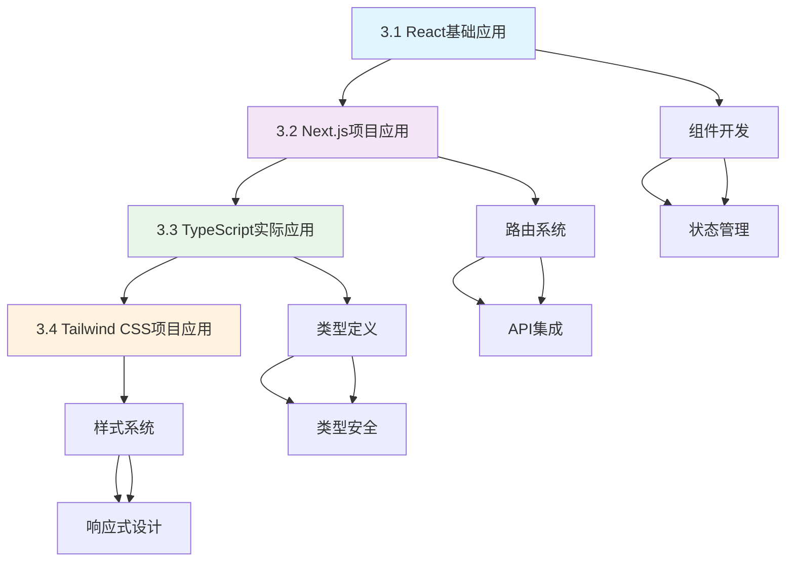
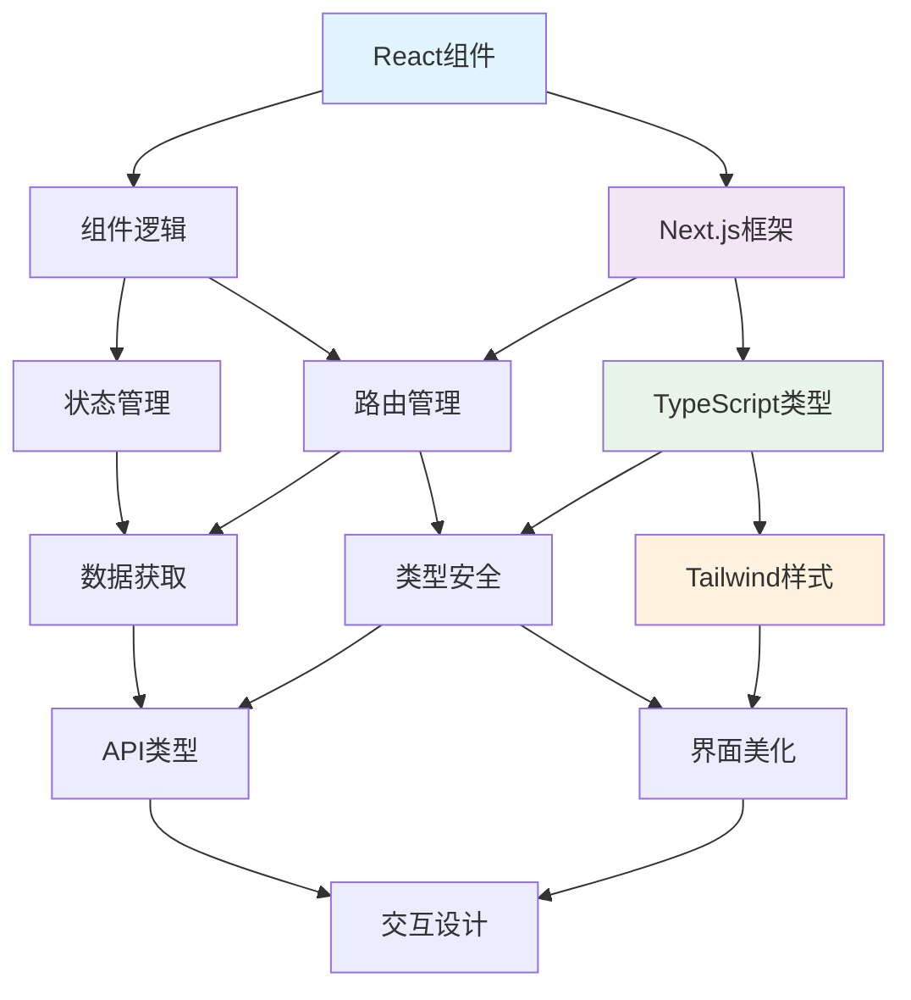

# 第3章：前端基础 ⚛️

> 构建现代化AI聊天应用的用户界面

---

## 🎯 章节概述

欢迎来到激动人心的第三章！经过第二章的环境准备，你已经拥有了完整的开发基础设施。现在我们要开始真正的代码开发，创建一个美观、交互流畅的AI聊天应用界面。

### 章节核心价值和重要性

如果说第二章是在搭建"工厂"，那么第三章就是开始"生产产品"。我们要用React、TypeScript和Tailwind CSS这些现代化的前端技术，创建一个不仅功能强大，而且用户体验出色的聊天界面。

这一章的价值在于：
- **视觉化呈现AI能力**：让AI的智能通过精美的界面展现给用户
- **掌握现代前端开发**：学习React 19、TypeScript、Tailwind CSS的实际应用
- **建立组件化思维**：培养可重用、可维护的前端开发理念
- **实现流畅用户体验**：通过优秀的交互设计提升应用的使用感受

### 与前后章节的连接关系

**承接第二章的环境基础**：
- 利用配置好的开发工具链进行高效开发
- 基于建立的项目架构进行组件开发
- 使用配置好的AI环境进行功能集成

**为后续章节奠定基础**：
- 第4章的后端开发将为这些前端组件提供数据和API支持
- 第5章的AI集成将让这些界面真正具备智能对话能力
- 第6-8章的功能完善将在这个界面基础上进行

**学习深度的递进**：
```
第2章：工具和环境 → 基础设施准备
第3章：前端界面 → 用户体验构建
第4章：后端逻辑 → 服务功能实现
第5章：AI集成 → 智能能力注入
```

### 学习完成后的能力提升

完成本章学习后，你将获得：

1. **React现代化开发能力**：掌握React 19的核心特性和最佳实践
2. **TypeScript类型安全开发**：在前端项目中熟练运用类型系统
3. **响应式UI设计能力**：使用Tailwind CSS创建适配各种设备的界面
4. **组件化开发思维**：建立可重用、可维护的前端代码架构
5. **用户体验设计意识**：理解并实现优秀的交互体验

---

## 📚 学习路径

### 章节内各小节的学习顺序

本章采用**渐进式实战**的学习结构，从基础组件到完整应用：



### 每个小节的核心目标

#### 3.1 React基础应用
**核心目标**：掌握React在AI应用中的实际运用
- 创建聊天相关的React组件
- 实现状态管理和用户交互
- 掌握React Hooks的实际应用
- 建立组件化开发的思维模式

#### 3.2 Next.js项目应用
**核心目标**：深度应用Next.js框架特性
- 理解并应用App Router架构
- 实现客户端和服务端组件的合理使用
- 集成API Routes进行前后端通信
- 优化应用性能和用户体验

#### 3.3 TypeScript实际应用
**核心目标**：在前端开发中实现类型安全
- 为React组件定义完整的类型系统
- 实现API调用的类型安全
- 掌握TypeScript在实际项目中的最佳实践
- 提升代码质量和开发效率

#### 3.4 Tailwind CSS项目应用
**核心目标**：构建现代化的用户界面
- 设计并实现聊天应用的完整UI
- 创建响应式和适配性强的界面
- 掌握现代CSS设计模式和技巧
- 建立一致的设计系统和组件库

### 章节内知识点的递进关系

1. **组件基础**（3.1节）→ **框架应用**（3.2节）→ **类型安全**（3.3节）→ **界面美化**（3.4节）
2. **功能实现** → **架构优化** → **代码质量** → **用户体验**
3. **能用** → **好用** → **安全** → **美观**

---

## 🛠️ 实践重点

第三章是我们真正开始编写应用代码的阶段，每一行代码都将直接影响用户的使用体验。

### 本章节的主要实战项目

- **聊天界面组件库**：从基础UI组件到复杂聊天组件的完整实现
- **响应式聊天应用**：适配桌面和移动设备的完整聊天界面
- **实时交互系统**：消息发送、接收、显示的完整交互流程
- **类型安全的前端架构**：完整的TypeScript类型定义和使用

### 需要掌握的核心技能

1. **React开发技能**
   - 函数组件和Hook的熟练使用
   - 状态管理和副作用处理
   - 组件通信和数据传递
   - 性能优化和最佳实践

2. **Next.js框架技能**
   - App Router的路由管理
   - 服务端和客户端组件的选择
   - API集成和数据获取
   - 构建优化和部署准备

3. **TypeScript应用技能**
   - 组件Props和State的类型定义
   - 事件处理和回调的类型安全
   - API接口的类型约束
   - 泛型和高级类型的实际应用

4. **UI设计和实现技能**
   - Tailwind CSS的高效使用
   - 响应式设计的实现方法
   - 现代UI模式和交互设计
   - 可访问性和用户体验优化

### 重要的开发实践

- **组件化设计**：创建可重用、可测试的React组件
- **状态管理**：合理使用useState、useEffect等Hook
- **性能优化**：使用React.memo、useMemo等优化技术
- **类型安全**：全面的TypeScript类型定义和检查
- **代码质量**：遵循最佳实践和代码规范

---

## 💡 学习建议

### 学习方法和注意事项

1. **理论与实践结合**
   - 每学习一个概念都要动手实现
   - 通过编写代码来加深理解
   - 不断调试和改进代码质量
   - 培养解决实际问题的能力

2. **渐进式学习方式**
   - 从简单组件开始，逐步增加复杂度
   - 先实现基础功能，再优化用户体验
   - 重视代码的可读性和可维护性
   - 建立良好的编程习惯和思维模式

3. **用户体验导向**
   - 时刻从用户角度思考界面设计
   - 注重交互的流畅性和直观性
   - 考虑不同设备和场景的使用需求
   - 追求简洁而不失功能的设计理念

### 常见问题和解决方案

**Q1: React组件应该如何组织和拆分？**
- A: 遵循单一职责原则，一个组件只负责一个功能；根据复用性决定组件粒度

**Q2: TypeScript在前端开发中如何平衡类型安全和开发效率？**
- A: 重点为接口和数据流定义类型，内部实现可以适当放宽；使用类型推断减少冗余

**Q3: 如何处理组件之间的状态共享？**
- A: 优先使用props传递；复杂状态考虑状态提升；全局状态可使用Context或状态管理库

**Q4: Tailwind CSS如何保持样式的一致性？**
- A: 建立设计系统；使用配置文件定义主题；创建可重用的样式组件

### 进阶学习方向

- **React进阶模式**：高阶组件、Render Props、自定义Hook等
- **性能优化技术**：代码分割、懒加载、缓存策略等
- **状态管理进阶**：Redux、Zustand等状态管理库
- **测试驱动开发**：单元测试、集成测试、端到端测试

---

## 📋 章节知识点总结

### 按小节整理的核心概念

#### 3.1 React基础应用
- **组件开发模式**：函数组件、JSX语法、组件拆分原则
- **状态管理系统**：useState、useEffect、useRef等Hook的应用
- **事件处理机制**：用户交互、表单处理、键盘事件等
- **组件通信方式**：Props传递、回调函数、Context使用

#### 3.2 Next.js项目应用
- **App Router架构**：页面组织、路由管理、布局系统
- **渲染策略选择**：服务端组件vs客户端组件的应用场景
- **API集成方法**：数据获取、错误处理、加载状态管理
- **性能优化技术**：代码分割、预加载、缓存策略

#### 3.3 TypeScript实际应用
- **类型系统设计**：接口定义、泛型使用、类型推断
- **组件类型安全**：Props类型、事件类型、Ref类型
- **API类型约束**：请求响应类型、错误类型、状态类型
- **开发效率提升**：类型检查、智能提示、重构安全

#### 3.4 Tailwind CSS项目应用
- **样式系统设计**：原子化CSS、设计令牌、主题配置
- **响应式布局**：断点系统、移动优先、自适应设计
- **组件样式化**：变体系统、条件样式、动态样式
- **用户界面优化**：可访问性、交互反馈、视觉层次

### 重要技术和方法

#### React开发最佳实践
- **组件设计原则**：单一职责、可重用性、可测试性
- **Hook使用规范**：依赖数组、清理机制、性能优化
- **状态管理策略**：本地状态vs全局状态、状态提升、状态派生
- **错误边界处理**：错误捕获、用户友好提示、优雅降级

#### TypeScript应用技巧
- **类型定义策略**：接口vs类型别名、泛型约束、条件类型
- **类型安全实践**：严格模式、类型断言、类型守卫
- **开发工具集成**：编辑器支持、类型检查、自动补全
- **团队协作标准**：类型文档、命名约定、代码审查

### 项目开发里程碑

#### 第一阶段：基础组件（3.1-3.2）
- [ ] 创建基础UI组件（Button、Input、Modal等）
- [ ] 实现聊天相关组件（MessageList、MessageInput等）
- [ ] 建立组件库和设计系统
- [ ] 完成基础的路由和页面结构

#### 第二阶段：功能完善（3.3-3.4）
- [ ] 添加完整的TypeScript类型定义
- [ ] 实现响应式设计和移动端适配
- [ ] 优化用户交互和体验细节
- [ ] 建立可维护的样式系统

#### 第三阶段：质量提升
- [ ] 代码质量检查和优化
- [ ] 性能测试和优化
- [ ] 可访问性改进
- [ ] 用户体验测试和改进

---

## 🔗 知识点关联图

### 技术栈集成关系



### 前后端交互流程

1. **用户交互**：React组件处理用户输入和事件
2. **状态管理**：管理应用状态和数据流
3. **API调用**：通过Next.js API Routes与后端通信
4. **类型安全**：TypeScript保证数据传输的类型正确性
5. **界面更新**：根据数据变化更新UI显示

### 前后章节的连接点

- **连接第2章**：使用配置好的开发环境和项目结构
- **连接第4章**：为后端API提供前端接口和交互
- **连接第5章**：为AI功能提供用户界面和交互入口

---

## ✅ 学习检查清单

### 必须掌握的技能点

#### React开发能力
- [ ] 能够创建和使用函数组件
- [ ] 熟练使用useState、useEffect等基础Hook
- [ ] 理解组件通信和数据传递方式
- [ ] 掌握事件处理和表单管理

#### Next.js应用能力
- [ ] 理解App Router的工作原理
- [ ] 能够创建页面和布局组件
- [ ] 掌握服务端和客户端组件的使用场景
- [ ] 能够集成API Routes进行数据交互

#### TypeScript开发能力
- [ ] 能够为React组件定义类型
- [ ] 理解接口和类型别名的使用
- [ ] 掌握泛型和高级类型的应用
- [ ] 能够进行类型安全的API调用

#### UI设计和实现能力
- [ ] 熟练使用Tailwind CSS进行样式开发
- [ ] 能够实现响应式设计和移动端适配
- [ ] 理解现代UI设计原则和模式
- [ ] 能够创建一致的设计系统

### 可以独立完成的任务

1. **组件开发任务**
   - [ ] 创建完整的聊天界面组件库
   - [ ] 实现可重用的基础UI组件
   - [ ] 建立组件的文档和使用示例

2. **功能实现任务**
   - [ ] 实现完整的聊天交互流程
   - [ ] 添加加载状态和错误处理
   - [ ] 优化用户体验和交互细节

3. **质量保证任务**
   - [ ] 进行代码质量检查和优化
   - [ ] 实现类型安全的开发流程
   - [ ] 建立可维护的代码架构

### 实践能力检验

#### 基础实践能力（必须达到）
- 能够独立创建React组件和页面
- 能够使用TypeScript进行类型安全开发
- 能够使用Tailwind CSS实现基础UI设计
- 能够理解和应用Next.js的基本特性

#### 进阶实践能力（建议达到）
- 能够设计和实现复杂的组件交互
- 能够优化应用性能和用户体验
- 能够建立可维护的代码架构
- 能够解决复杂的前端开发问题

#### 专业实践能力（优秀标准）
- 能够设计和实现企业级的前端架构
- 能够建立完整的设计系统和组件库
- 能够指导团队进行前端开发
- 能够持续改进和优化开发流程

---

## 🚀 下一步学习方向

### 为下一章节做准备

学完第3章后，你将拥有：
- **完整的前端界面**：美观而功能完整的聊天应用界面
- **现代化的组件库**：可重用、可维护的React组件集合
- **类型安全的代码架构**：TypeScript保证的代码质量
- **优秀的用户体验**：响应式、交互流畅的界面设计

**第4章《后端基础》**将为这些前端组件提供数据和功能支持：
- 设计和实现RESTful API接口
- 建立数据库模型和数据访问层
- 实现业务逻辑和服务层
- 为AI集成做好后端准备

### 扩展学习建议

1. **React生态深入**
   - 学习React DevTools的高级使用
   - 了解React 19的最新特性和改进
   - 研究React性能优化的高级技术

2. **TypeScript进阶**
   - 掌握高级类型系统和类型操作
   - 学习TypeScript编译器的配置和优化
   - 了解TypeScript在大型项目中的最佳实践

3. **UI/UX设计提升**
   - 学习现代UI设计原则和趋势
   - 掌握可访问性设计的要求和实现
   - 了解用户体验设计的方法和工具

### 实践项目推荐

1. **组件库开发**
   - 基于当前项目抽取通用组件库
   - 添加文档和示例页面
   - 发布为npm包供他人使用

2. **设计系统建立**
   - 建立完整的设计令牌系统
   - 创建设计规范和使用指南
   - 实现主题切换和定制功能

---

## 🎊 章节总结

恭喜你即将开始第三章的学习！这将是一段充满创造力和成就感的旅程。

### 你将要获得的核心能力

1. **现代前端开发技能**：掌握React、Next.js、TypeScript的实际应用
2. **用户界面设计能力**：创建美观、易用的聊天应用界面  
3. **组件化开发思维**：建立可重用、可维护的前端架构
4. **类型安全开发习惯**：在前端开发中应用类型安全的最佳实践

### 学习成果的价值

- **立即可见的成果**：每一个组件的创建都会在浏览器中看到效果
- **实用的开发技能**：掌握目前最流行的前端技术栈
- **职业发展助力**：前端开发技能在就业市场上非常受欢迎
- **创造力的体现**：通过代码创造出美观而实用的用户界面

### 激励继续学习

前端开发是最容易看到成果、最能激发创造力的编程领域之一。每一行CSS代码、每一个React组件都会直接影响用户的视觉体验和使用感受。

准备好开始这段精彩的前端开发之旅了吗？让我们一起用代码创造出令人惊艳的AI聊天应用界面！🚀

---

> **学习提示**：前端开发需要大量的实践和调试，建议保持充足的耐心和好奇心。每当你看到界面按照预期显示时，那种成就感将是对你努力的最好回报。记住，优秀的用户界面是优秀产品的重要组成部分！
