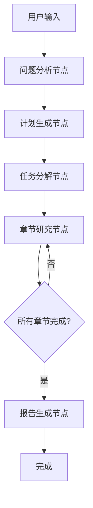

# DeepResearch Agent - LangGraphJS 实现方案

## 1. 架构概述

基于 LangGraphJS 的 DeepResearch Agent 采用状态图（StateGraph）架构，通过定义节点（Node）和边（Edge）来实现复杂的研究工作流。

### 1.1 核心架构



### 1.2 状态定义

```typescript
interface ResearchState {
  // 用户输入
  question: string;
  sessionId: string;
  userId: string;

  // 分析结果
  analysis?: QuestionAnalysis;

  // 研究计划
  plan?: ResearchPlan;

  // 任务列表
  tasks: ResearchTask[];
  currentTaskIndex: number;

  // 执行结果
  searchResults: SearchResult[];
  analysisResults: AnalysisResult[];
  generatedContent: ContentSection[];

  // 最终输出
  finalReport?: string;
  generatedFiles: GeneratedFile[];

  // 状态控制
  status:
    | 'analyzing'
    | 'planning'
    | 'executing'
    | 'generating'
    | 'completed'
    | 'error';
  progress: number;
  error?: string;

  // 消息历史
  messages: BaseMessage[];
}
```

## 2. LangGraphJS 实现

### 2.1 状态图定义

```typescript
import { StateGraph, Annotation } from '@langchain/langgraph';
import { BaseMessage } from '@langchain/core/messages';

// 定义状态注解
const ResearchStateAnnotation = Annotation.Root({
  question: Annotation<string>,
  sessionId: Annotation<string>,
  userId: Annotation<string>,
  analysis: Annotation<QuestionAnalysis | undefined>,
  plan: Annotation<ResearchPlan | undefined>,
  tasks: Annotation<ResearchTask[]>,
  currentTaskIndex: Annotation<number>,
  searchResults: Annotation<SearchResult[]>,
  analysisResults: Annotation<AnalysisResult[]>,
  generatedContent: Annotation<ContentSection[]>,
  finalReport: Annotation<string | undefined>,
  generatedFiles: Annotation<GeneratedFile[]>,
  status: Annotation<ResearchStatus>,
  progress: Annotation<number>,
  error: Annotation<string | undefined>,
  messages: Annotation<BaseMessage[]>,
});

type ResearchState = typeof ResearchStateAnnotation.State;
```

### 2.2 节点实现

#### 2.2.1 问题分析节点

```typescript
async function analyzeQuestionNode(
  state: ResearchState
): Promise<Partial<ResearchState>> {
  const { question, messages } = state;

  const analysisPrompt = `
  请分析以下研究问题：${question}
  
  请提供：
  1. 问题的核心主题和关键词
  2. 研究复杂度评估
  3. 预估研究时间
  4. 主要研究方向
  5. 所需信息来源类型
  
  以JSON格式返回结果。
  `;

  const llm = new ChatOpenAI({ model: 'gpt-4' });
  const response = await llm.invoke([
    ...messages,
    new HumanMessage(analysisPrompt),
  ]);

  try {
    const analysis = JSON.parse(response.content as string);

    return {
      analysis,
      status: 'planning',
      progress: 20,
      messages: [...messages, new HumanMessage(analysisPrompt), response],
    };
  } catch (error) {
    return {
      status: 'error',
      error: `问题分析失败: ${error.message}`,
      messages: [...messages, new HumanMessage(analysisPrompt), response],
    };
  }
}
```

#### 2.2.2 计划生成节点

```typescript
async function generatePlanNode(
  state: ResearchState
): Promise<Partial<ResearchState>> {
  const { question, analysis, messages } = state;

  const planPrompt = `
  基于问题分析结果，制定详细的研究计划：
  
  问题：${question}
  分析：${JSON.stringify(analysis, null, 2)}
  
  请生成包含以下内容的研究计划：
  1. 研究目标
  2. 研究方法
  3. 内容结构（章节安排）
  4. 预期成果
  
  以JSON格式返回。
  `;

  const llm = new ChatOpenAI({ model: 'gpt-4' });
  const response = await llm.invoke([
    ...messages,
    new HumanMessage(planPrompt),
  ]);

  try {
    const plan = JSON.parse(response.content as string);

    return {
      plan,
      status: 'executing',
      progress: 30,
      messages: [...messages, new HumanMessage(planPrompt), response],
    };
  } catch (error) {
    return {
      status: 'error',
      error: `计划生成失败: ${error.message}`,
      messages: [...messages, new HumanMessage(planPrompt), response],
    };
  }
}
```

#### 2.2.3 章节研究节点

```typescript
async function researchSectionNode(
  state: ResearchState
): Promise<Partial<ResearchState>> {
  const { plan, generatedContent } = state;

  if (!plan || !plan.sections) {
    return {
      status: 'error',
      error: '缺少研究计划或章节信息',
    };
  }

  // 找到下一个需要研究的章节
  const completedSections = generatedContent.map((c) => c.sectionIndex);
  const nextSectionIndex = plan.sections.findIndex(
    (_, index) => !completedSections.includes(index)
  );

  if (nextSectionIndex === -1) {
    // 所有章节都已完成
    return {
      status: 'generating',
      progress: 80,
    };
  }

  const section = plan.sections[nextSectionIndex];
  const { sessionId } = state;

  // 创建统一的研究 Agent，集成搜索、分析、内容生成功能
  const researchAgent = createSectionResearchAgent();

  const researchInput = {
    messages: [
      {
        role: 'user',
        content: `请完成"${section.title}"章节的完整研究，包括信息搜索、深度分析和内容生成：

章节标题：${section.title}
章节描述：${section.description}
章节优先级：${section.priority}

请按以下步骤完成研究：

1. **信息搜索阶段**：
   - 使用多个搜索查询获取相关信息
   - 搜索权威来源、学术资料、官方文档
   - 重点关注：核心概念、发展历史、技术细节、应用案例

2. **深度分析阶段**：
   - 使用sequential-thinking工具进行深度思考
   - 提取关键信息和核心观点
   - 识别重要数据、事实和趋势
   - 评估信息可靠性和相关性

3. **内容生成阶段**：
   - 基于分析结果生成高质量章节内容
   - 使用清晰的Markdown格式和标题层级
   - 包含具体数据、事实和引用来源
   - 确保逻辑连贯、论证充分

请直接返回最终的章节内容（Markdown格式），包含完整的研究成果。`,
      },
    ],
  };

  try {
    const config = {
      configurable: {
        thread_id: `section-research-${sessionId}-${nextSectionIndex}`,
      },
    };

    const result = await researchAgent.invoke(researchInput, config);

    // 提取生成的内容
    const lastMessage = result.messages[result.messages.length - 1];
    const sectionContent = lastMessage.content;

    const content: ContentSection = {
      taskId: `section-${nextSectionIndex}`,
      sectionIndex: nextSectionIndex,
      title: section.title,
      content: sectionContent,
      timestamp: new Date(),
    };

    const completedSectionsCount = generatedContent.length + 1;
    const totalSections = plan.sections.length;
    const progress = 40 + (completedSectionsCount / totalSections) * 40;

    return {
      generatedContent: [...state.generatedContent, content],
      messages: [...state.messages, ...result.messages],
      progress,
    };
  } catch (error) {
    return {
      status: 'error',
      error: `章节研究失败: ${error.message}`,
    };
  }
}

// 创建统一的章节研究 ReactAgent
function createSectionResearchAgent() {
  const llm = new ChatOpenAI({
    model: 'gpt-4',
    temperature: 0.2,
  });

  const searchTool = new TavilySearch({
    maxResults: 8,
    searchDepth: 'advanced',
    includeAnswer: true,
  });

  const mcpTools = new MultiServerMCPClient({
    mcpServers: {
      'server-sequential-thinking': {
        command: 'npx',
        args: ['@modelcontextprotocol/server-sequential-thinking', '-y'],
        transport: 'stdio',
      },
      filesystem: {
        command: 'npx',
        args: ['-y', '@modelcontextprotocol/server-filesystem'],
        transport: 'stdio',
      },
    },
  });

  const researchPrompt = `你是一个专业的研究专家，能够完成完整的章节研究工作。你的能力包括：

**信息搜索能力**：
- 制定有效的搜索策略
- 执行多轮搜索获取全面信息
- 筛选和评估信息质量
- 识别权威来源和可靠数据

**深度分析能力**：
- 使用sequential-thinking工具进行深度思考
- 提取关键信息和核心观点
- 发现内在联系和模式
- 评估信息的可靠性和时效性

**内容创作能力**：
- 生成结构化的高质量内容
- 使用适当的Markdown格式
- 包含具体数据和引用来源
- 确保逻辑清晰、论证充分

工作流程：
1. 首先使用搜索工具获取相关信息
2. 然后使用sequential-thinking工具进行深度分析
3. 最后基于分析结果生成完整的章节内容

请确保每个步骤都充分完成，生成的内容具有学术性和专业性。`;

  return createReactAgent({
    llm,
    tools: [searchTool, ...mcpTools],
    prompt: researchPrompt,
  });
}
```

#### 2.2.4 条件边：检查章节完成状态

```typescript
async function executeTaskNode(
  state: ResearchState
): Promise<Partial<ResearchState>> {
  const {
    tasks,
    currentTaskIndex,
    searchResults,
    analysisResults,
    generatedContent,
  } = state;

  if (currentTaskIndex >= tasks.length) {
    return {
      status: 'generating',
      progress: 80,
    };
  }

  const currentTask = tasks[currentTaskIndex];

  // 检查依赖任务是否完成
  const dependenciesCompleted = currentTask.dependencies.every((depId) => {
    const depTask = tasks.find((t) => t.id === depId);
    return depTask && depTask.status === 'completed';
  });

  if (!dependenciesCompleted) {
    // 寻找下一个可执行的任务
    const nextTaskIndex = tasks.findIndex(
      (task, index) =>
        index > currentTaskIndex &&
        task.status === 'pending' &&
        task.dependencies.every((depId) => {
          const depTask = tasks.find((t) => t.id === depId);
          return depTask && depTask.status === 'completed';
        })
    );

    if (nextTaskIndex === -1) {
      return {
        status: 'error',
        error: '无法找到可执行的任务，可能存在循环依赖',
      };
    }

    return {
      currentTaskIndex: nextTaskIndex,
    };
  }

  // 执行当前任务
  let updatedState: Partial<ResearchState> = {};

  switch (currentTask.type) {
    case 'search':
      updatedState = await executeSearchTask(currentTask, state);
      break;
    case 'analyze':
      updatedState = await executeAnalyzeTask(currentTask, state);
      break;
    case 'generate':
      updatedState = await executeGenerateTask(currentTask, state);
      break;
    case 'report':
      updatedState = await executeReportTask(currentTask, state);
      break;
  }

  // 更新任务状态
  const updatedTasks = [...tasks];
  updatedTasks[currentTaskIndex] = {
    ...currentTask,
    status: 'completed',
  };

  const completedTasks = updatedTasks.filter(
    (t) => t.status === 'completed'
  ).length;
  const progress = 40 + (completedTasks / updatedTasks.length) * 40;

  return {
    ...updatedState,
    tasks: updatedTasks,
    currentTaskIndex: currentTaskIndex + 1,
    progress,
  };
}
```

#### 2.2.5 搜索任务执行（使用 ReactAgent）

```typescript
import { createReactAgent } from '@langchain/langgraph/prebuilt';
import { ChatOpenAI } from '@langchain/openai';
import { TavilySearch } from '@langchain/tavily';
import { MultiServerMCPClient } from '@langchain/mcp-adapters';

// 创建搜索专用的 ReactAgent
function createSearchAgent() {
  const llm = new ChatOpenAI({
    model: 'gpt-4',
    temperature: 0.1,
  });

  const searchTool = new TavilySearch({
    maxResults: 5,
    searchDepth: 'advanced',
    includeAnswer: true,
  });

  const mcpTools = new MultiServerMCPClient({
    mcpServers: {
      'server-sequential-thinking': {
        command: 'npx',
        args: ['@modelcontextprotocol/server-sequential-thinking', '-y'],
        transport: 'stdio',
      },
    },
  });

  const searchPrompt = `你是一个专业的信息搜索助手。你的任务是：

1. 理解用户的搜索需求
2. 制定有效的搜索策略
3. 执行搜索并获取相关信息
4. 对搜索结果进行初步筛选和整理

请根据用户提供的章节标题和描述，搜索相关的高质量信息。
优先搜索权威来源、学术资料、官方文档等可靠信息。

搜索完成后，请提供：
- 搜索查询词
- 搜索结果摘要
- 关键信息点
- 信息来源评估`;

  return createReactAgent({
    llm,
    tools: [searchTool, ...mcpTools],
    prompt: searchPrompt,
  });
}

async function executeSearchTask(
  task: ResearchTask,
  state: ResearchState
): Promise<Partial<ResearchState>> {
  const { plan, sessionId } = state;
  const section = plan?.sections?.[task.sectionIndex];

  if (!section) {
    throw new Error(`找不到章节 ${task.sectionIndex}`);
  }

  const searchAgent = createSearchAgent();

  const searchInput = {
    messages: [
      {
        role: 'user',
        content: `请搜索关于"${section.title}"的信息。
        
章节描述：${section.description || ''}
搜索重点：${section.title}相关的核心概念、发展历史、技术细节、应用案例等

请使用多个不同的搜索查询来获取全面的信息。`,
      },
    ],
  };

  try {
    const config = {
      configurable: {
        thread_id: `search-${sessionId}-${task.id}`,
      },
    };

    const result = await searchAgent.invoke(searchInput, config);

    // 提取搜索结果
    const lastMessage = result.messages[result.messages.length - 1];
    const searchContent = lastMessage.content;

    const searchResult: SearchResult = {
      taskId: task.id,
      sectionIndex: task.sectionIndex,
      query: section.title,
      results: [
        {
          content: searchContent,
          source: 'ReactAgent搜索',
          timestamp: new Date(),
        },
      ],
      timestamp: new Date(),
    };

    return {
      searchResults: [...state.searchResults, searchResult],
      messages: [...state.messages, ...result.messages],
    };
  } catch (error) {
    throw new Error(`搜索任务失败: ${error.message}`);
  }
}
```

#### 2.2.6 分析任务执行（使用 ReactAgent）

```typescript
// 创建分析专用的 ReactAgent
function createAnalysisAgent() {
  const llm = new ChatOpenAI({
    model: 'gpt-4',
    temperature: 0.2,
  });

  const mcpTools = new MultiServerMCPClient({
    mcpServers: {
      'server-sequential-thinking': {
        command: 'npx',
        args: ['@modelcontextprotocol/server-sequential-thinking', '-y'],
        transport: 'stdio',
      },
    },
  });

  const analysisPrompt = `你是一个专业的信息分析师。你的任务是：

1. 深入分析提供的搜索结果和信息
2. 提取关键信息和核心观点
3. 识别重要的数据、事实和趋势
4. 评估信息的可靠性和相关性
5. 生成结构化的分析报告

分析时请注意：
- 区分事实和观点
- 识别权威来源
- 提取量化数据
- 发现内在联系和模式
- 评估信息的时效性

请使用sequential-thinking工具进行深度思考和分析。`;

  return createReactAgent({
    llm,
    tools: [...mcpTools],
    prompt: analysisPrompt,
  });
}

async function executeAnalyzeTask(
  task: ResearchTask,
  state: ResearchState
): Promise<Partial<ResearchState>> {
  const { searchResults, sessionId } = state;

  // 获取对应的搜索结果
  const searchResult = searchResults.find(
    (r) => r.sectionIndex === task.sectionIndex
  );
  if (!searchResult) {
    throw new Error(`找不到章节 ${task.sectionIndex} 的搜索结果`);
  }

  const analysisAgent = createAnalysisAgent();

  const analysisInput = {
    messages: [
      {
        role: 'user',
        content: `请深入分析以下搜索结果：

搜索查询：${searchResult.query}
搜索结果：
${JSON.stringify(searchResult.results, null, 2)}

请提供结构化的分析，包括：
1. 关键信息摘要
2. 重要观点和洞察
3. 核心数据和事实
4. 信息来源评估
5. 相关性和可靠性分析

请使用sequential-thinking工具进行深度分析。`,
      },
    ],
  };

  try {
    const config = {
      configurable: {
        thread_id: `analysis-${sessionId}-${task.id}`,
      },
    };

    const result = await analysisAgent.invoke(analysisInput, config);

    // 提取分析结果
    const lastMessage = result.messages[result.messages.length - 1];
    const analysisContent = lastMessage.content;

    // 尝试解析结构化分析结果
    let structuredAnalysis;
    try {
      // 如果返回的是JSON格式
      structuredAnalysis = JSON.parse(analysisContent);
    } catch {
      // 如果不是JSON，则创建结构化格式
      structuredAnalysis = {
        summary: analysisContent.substring(0, 500) + '...',
        keyPoints: extractKeyPoints(analysisContent),
        insights: extractInsights(analysisContent),
        sources: extractSources(analysisContent),
      };
    }

    const analysisResult: AnalysisResult = {
      taskId: task.id,
      sectionIndex: task.sectionIndex,
      analysis: structuredAnalysis,
      timestamp: new Date(),
    };

    return {
      analysisResults: [...state.analysisResults, analysisResult],
      messages: [...state.messages, ...result.messages],
    };
  } catch (error) {
    throw new Error(`分析任务失败: ${error.message}`);
  }
}

// 辅助函数：提取关键点
function extractKeyPoints(content: string): string[] {
  const lines = content.split('\n');
  return lines
    .filter(
      (line) => line.includes('•') || line.includes('-') || line.includes('*')
    )
    .map((line) => line.replace(/[•\-*]\s*/, '').trim())
    .filter((line) => line.length > 10)
    .slice(0, 10);
}

// 辅助函数：提取洞察
function extractInsights(content: string): string[] {
  const insightKeywords = ['洞察', '发现', '趋势', '模式', '关键', '重要'];
  const lines = content.split('\n');
  return lines
    .filter((line) => insightKeywords.some((keyword) => line.includes(keyword)))
    .map((line) => line.trim())
    .filter((line) => line.length > 20)
    .slice(0, 5);
}

// 辅助函数：提取来源
function extractSources(content: string): string[] {
  const urlRegex = /https?:\/\/[^\s]+/g;
  const urls = content.match(urlRegex) || [];
  return [...new Set(urls)].slice(0, 10);
}
```

#### 2.2.7 内容生成任务执行（使用 ReactAgent）

```typescript
// 创建内容生成专用的 ReactAgent
function createContentGenerationAgent() {
  const llm = new ChatOpenAI({
    model: 'gpt-4',
    temperature: 0.3,
  });

  const mcpTools = new MultiServerMCPClient({
    mcpServers: {
      'server-sequential-thinking': {
        command: 'npx',
        args: ['@modelcontextprotocol/server-sequential-thinking', '-y'],
        transport: 'stdio',
      },
      filesystem: {
        command: 'npx',
        args: ['-y', '@modelcontextprotocol/server-filesystem'],
        transport: 'stdio',
      },
    },
  });

  const generationPrompt = `你是一个专业的内容创作专家。你的任务是：

1. 基于分析结果生成高质量的研究内容
2. 确保内容结构清晰、逻辑严密
3. 使用适当的Markdown格式
4. 包含必要的引用和参考
5. 保持内容的学术性和专业性

内容生成要求：
- 使用清晰的标题层级（H2, H3, H4）
- 包含具体的数据和事实
- 提供相关的引用来源
- 逻辑连贯，论证充分
- 语言准确，表达清晰

请使用sequential-thinking工具进行深度思考，确保生成的内容质量。`;

  return createReactAgent({
    llm,
    tools: [...mcpTools],
    prompt: generationPrompt,
  });
}

async function executeGenerateTask(
  task: ResearchTask,
  state: ResearchState
): Promise<Partial<ResearchState>> {
  const { plan, analysisResults, sessionId } = state;

  const section = plan?.sections?.[task.sectionIndex];
  const analysis = analysisResults.find(
    (r) => r.sectionIndex === task.sectionIndex
  );

  if (!section || !analysis) {
    throw new Error(`找不到章节 ${task.sectionIndex} 的信息或分析结果`);
  }

  const contentAgent = createContentGenerationAgent();

  const generateInput = {
    messages: [
      {
        role: 'user',
        content: `请基于以下分析结果生成"${section.title}"章节的详细内容：

章节标题：${section.title}
章节要求：${section.description}

分析结果：
${JSON.stringify(analysis.analysis, null, 2)}

请生成：
1. 结构化的章节内容（Markdown格式）
2. 包含适当的标题层级
3. 引用相关来源和数据
4. 逻辑清晰，内容丰富
5. 符合学术写作规范

请使用sequential-thinking工具进行深度思考，确保内容质量。`,
      },
    ],
  };

  try {
    const config = {
      configurable: {
        thread_id: `generate-${sessionId}-${task.id}`,
      },
    };

    const result = await contentAgent.invoke(generateInput, config);

    // 提取生成的内容
    const lastMessage = result.messages[result.messages.length - 1];
    const generatedContent = lastMessage.content;

    const content: ContentSection = {
      taskId: task.id,
      sectionIndex: task.sectionIndex,
      title: section.title,
      content: generatedContent,
      timestamp: new Date(),
    };

    return {
      generatedContent: [...state.generatedContent, content],
      messages: [...state.messages, ...result.messages],
    };
  } catch (error) {
    throw new Error(`内容生成任务失败: ${error.message}`);
  }
}
```

#### 2.2.8 最终报告生成

```typescript
async function executeReportTask(
  task: ResearchTask,
  state: ResearchState
): Promise<Partial<ResearchState>> {
  const { generatedContent, question, messages } = state;

  // 按章节顺序排序内容
  const sortedContent = generatedContent.sort(
    (a, b) => a.sectionIndex - b.sectionIndex
  );

  const reportPrompt = `
  请将以下章节内容整合为一份完整的研究报告：

  研究问题：${question}

  章节内容：
  ${sortedContent
    .map(
      (section) => `
  ## ${section.title}
  ${section.content}
  `
    )
    .join('\n\n')}

  请生成：
  1. 完整的研究报告（Markdown格式）
  2. 包含目录、摘要、结论
  3. 统一的格式和风格
  4. 适当的引用和参考文献

  直接返回完整的Markdown报告。
  `;

  const llm = new ChatOpenAI({ model: 'gpt-4' });
  const response = await llm.invoke([
    ...messages,
    new HumanMessage(reportPrompt),
  ]);

  return {
    finalReport: response.content as string,
    status: 'completed',
    progress: 100,
    messages: [...messages, new HumanMessage(reportPrompt), response],
  };
}
```

### 2.3 边（Edge）定义

```typescript
// 条件边：检查章节是否全部完成
function shouldContinueResearch(state: ResearchState): string {
  const { plan, generatedContent } = state;

  if (!plan || !plan.sections) {
    return 'generate_report';
  }

  // 检查是否所有章节都已完成
  const completedSections = generatedContent.map((c) => c.sectionIndex);
  const allSectionsCompleted = plan.sections.every((_, index) =>
    completedSections.includes(index)
  );

  if (allSectionsCompleted) {
    return 'generate_report';
  }

  return 'research_section';
}

// 条件边：检查是否有错误
function checkForErrors(state: ResearchState): string {
  if (state.status === 'error') {
    return 'error_handler';
  }

  return 'continue';
}
```

### 2.4 状态图构建

```typescript
import { StateGraph, START, END } from '@langchain/langgraph';

export function createDeepResearchGraph() {
  const workflow = new StateGraph(ResearchStateAnnotation)
    // 添加节点
    .addNode('analyze_question', analyzeQuestionNode)
    .addNode('generate_plan', generatePlanNode)
    .addNode('research_section', researchSectionNode)
    .addNode('generate_report', executeReportTask)

    // 添加边
    .addEdge(START, 'analyze_question')
    .addEdge('analyze_question', 'generate_plan')
    .addEdge('generate_plan', 'research_section')

    // 条件边：检查是否继续研究章节
    .addConditionalEdges('research_section', shouldContinueResearch, {
      research_section: 'research_section',
      generate_report: 'generate_report',
    })

    .addEdge('generate_report', END);

  return workflow.compile();
}
```

## 3. 类型定义

### 3.1 核心接口

```typescript
interface QuestionAnalysis {
  coreTheme: string;
  keywords: string[];
  complexity: 'simple' | 'medium' | 'complex';
  estimatedTime: number;
  researchDirections: string[];
  sourceTypes: string[];
}

interface ResearchPlan {
  title: string;
  description: string;
  objectives: string[];
  methodology: string[];
  expectedOutcome: string;
  sections: PlanSection[];
}

interface PlanSection {
  title: string;
  description: string;
  priority: number;
}

interface ResearchTask {
  id: string;
  type: 'search' | 'analyze' | 'generate' | 'report';
  title: string;
  description: string;
  sectionIndex: number;
  status: 'pending' | 'running' | 'completed' | 'failed';
  dependencies: string[];
  result?: unknown;
  error?: string;
}

interface SearchResult {
  taskId: string;
  sectionIndex: number;
  query: string;
  results: unknown[];
  timestamp: Date;
}

interface AnalysisResult {
  taskId: string;
  sectionIndex: number;
  analysis: {
    summary: string;
    keyPoints: string[];
    insights: string[];
    sources: string[];
  };
  timestamp: Date;
}

interface ContentSection {
  taskId: string;
  sectionIndex: number;
  title: string;
  content: string;
  timestamp: Date;
}

interface GeneratedFile {
  id: string;
  sessionId: string;
  name: string;
  type: 'markdown' | 'html' | 'json';
  content: string;
  path: string;
  size: number;
  createdAt: Date;
}
```

## 4. 工具集成

### 4.1 搜索工具

```typescript
import { TavilySearch } from '@langchain/tavily';

// 配置搜索工具
const searchTool = new TavilySearch({
  maxResults: 5,
  searchDepth: 'advanced',
  includeAnswer: true,
  includeRawContent: false,
});
```

### 4.2 MCP 工具集成

```typescript
import { MultiServerMCPClient } from '@langchain/mcp-adapters';

const mcpTools = new MultiServerMCPClient({
  mcpServers: {
    'server-sequential-thinking': {
      command: 'npx',
      args: ['@modelcontextprotocol/server-sequential-thinking', '-y'],
      transport: 'stdio',
    },
    filesystem: {
      command: 'npx',
      args: ['-y', '@modelcontextprotocol/server-filesystem'],
      transport: 'stdio',
    },
  },
});
```

## 5. 使用示例

### 5.1 基本使用

```typescript
import { createDeepResearchGraph } from './deepresearch';

async function runResearch() {
  const graph = createDeepResearchGraph();

  const initialState: Partial<ResearchState> = {
    question: '什么是人工智能？请详细介绍AI的发展历史、核心技术和应用场景。',
    sessionId: 'session-123',
    userId: 'user-456',
    tasks: [],
    currentTaskIndex: 0,
    searchResults: [],
    analysisResults: [],
    generatedContent: [],
    generatedFiles: [],
    status: 'analyzing',
    progress: 0,
    messages: [],
  };

  // 流式执行
  const stream = await graph.stream(initialState);

  for await (const chunk of stream) {
    console.log('状态更新:', chunk);
  }
}
```

### 5.2 带检查点的执行

```typescript
import { MemorySaver } from '@langchain/langgraph';

const checkpointer = new MemorySaver();
const graph = createDeepResearchGraph().withConfig({
  checkpointer,
});

// 可恢复的执行
const config = { configurable: { thread_id: 'research-thread-1' } };
const stream = await graph.stream(initialState, config);
```

## 6. 错误处理和恢复

### 6.1 错误处理节点

```typescript
async function errorHandlerNode(
  state: ResearchState
): Promise<Partial<ResearchState>> {
  const { error, tasks, currentTaskIndex } = state;

  console.error('研究过程中发生错误:', error);

  // 尝试恢复策略
  if (currentTaskIndex < tasks.length) {
    const failedTask = tasks[currentTaskIndex];

    // 标记任务失败
    const updatedTasks = [...tasks];
    updatedTasks[currentTaskIndex] = {
      ...failedTask,
      status: 'failed',
      error,
    };

    // 尝试继续下一个任务
    return {
      tasks: updatedTasks,
      currentTaskIndex: currentTaskIndex + 1,
      status: 'executing',
      error: undefined,
    };
  }

  return {
    status: 'error',
    error: `研究失败: ${error}`,
  };
}
```

## 7. 性能优化

### 7.1 并行任务执行

```typescript
// 修改任务执行节点以支持并行处理
async function executeTaskNodeParallel(
  state: ResearchState
): Promise<Partial<ResearchState>> {
  const { tasks } = state;

  // 找到所有可并行执行的任务
  const executableTasks = tasks.filter(
    (task) =>
      task.status === 'pending' &&
      task.dependencies.every((depId) => {
        const depTask = tasks.find((t) => t.id === depId);
        return depTask && depTask.status === 'completed';
      })
  );

  if (executableTasks.length === 0) {
    return { status: 'generating', progress: 80 };
  }

  // 并行执行任务
  const results = await Promise.allSettled(
    executableTasks.map((task) => executeTask(task, state))
  );

  // 处理结果
  const updatedTasks = [...tasks];
  results.forEach((result, index) => {
    const task = executableTasks[index];
    const taskIndex = tasks.findIndex((t) => t.id === task.id);

    if (result.status === 'fulfilled') {
      updatedTasks[taskIndex] = {
        ...task,
        status: 'completed',
        result: result.value,
      };
    } else {
      updatedTasks[taskIndex] = {
        ...task,
        status: 'failed',
        error: result.reason.message,
      };
    }
  });

  const completedTasks = updatedTasks.filter(
    (t) => t.status === 'completed'
  ).length;
  const progress = 40 + (completedTasks / updatedTasks.length) * 40;

  return {
    tasks: updatedTasks,
    progress,
  };
}
```

## 8. 监控和日志

### 8.1 进度跟踪

```typescript
interface ProgressEvent {
  sessionId: string;
  type: 'task_started' | 'task_completed' | 'task_failed' | 'progress_updated';
  data: {
    taskId?: string;
    taskTitle?: string;
    progress?: number;
    error?: string;
    timestamp: Date;
  };
}

class ProgressTracker {
  private listeners: Map<string, ((event: ProgressEvent) => void)[]> =
    new Map();

  subscribe(sessionId: string, callback: (event: ProgressEvent) => void) {
    if (!this.listeners.has(sessionId)) {
      this.listeners.set(sessionId, []);
    }
    this.listeners.get(sessionId)!.push(callback);
  }

  emit(event: ProgressEvent) {
    const callbacks = this.listeners.get(event.sessionId) || [];
    callbacks.forEach((callback) => callback(event));
  }
}
```

## 9. 部署和扩展

### 9.1 API 集成

```typescript
// Next.js API 路由示例
export async function POST(request: Request) {
  const { question, sessionId, userId } = await request.json();

  const graph = createDeepResearchGraph();
  const initialState = {
    question,
    sessionId,
    userId,
    // ... 其他初始状态
  };

  // 异步执行研究
  const stream = await graph.stream(initialState);

  // 返回流式响应
  return new Response(
    new ReadableStream({
      async start(controller) {
        for await (const chunk of stream) {
          controller.enqueue(
            new TextEncoder().encode(`data: ${JSON.stringify(chunk)}\n\n`)
          );
        }
        controller.close();
      },
    }),
    {
      headers: {
        'Content-Type': 'text/event-stream',
        'Cache-Control': 'no-cache',
        Connection: 'keep-alive',
      },
    }
  );
}
```

## 10. 总结

这个基于 LangGraphJS 的 DeepResearch Agent 实现方案具有以下特点：

1. **模块化架构**：清晰的节点和边定义，易于维护和扩展
2. **状态管理**：完整的状态跟踪和持久化支持
3. **错误恢复**：健壮的错误处理和恢复机制
4. **性能优化**：支持并行任务执行和流式处理
5. **工具集成**：灵活的工具集成框架
6. **监控支持**：完整的进度跟踪和日志系统

通过这种设计，我们可以构建一个高效、可靠、可扩展的智能研究助手系统。
