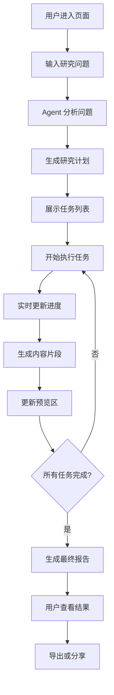
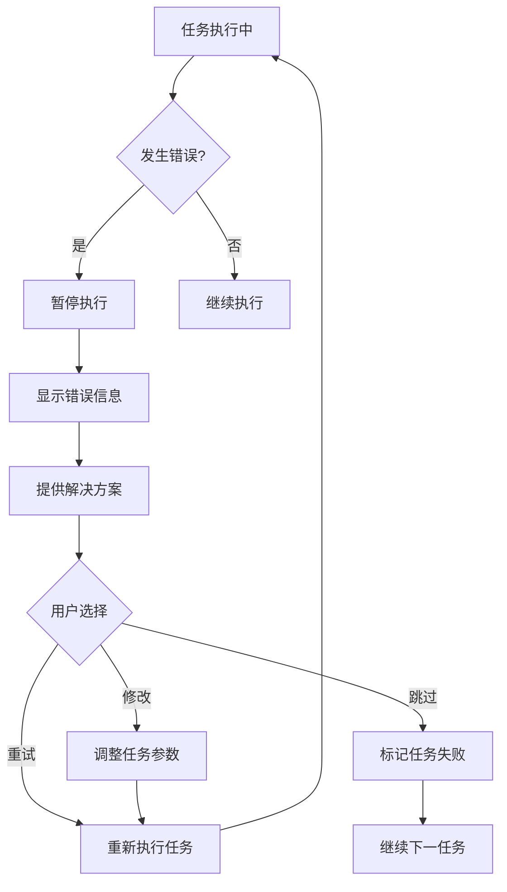
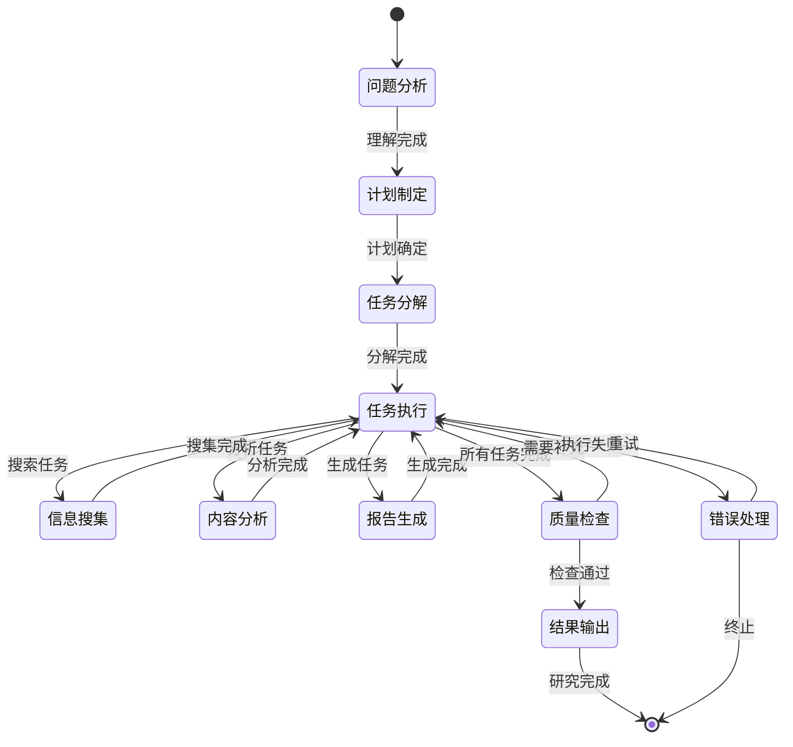

# DeepResearch 功能需求文档

## 1. 项目概述

### 1.1 功能定位

DeepResearch 是一个智能研究助手页面，旨在帮助用户通过 AI Agent 自动化完成复杂的研究任务。用户只需提出研究问题，系统将自动分解任务、制定计划、逐步执行，并实时生成结构化的研究报告。

### 1.2 目标用户

- 研究人员和学者
- 内容创作者
- 产品经理和分析师
- 需要深度调研的专业人士

### 1.3 核心价值

- **自动化研究流程**：将复杂研究任务分解为可执行的子任务
- **实时进度跟踪**：可视化展示研究进展和任务状态
- **结构化输出**：生成高质量的 Markdown 或 HTML 研究报告
- **交互式体验**：用户可以实时查看和调整研究方向

## 2. 功能需求

### 2.1 核心功能

#### 2.1.1 智能问题分析

- **输入处理**：接收用户的研究问题或主题
- **问题理解**：使用 LLM 分析问题的复杂度和研究范围
- **任务分解**：将复杂问题分解为多个可执行的子任务
- **计划生成**：制定详细的研究计划和执行顺序

#### 2.1.2 自动化研究执行

- **信息搜集**：通过搜索引擎、API 等方式获取相关信息
- **内容分析**：对搜集的信息进行筛选、分析和整理
- **知识整合**：将分散的信息整合为连贯的知识体系
- **报告生成**：生成结构化的研究报告

#### 2.1.3 实时进度管理

- **任务状态跟踪**：实时更新每个子任务的执行状态
- **进度可视化**：通过进度条、状态图标等方式展示进展
- **动态调整**：根据执行结果动态调整后续任务
- **异常处理**：处理执行过程中的错误和异常情况

### 2.2 用户界面功能

#### 2.2.1 左侧对话区域

- **问题输入框**：支持多行文本输入，可输入复杂的研究问题
- **对话历史**：显示用户与 Agent 的完整对话记录
- **思考过程展示**：实时显示 Agent 的思考和分析过程
- **任务列表**：展示分解后的任务列表和执行状态
- **进度指示器**：显示整体研究进度和当前执行的任务

#### 2.2.2 右侧预览区域

- **文件树结构**：显示生成的文档结构和文件列表
- **内容预览**：实时预览生成的 Markdown 或 HTML 内容
- **语法高亮**：支持代码块的语法高亮显示
- **预览模式切换**：支持源码模式和渲染模式切换
- **内容搜索**：在生成的内容中进行搜索和定位

### 2.3 交互功能

#### 2.3.1 实时通信

- **流式更新**：使用 SSE 或 WebSocket 实现内容的流式更新
- **状态同步**：左右两侧内容的实时同步更新
- **进度推送**：实时推送任务执行进度和状态变化

#### 2.3.2 用户控制

- **暂停/继续**：用户可以暂停或继续研究过程
- **任务调整**：允许用户修改或添加研究任务
- **方向调整**：用户可以调整研究方向和重点
- **结果导出**：支持导出生成的研究报告

#### 2.3.3 会话管理

- **会话持久化**：每个研究会话都有唯一的 sessionId，支持长期保存
- **会话恢复**：用户可以通过 sessionId 恢复之前的研究会话
- **历史记录**：保存用户的研究历史，支持查看和管理
- **分享功能**：生成可分享的研究报告链接

#### 2.3.4 文件管理

- **自动保存**：研究过程中自动保存所有生成的内容
- **版本控制**：支持内容的版本管理和回滚
- **文件组织**：按照预定义的目录结构组织生成的文件
- **静态访问**：生成的 HTML 报告可通过独立 URL 访问

## 3. 技术需求

### 3.1 系统架构

#### 3.1.1 前端架构

```
DeepResearch Page
├── ChatPanel (左侧对话区)
│   ├── QuestionInput
│   ├── ConversationHistory
│   ├── ThinkingProcess
│   ├── TaskList
│   └── ProgressIndicator
└── PreviewPanel (右侧预览区)
    ├── FileTree
    ├── ContentViewer
    ├── ModeToggle
    └── SearchBox
```

#### 3.1.2 后端架构

```
API Layer
├── /api/deepresearch
│   ├── /start - 开始研究任务
│   ├── /status - 获取任务状态
│   ├── /pause - 暂停任务
│   ├── /resume - 恢复任务
│   ├── /export - 导出结果
│   └── /files - 文件管理
├── /research/[sessionId] - 静态研究报告访问路由
└── Agent Layer
    ├── ResearchAgent - 主研究智能体
    ├── TaskManager - 任务管理器
    ├── ContentGenerator - 内容生成器
    ├── FileManager - 文件管理器
    └── ProgressTracker - 进度跟踪器
```

#### 3.1.3 路由设计

**页面路由**：

- `/deepresearch` - DeepResearch 主页面
- `/research/[sessionId]` - 静态研究报告展示页面

**API 路由**：

- `POST /api/deepresearch/start` - 开始新的研究任务
- `GET /api/deepresearch/status/[sessionId]` - 获取研究状态
- `POST /api/deepresearch/pause/[sessionId]` - 暂停研究任务
- `POST /api/deepresearch/resume/[sessionId]` - 恢复研究任务
- `GET /api/deepresearch/export/[sessionId]` - 导出研究结果
- `GET /api/deepresearch/files/[sessionId]` - 获取文件列表
- `GET /api/deepresearch/files/[sessionId]/[...path]` - 获取具体文件内容

**静态文件访问**：

- `/research/[sessionId]/` - 访问生成的静态 HTML 报告
- `/research/[sessionId]/assets/*` - 访问样式和脚本文件
- `/research/[sessionId]/data/*` - 访问研究数据文件

### 3.2 技术选型

#### 3.2.1 前端技术栈

- **框架**：Next.js 14 (React 18)
- **状态管理**：Zustand 或 React Context
- **UI 组件**：Tailwind CSS + Headless UI
- **代码高亮**：Monaco Editor
- **Markdown 渲染**：react-markdown
- **实时通信**：EventSource (SSE)

#### 3.2.2 后端技术栈

- **运行时**：Node.js
- **框架**：Next.js API Routes
- **AI 框架**：LangGraph + LangChain
- **LLM 服务**：OpenAI GPT-4 或其他兼容 API
- **数据存储**：SQLite
- **实时通信**：Server-Sent Events

### 3.3 数据模型

#### 3.3.1 研究会话模型

```typescript
interface ResearchSession {
  id: string; // 唯一的 sessionId，用于标识研究会话
  userId: string;
  question: string;
  status: 'planning' | 'executing' | 'completed' | 'paused' | 'error';
  plan: ResearchPlan;
  tasks: ResearchTask[];
  generatedFiles: GeneratedFile[];
  outputPath: string; // public/{sessionId}/ 目录路径
  finalHtmlFile?: string; // 最终生成的 HTML 文件路径
  createdAt: Date;
  updatedAt: Date;
}
```

#### 3.3.2 研究任务模型

```typescript
interface ResearchTask {
  id: string;
  sessionId: string;
  title: string;
  description: string;
  type: 'search' | 'analyze' | 'generate' | 'review';
  status: 'pending' | 'running' | 'completed' | 'failed';
  priority: number;
  dependencies: string[];
  result?: any;
  createdAt: Date;
  completedAt?: Date;
}
```

#### 3.3.3 生成文件模型

```typescript
interface GeneratedFile {
  id: string;
  sessionId: string;
  name: string;
  type: 'markdown' | 'html' | 'json' | 'css' | 'js';
  content: string;
  relativePath: string; // 相对于 public/{sessionId}/ 的路径
  absolutePath: string; // 完整的文件系统路径
  size: number;
  isPublic: boolean; // 是否可通过 URL 访问
  createdAt: Date;
  updatedAt: Date;
}
```

#### 3.3.4 文件存储结构

```
public/
├── {sessionId}/
│   ├── index.html          # 最终的研究报告 HTML 文件
│   ├── assets/
│   │   ├── styles.css      # 样式文件
│   │   ├── script.js       # 交互脚本
│   │   └── images/         # 图片资源
│   ├── data/
│   │   ├── research.json   # 研究数据
│   │   ├── tasks.json      # 任务执行记录
│   │   └── sources.json    # 信息来源记录
│   └── sections/
│       ├── introduction.md # 各章节的 Markdown 文件
│       ├── analysis.md
│       ├── conclusion.md
│       └── references.md
```

#### 3.3.5 静态 HTML 生成规范

**HTML 模板结构**：

```html
<!DOCTYPE html>
<html lang="zh-CN">
  <head>
    <meta charset="UTF-8" />
    <meta name="viewport" content="width=device-width, initial-scale=1.0" />
    <title>{研究主题} - 深度研究报告</title>
    <link rel="stylesheet" href="./assets/styles.css" />
  </head>
  <body>
    <header>
      <h1>{研究主题}</h1>
      <div class="meta">
        <span>生成时间: {生成时间}</span>
        <span>会话ID: {sessionId}</span>
      </div>
    </header>

    <nav class="toc">
      <!-- 自动生成的目录 -->
    </nav>

    <main class="content">
      <!-- 研究内容 -->
    </main>

    <footer>
      <p>本报告由 DeepResearch AI 助手生成</p>
    </footer>

    <script src="./assets/script.js"></script>
  </body>
</html>
```

**CSS 样式要求**：

- 响应式设计，支持移动端查看
- 清晰的排版和层次结构
- 代码块语法高亮
- 打印友好的样式

**JavaScript 功能**：

- 目录导航
- 搜索功能
- 代码块复制
- 图片放大查看

## 4. 界面设计规范

### 4.1 布局设计

#### 4.1.1 整体布局

- **双栏布局**：左侧对话区占 40%，右侧预览区占 60%
- **响应式设计**：移动端支持上下布局或标签页切换
- **可调节分割线**：用户可以调整左右区域的宽度比例

#### 4.1.2 左侧对话区设计

- **顶部**：问题输入框 (高度自适应，最大 200px)
- **中部**：对话历史和思考过程 (可滚动区域)
- **底部**：任务列表和进度指示器 (固定高度 300px)

#### 4.1.3 右侧预览区设计

- **顶部**：工具栏 (文件切换、模式切换、搜索框)
- **左侧**：文件树 (宽度 200px，可折叠)
- **右侧**：内容预览区 (剩余空间)

### 4.2 视觉设计

#### 4.2.1 色彩方案

- **主色调**：蓝色系 (#3B82F6)
- **辅助色**：灰色系 (#6B7280)
- **状态色**：
  - 进行中：橙色 (#F59E0B)
  - 已完成：绿色 (#10B981)
  - 错误：红色 (#EF4444)
  - 等待中：灰色 (#9CA3AF)

#### 4.2.2 图标设计

- **任务状态图标**：使用 Heroicons 或 Lucide 图标库
- **文件类型图标**：区分 Markdown、HTML、JSON 等文件类型
- **操作按钮图标**：播放、暂停、停止、导出等

### 4.3 交互设计

#### 4.3.1 动画效果

- **任务状态变化**：平滑的状态转换动画
- **内容更新**：淡入淡出效果
- **进度指示**：流畅的进度条动画
- **加载状态**：骨架屏或加载动画

#### 4.3.2 反馈机制

- **即时反馈**：按钮点击、输入验证等即时响应
- **状态提示**：Toast 消息、状态标签等
- **错误处理**：友好的错误提示和恢复建议

## 5. 用户流程设计

### 5.1 主要用户流程



### 5.2 异常流程处理



## 6. Agent 工作流设计

### 6.1 研究 Agent 状态机



### 6.2 任务类型定义

#### 6.2.1 搜索任务 (SearchTask)

- **目标**：获取相关信息和资料
- **工具**：搜索引擎 API、知识库查询
- **输出**：搜索结果列表和摘要

#### 6.2.2 分析任务 (AnalysisTask)

- **目标**：分析和处理搜集的信息
- **工具**：文本分析、数据处理
- **输出**：分析结果和洞察

#### 6.2.3 生成任务 (GenerationTask)

- **目标**：生成结构化内容
- **工具**：模板引擎、内容生成器
- **输出**：Markdown 或 HTML 文档

#### 6.2.4 审查任务 (ReviewTask)

- **目标**：检查和优化生成的内容
- **工具**：质量检查器、格式验证器
- **输出**：优化建议和修正内容

## 7. 开发计划

### 7.1 第一阶段：基础框架 (2 周)

- [ ] 创建 DeepResearch 页面路由
- [ ] 实现基础的双栏布局
- [ ] 搭建左侧对话区基础组件
- [ ] 搭建右侧预览区基础组件
- [ ] 实现基础的状态管理

### 7.2 第二阶段：Agent 集成 (3 周)

- [ ] 设计和实现 ResearchAgent
- [ ] 实现任务管理系统
- [ ] 集成 LangGraph 状态管理
- [ ] 实现基础的任务执行流程
- [ ] 添加简单的搜索和分析功能

### 7.3 第三阶段：实时通信 (2 周)

- [ ] 实现 Server-Sent Events
- [ ] 建立前后端实时通信
- [ ] 实现进度状态的实时更新
- [ ] 添加任务状态变化的推送
- [ ] 优化用户体验和响应速度

### 7.4 第四阶段：内容生成和持久化 (2 周)

- [ ] 实现内容生成器
- [ ] 支持 Markdown 文档生成
- [ ] 支持 HTML 文档生成
- [ ] 实现文件树结构展示
- [ ] 添加内容预览和编辑功能
- [ ] 实现 sessionId 持久化存储
- [ ] 创建 public/{sessionId} 目录结构
- [ ] 实现静态 HTML 报告生成
- [ ] 添加 /research/[sessionId] 路由访问

### 7.5 第五阶段：高级功能 (3 周)

- [ ] 实现任务暂停/恢复功能
- [ ] 添加用户控制和调整功能
- [ ] 实现结果导出功能
- [ ] 优化错误处理和异常恢复
- [ ] 添加质量检查和内容优化

### 7.6 第六阶段：测试和优化 (2 周)

- [ ] 单元测试和集成测试
- [ ] 性能优化和内存管理
- [ ] 用户体验测试和改进
- [ ] 文档编写和部署准备
- [ ] 最终验收和上线准备

## 8. 风险评估与解决方案

### 8.1 技术风险

#### 8.1.1 LLM API 稳定性风险

**风险描述**：LLM 服务可能出现延迟、限流或服务中断

**解决方案**：

- 实现多个 LLM 服务提供商的支持
- 添加请求重试机制和降级策略
- 实现本地缓存减少 API 调用
- 设置合理的超时和错误处理

#### 8.1.2 实时通信性能风险

**风险描述**：大量并发用户可能导致 SSE 连接过多，影响服务器性能

**解决方案**：

- 实现连接池管理和资源限制
- 使用 Redis 等缓存系统优化状态管理
- 实现智能的消息推送策略
- 考虑使用 WebSocket 集群方案

#### 8.1.3 内容生成质量风险

**风险描述**：生成的研究报告可能质量不稳定或包含错误信息

**解决方案**：

- 实现多轮质量检查机制
- 添加人工审核和修正功能
- 建立内容质量评估标准
- 提供用户反馈和改进机制

### 8.2 用户体验风险

#### 8.2.1 响应时间过长风险

**风险描述**：复杂研究任务可能需要很长时间完成，影响用户体验

**解决方案**：

- 实现任务分片和并行处理
- 提供详细的进度指示和预估时间
- 允许用户暂停和恢复任务
- 实现增量结果展示

#### 8.2.2 界面复杂度风险

**风险描述**：双栏布局和多功能界面可能让用户感到困惑

**解决方案**：

- 设计简洁直观的用户界面
- 提供新手引导和帮助文档
- 实现渐进式功能展示
- 收集用户反馈持续优化

### 8.3 数据安全风险

#### 8.3.1 用户数据隐私风险

**风险描述**：用户的研究问题和生成内容可能包含敏感信息

**解决方案**：

- 实现端到端加密存储
- 严格的数据访问控制
- 定期数据清理和匿名化
- 遵循数据保护法规要求

#### 8.3.2 API 密钥安全风险

**风险描述**：LLM API 密钥泄露可能导致服务滥用

**解决方案**：

- 使用环境变量和密钥管理服务
- 实现 API 调用监控和限流
- 定期轮换 API 密钥
- 建立异常检测和告警机制

## 9. 成功指标

### 9.1 功能指标

- **任务完成率**：≥ 95% 的研究任务能够成功完成
- **内容质量**：生成内容的准确性和完整性评分 ≥ 4.0/5.0
- **响应时间**：平均任务完成时间 ≤ 10 分钟
- **系统稳定性**：服务可用性 ≥ 99.5%

### 9.2 用户体验指标

- **用户满意度**：用户满意度评分 ≥ 4.2/5.0
- **任务成功率**：用户成功完成研究任务的比例 ≥ 90%
- **重复使用率**：用户 7 天内重复使用的比例 ≥ 60%
- **推荐意愿**：用户推荐给他人的意愿 ≥ 70%

### 9.3 技术指标

- **页面加载时间**：首屏加载时间 ≤ 3 秒
- **实时更新延迟**：状态更新延迟 ≤ 1 秒
- **并发处理能力**：支持 ≥ 100 个并发研究任务
- **错误率**：系统错误率 ≤ 1%

## 10. 后续扩展计划

### 10.1 短期扩展 (3-6 个月)

- **多语言支持**：支持英文、中文等多种语言的研究
- **模板系统**：提供预定义的研究模板和框架
- **协作功能**：支持多用户协作研究
- **移动端适配**：优化移动设备的使用体验

### 10.2 中期扩展 (6-12 个月)

- **知识图谱集成**：集成外部知识图谱提高研究质量
- **专业领域定制**：针对特定领域提供专业化功能
- **API 开放**：提供 API 接口供第三方集成
- **企业版功能**：团队管理、权限控制等企业级功能

### 10.3 长期扩展 (1-2 年)

- **AI 助手进化**：更智能的研究助手和个性化推荐
- **多模态支持**：支持图片、视频等多媒体内容分析
- **自动化工作流**：与其他工具集成的自动化研究流程
- **商业化模式**：探索可持续的商业化运营模式

## 11. 总结

DeepResearch 功能旨在通过 AI Agent 技术革新传统的研究工作流程，为用户提供智能化、自动化的研究体验。通过精心设计的双栏界面、实时的进度跟踪和高质量的内容生成，我们期望能够显著提升用户的研究效率和体验。

本需求文档为 DeepResearch 功能的开发提供了全面的指导，涵盖了从功能设计到技术实现、从用户体验到风险管控的各个方面。在实际开发过程中，我们将根据用户反馈和技术发展情况，持续优化和完善这一功能。

通过分阶段的开发计划和明确的成功指标，我们有信心在预定的时间内交付一个高质量、用户友好的 DeepResearch 功能，为用户的研究工作带来真正的价值。
