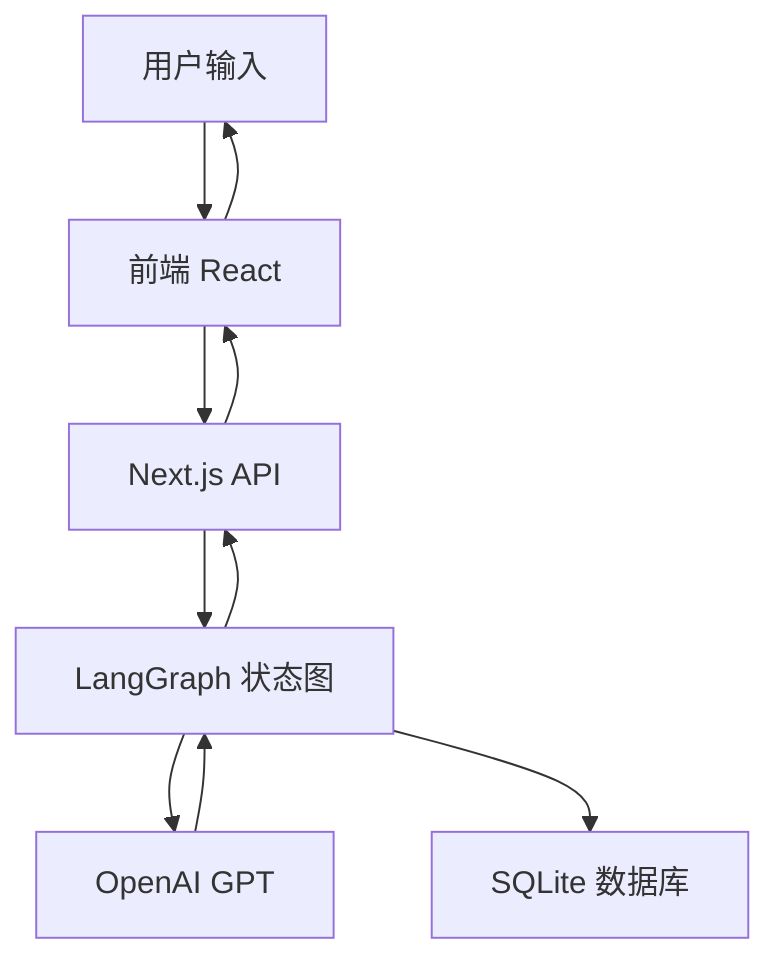
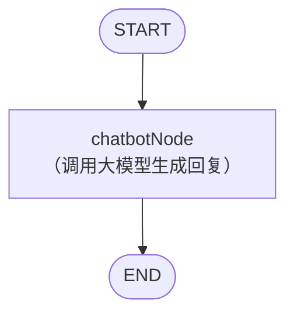
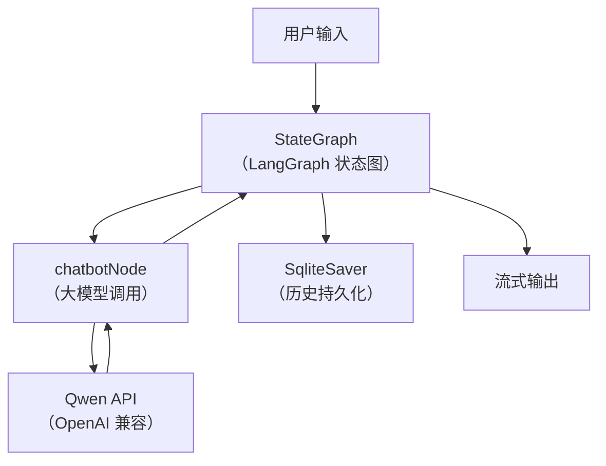
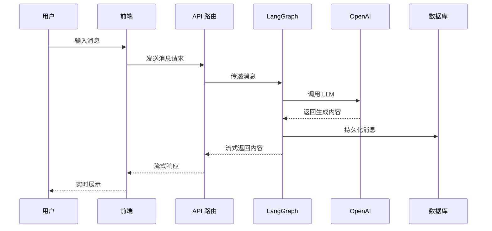

# LangGraph 智能聊天应用开发

## 一、项目介绍与技术栈解析

### 1.1 项目背景与价值
- **AI 应用开发趋势**：大语言模型（LLM）如 OpenAI GPT 在企业和个人应用中极具价值，能极大提升对话式交互体验。
- **流式响应**：提升用户体验，消息边生成边展示，减少等待时间。
- **多会话管理**：支持用户多轮对话和历史追溯。

### 1.2 技术栈
- **Next.js 15**：现代 React 框架，支持 App Router、Server/Client Components、流式渲染。
- **LangGraphJS**：AI 状态图框架，支持节点、边、检查点、流式事件。
- **OpenAI API（兼容通义千问 Qwen）**：对接 Qwen，流式响应。
- **better-sqlite3**：本地持久化会话和消息历史。

> **特别说明：**
> 本项目所有与大语言模型相关的 API 调用，实际采用的是**通义千问（Qwen）的大模型服务**，其 API 协议与 OpenAI 官方接口完全兼容。开发时可直接复用 OpenAI 的 SDK、参数配置和流式响应处理方式，无需额外适配。

---

## 二、开发环境与项目初始化

### 2.1 环境准备
- Node.js、pnpm 安装
- 推荐 VS Code + TypeScript 插件

### 2.2 项目初始化
```bash
pnpm create next-app@latest langgraph-chat-app
```

```
√ Would you like to use TypeScript? ... Yes
√ Would you like to use ESLint? ... No
√ Would you like to use Tailwind CSS? ... Yes
√ Would you like your code inside a `src/` directory? ... No
√ Would you like to use App Router? (recommended) ... Yes
√ Would you like to use Turbopack for `next dev`? ... No
√ Would you like to customize the import alias (`@/*` by default)? ... No
Creating a new Next.js app in D:\myFile\course\langgraph-chat-app.
```
- 选择 TypeScript、Tailwind CSS、 App Router可以根据自己的习惯选择

选择完成后会自动安装依赖

最后出现 一个`Warning` 

```
╭ Warning ───────────────────────────────────────────────────────────────────────────────────╮
│                                                                                            │
│   Ignored build scripts: @tailwindcss/oxide, sharp.                                        │
│   Run "pnpm approve-builds" to pick which dependencies should be allowed to run scripts.   │
│                                                                                            │
╰────────────────────────────────────────────────────────────────────────────────────────────╯
```
按照提示执行命令即可 `pnpm approve-builds`

### 2.3 依赖安装
```bash
pnpm add @langchain/core @langchain/langgraph @langchain/openai better-sqlite3
pnpm add -D @types/better-sqlite3
```


---

## 三、项目架构与核心原理

### 3.1 目录结构
```plaintext
app/
├── agent/          # LangGraph 代理逻辑
├── api/            # API 路由
├── components/     # React 组件
├── utils/          # 工具函数
└── globals.css     # 全局样式
```


**环境变量配置**
`.env` 文件示例：
```
OPENAI_MODEL_NAME=qwen-plus
OPENAI_API_KEY=sk-xxxx (你的通义千问API Key)
OPENAI_BASE_URL=https://dashscope.aliyuncs.com/compatible-mode/v1
```

### 3.2 数据流与系统架构



- 前端输入消息，API 路由转发，LangGraph 状态图处理，调用 OpenAI，结果流式返回前端。

---

## 四、核心功能实现

### 4.1 LangGraph 聊天机器人

#### 4.1.1 StateGraph 配置
```typescript
const workflow = new StateGraph(MessagesAnnotation)
  .addNode('chatbot', chatbotNode)
  .addEdge(START, 'chatbot')
  .addEdge('chatbot', END);
```
- **节点**：如 `chatbotNode` 负责与 LLM 交互
- **边**：定义对话流程

#### 4.1.2 聊天节点实现
- 集成 OpenAI（实际为通义千问 Qwen 兼容接口），处理消息，生成回复

#### 4.1.3 检查点持久化
- 使用 SQLite 保存会话状态和历史

#### 4.1.4 代码结构与原理详解

- **模型初始化**
  ```typescript
  const model = new ChatOpenAI({
    model: process.env.OPENAI_MODEL_NAME,
    temperature: 0.7,
    streaming: true, // 启用流式响应
  });
  ```
  通过 `ChatOpenAI` 实例化大模型，实际对接通义千问 Qwen 的 OpenAI 兼容接口。

- **聊天节点定义**
  ```typescript
  async function chatbotNode(state: typeof MessagesAnnotation.State) {
    const response = await model.invoke(state.messages);
    return { messages: [response] };
  }
  ```
  这是 LangGraph 的“节点”函数，接收历史消息，调用大模型生成回复。

- **状态图（StateGraph）构建**
  ```typescript
  const workflow = new StateGraph(MessagesAnnotation)
    .addNode('chatbot', chatbotNode)
    .addEdge(START, 'chatbot')
    .addEdge('chatbot', END);
  ```
  定义了一个简单的对话流程：`START` → `chatbot` → `END`

- **检查点与会话持久化**
  ```typescript
  const dbPath = path.resolve(process.cwd(), 'chat_history.db');
  export const db = new Database(dbPath);
  let checkpointer: SqliteSaver;
  checkpointer = new SqliteSaver(db);
  ```
  使用 SQLite 数据库存储所有会话历史，实现断点续聊。

- **应用初始化与导出**
  ```typescript
  async function initializeApp() {
    app = workflow.compile({ checkpointer });
    return app;
  }
  export const getApp = async () => await initializeApp();
  ```
  提供 `getApp` 方法，供 API 路由等调用。

- **流式响应与批量处理**
  文件后半部分提供了流式响应、状态流、批量处理等多种用法示例，便于扩展和测试。

#### 4.1.5 节点流程图



#### 4.1.6 详细数据流（含持久化与流式）



#### 4.1.7 总结

- `chatbot.ts` 是 LangGraph 聊天机器人最核心的实现文件，负责模型调用、对话流程、历史持久化和流式响应。
- 其结构高度模块化，便于扩展更多节点（如工具调用、外部搜索等）。
- 通过 Mermaid 流程图，可以直观理解对话流转和数据流动。

---

### 4.2 API 路由实现

> **注意：**
> 虽然代码和文档中多处出现 “OpenAI” 字样，但实际对接的是**通义千问（Qwen）**的 OpenAI 兼容接口。只需在环境变量中填入通义千问的 API Key、模型名称和 baseUrl 即可，无需修改代码逻辑。

#### 4.2.1 流式响应 POST /api/chat
```typescript
export async function POST(request: NextRequest) {
  // ... 省略校验
  const stream = new ReadableStream({
    async start(controller) {
      // 获取 LangGraph 应用实例
      const app = await getApp();
      // 通过 streamEvents 获取流式响应
      for await (const event of app.streamEvents(
        { messages: [userMessage] },
        { version: 'v2', ...threadConfig }
      )) {
        if (event.event === 'on_chat_model_stream') {
          const chunk = event.data?.chunk;
          if (chunk?.content) {
            const data = JSON.stringify({ type: 'chunk', content: chunk.content }) + '\n';
            controller.enqueue(new TextEncoder().encode(data));
          }
        }
      }
      // 结束标记
      controller.enqueue(new TextEncoder().encode(JSON.stringify({ type: 'end', status: 'success', thread_id: threadId }) + '\n'));
      controller.close();
    },
  });
  return new Response(stream, { headers: { 'Content-Type': 'text/plain; charset=utf-8', 'Transfer-Encoding': 'chunked', 'Cache-Control': 'no-cache', Connection: 'keep-alive' } });
}
```

// 可选：在 LLM 初始化时自定义 baseUrl 示例
```typescript
const llm = new OpenAI({
  apiKey: process.env.OPENAI_API_KEY,
  baseURL: process.env.OPENAI_BASE_URL, // 指向通义千问兼容地址
  model: process.env.OPENAI_MODEL_NAME,
  // 其他参数
});
```

#### 4.2.2 会话管理 API
- GET/POST/PATCH/DELETE `/api/chat/sessions`，支持会话列表、创建、重命名、删除

---

### 4.3 前端界面实现

#### 4.3.1 会话管理组件
- `SessionSidebar.tsx` 负责会话列表、切换、新建、重命名、删除
- 通过 API 获取/操作会话

#### 4.3.2 消息流式渲染与打字机效果
```typescript
const reader = response.body?.getReader();
const decoder = new TextDecoder();

while (true) {
  const { done, value } = await reader.read();
  if (done) break;
  // 处理流式数据
}
```
- 实现边生成边展示的打字机效果

#### 4.3.3 主要 UI 组件
- 消息列表组件
- 输入框组件
- 会话管理侧边栏

---

## 五、流程与原理总结

### 5.1 总体流程图



---

## 六、进阶与优化

- 前端流式处理与性能优化
- 状态同步与恢复
- 工具扩展与自定义
- 错误处理与用户体验提升

---

# 结语

本课程通过 LangGraphJS、Next.js、OpenAI API 等现代技术，带你从零实现一个可扩展、体验优秀的 AI 聊天助手。希望你能掌握核心原理，灵活扩展，打造属于自己的智能应用！

